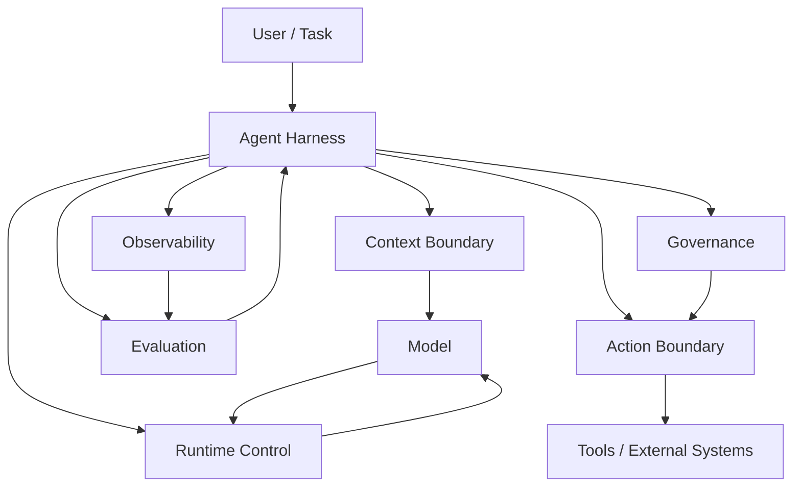

# 01. Why Agent Harness / 为什么需要 Agent Harness

> **本章副标题 / Subtitle**  
> 中文：从 Prompt 到工程系统  
> English: From prompting to engineering systems

## 1. Chapter Thesis / 本章命题

**中文**：Agent Harness 的核心不是让模型更聪明，而是把开放、概率化、不可完全预测的模型能力，放进一个可控、可观察、可评估、可治理的工程系统中。

**English**: The core of an Agent Harness is not making the model smarter. It is placing open-ended, probabilistic model capability inside an engineering system that can control, observe, evaluate, and govern it.

## 2. How This Chapter Connects / 前后关联

**中文**：本章建立全课的总问题：为什么 prompt、tool calling、workflow 都不足以单独构成可靠 Agent 系统。后续章节会把 Harness 拆成边界、运行时、能力封装、信任机制和生产架构。

**English**: This chapter establishes the course question: why prompts, tool calling, and workflows alone are not enough for reliable agent systems. Later chapters decompose the harness into boundaries, runtime, capability packaging, trust mechanisms, and production architecture.

Next / 下一章：[02. Task, Environment and Boundary](course-02.html)

## 3. Learning Outcomes / 学习目标

- 中文：解释 `Why Agent Harness` 在 Agent Harness 中解决的工程问题。  
  English: Explain the engineering problem solved by `Why Agent Harness` inside an Agent Harness.
- 中文：用本章思维模型审查一个真实 Agent 设计。  
  English: Use this chapter's mental model to review a real agent design.
- 中文：产出本章对应的设计 artifact，并把它接入 Course Builder Harness 贯穿案例。  
  English: Produce the chapter artifact and connect it to the Course Builder Harness case study.
- 中文：识别本章相关的典型失败模式。  
  English: Identify typical failure modes related to this chapter.

## 4. The Engineering Problem / 工程问题

**中文**：很多 Agent 原型看起来像“一个强模型 + 一段系统提示词 + 几个工具”。这种形态在演示中经常有效，但进入真实任务后会暴露出不可预测、不可复现、不可审计、不可恢复的问题。Harness 要解决的不是“模型不会回答”，而是“系统如何在模型可能出错时仍然可靠完成任务”。

**English**: Many agent prototypes look like a strong model plus a system prompt plus a few tools. This often works in demos, but real tasks reveal unpredictability, poor reproducibility, weak auditability, and limited recovery. The harness does not solve the problem that a model cannot answer; it solves how the system can still complete tasks when the model may be wrong.

## 5. Mental Model / 思维模型

**中文**：把 LLM 想象成一个强大的推理核心，但它本身不拥有稳定工程边界。Harness 是围绕这个核心建立的外骨骼：定义输入、限制动作、记录过程、检测失败、触发恢复、控制权限，并把运行结果变成可持续改进的证据。

**English**: Think of the LLM as a powerful reasoning core without stable engineering boundaries. The harness is the exoskeleton around that core: it defines inputs, constrains actions, records execution, detects failures, triggers recovery, controls permissions, and converts runs into evidence for continuous improvement.

## 6. Harness Abstraction / Harness 抽象

### LLM / 大语言模型
- 中文：负责生成、推理、解释和选择。它是能力核心，但不是完整系统。
- English: Responsible for generation, reasoning, explanation, and selection. It is the capability core, not the complete system.

### Agent / 智能体
- 中文：围绕目标进行多步行动的运行时行为。Agent 不是单一类或函数，而是一种目标驱动的执行模式。
- English: A runtime behavior that takes multi-step actions toward a goal. An agent is not a single class or function; it is a goal-directed execution mode.

### Harness / 控制外壳
- 中文：围绕 Agent 建立的工程系统，负责边界、工具、状态、运行时、观察、评测和治理。
- English: The engineering system around the agent that manages boundaries, tools, state, runtime, observation, evaluation, and governance.

### Reliability / 可靠性
- 中文：不是要求模型永不犯错，而是让系统能够发现错误、限制错误、恢复错误并学习错误。
- English: Reliability does not mean the model never fails; it means the system can detect, limit, recover from, and learn from failures.

## 7. Reference Diagram / 参考图

## 8. Design Principles / 设计原则

- **中文**：模型提供智能，Harness 提供控制。  
  **English**: The model provides intelligence; the harness provides control.
- **中文**：不要把系统可靠性寄托在一句 system prompt 上。  
  **English**: Do not place system reliability in a single system prompt.
- **中文**：所有外部副作用都必须经过显式边界。  
  **English**: Every external side effect must pass through an explicit boundary.
- **中文**：每一次 Agent run 都应该留下可回放证据。  
  **English**: Every agent run should leave replayable evidence.

## 9. Reference Implementation Direction / 参考实现方向

**中文**：本课程强调“思维 > 具体方案”。参考实现的作用是帮助理解抽象，不应把某个框架、SDK 或协议等同于 Harness 本身。实现时建议先写清楚边界、状态和失败路径，再选择具体技术。

**English**: This course emphasizes “thinking > specific solution.” A reference implementation exists to explain the abstraction; no framework, SDK, or protocol should be equated with the harness itself. In implementation, specify boundaries, state, and failure paths before choosing technologies.

Recommended implementation notes / 推荐实现备注：
- 中文：用 Markdown 或 YAML 保存设计决策，便于版本化和评审。  
  English: Store design decisions in Markdown or YAML so they can be versioned and reviewed.
- 中文：把本章 artifact 放入仓库的 `docs/design/` 或 `labs/` 目录。  
  English: Place this chapter artifact under `docs/design/` or `labs/` in the repository.
- 中文：每次修改抽象边界后，都要更新相邻章节的接口假设。  
  English: Whenever an abstraction boundary changes, update the interface assumptions of adjacent chapters.

## 10. Failure Modes / 失效模式

### Prompt-only agent
- 中文：所有逻辑都藏在 prompt 中，无法测试、版本化或回放。
- English: All logic is hidden in prompts, making it hard to test, version, or replay.

### Demo reliability
- 中文：只在示例输入上有效，缺少失败路径和恢复机制。
- English: Works only on demo inputs and lacks failure paths and recovery mechanisms.

### Invisible execution
- 中文：工具调用、上下文构造和模型判断不可见。
- English: Tool calls, context construction, and model decisions are not visible.

### Security by instruction
- 中文：用“不要做危险事”代替权限控制。
- English: Uses instructions such as “do not do dangerous things” instead of real permission control.

## 11. Lab: Course Builder Harness / 实验：课程构建 Harness

1. 中文：选择一个你想构建的 Agent，例如课程维护助手、代码审查助手或研究助手。  
   English: Choose an agent you want to build, such as a course-maintenance assistant, code-review assistant, or research assistant.
2. 中文：写下它能看到什么、能做什么、会产生什么外部影响。  
   English: Write down what it can see, what it can do, and what external effects it can create.
3. 中文：列出至少三个它可能失败的方式。  
   English: List at least three ways it might fail.
4. 中文：用一句话说明为什么它需要 Harness，而不只是 prompt。  
   English: State in one sentence why it needs a harness rather than only a prompt.

**Expected artifact / 预期产物**：一页 Agent Harness 设计动机说明。 / A one-page motivation memo for the Agent Harness.

## 12. Review Checklist / 复盘清单

- [ ] 中文：我能在自己的设计中落实：模型提供智能，Harness 提供控制。  
      English: I can apply this principle in my own design: The model provides intelligence; the harness provides control.
- [ ] 中文：我能在自己的设计中落实：不要把系统可靠性寄托在一句 system prompt 上。  
      English: I can apply this principle in my own design: Do not place system reliability in a single system prompt.
- [ ] 中文：我能在自己的设计中落实：所有外部副作用都必须经过显式边界。  
      English: I can apply this principle in my own design: Every external side effect must pass through an explicit boundary.
- [ ] 中文：我能识别并避免 `Prompt-only agent`：所有逻辑都藏在 prompt 中，无法测试、版本化或回放。  
      English: I can identify and avoid `Prompt-only agent`: All logic is hidden in prompts, making it hard to test, version, or replay.
- [ ] 中文：我能识别并避免 `Demo reliability`：只在示例输入上有效，缺少失败路径和恢复机制。  
      English: I can identify and avoid `Demo reliability`: Works only on demo inputs and lacks failure paths and recovery mechanisms.

## 13. Image Descriptions / 图片描述

### 封面图
- 中文图像描述：一个发光的模型核心被透明工程外壳包围，外壳上标有 Context、Tools、Runtime、Eval、Governance，强调“能力在内，控制在外”。
- English image prompt: A glowing model core enclosed by a transparent engineering shell labeled Context, Tools, Runtime, Eval, and Governance, emphasizing capability inside and control outside.

### 对比图
- 中文图像描述：左侧是 prompt-only demo 的单线结构，右侧是完整 harness 的闭环结构，对比不可控与可控。
- English image prompt: A comparison diagram: a prompt-only demo as a single line on the left, and a closed-loop harness on the right, contrasting uncontrolled and controlled systems.

## 14. Key Takeaways / 关键总结

- 中文：`Why Agent Harness` 不是孤立模块，而是 Agent Harness 处理不确定性的一层工程边界。
- English: `Why Agent Harness` is not an isolated module; it is one engineering boundary through which the Agent Harness handles uncertainty.
- 中文：具体工具会变化，但本章的判断问题应保持稳定：边界是什么，证据在哪里，失败如何恢复。
- English: Specific tools will change, but the chapter’s judgment questions should remain stable: what is the boundary, where is the evidence, and how does failure recover?
