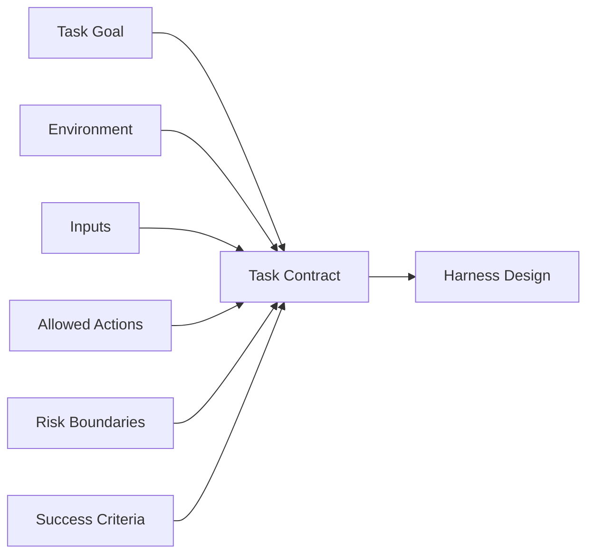

# 02. Task, Environment and Boundary / 任务、环境与边界

> **本章副标题 / Subtitle**  
> 中文：先设计问题，再设计 Agent  
> English: Design the problem before designing the agent

## 1. Chapter Thesis / 本章命题

**中文**：Agent 设计的第一步不是选择工具、框架或模型，而是定义任务、环境和边界。边界决定 Agent 可以知道什么、可以做什么、如何判断成功、哪里必须停止。

**English**: The first step in agent design is not choosing tools, frameworks, or models. It is defining the task, environment, and boundaries. Boundaries determine what the agent may know, what it may do, how success is judged, and where it must stop.

## 2. How This Chapter Connects / 前后关联

**中文**：上一章说明为什么需要 Harness。本章把 Harness 的起点前移到任务定义。下一章会把这些边界转化为一个最小可运行闭环。

**English**: The previous chapter explained why a harness is needed. This chapter moves the starting point to task definition. The next chapter turns these boundaries into a minimal executable loop.

Previous / 上一章：[01. Why Agent Harness](course-01.html) | Next / 下一章：[03. Minimal Harness](course-03.html)

## 3. Learning Outcomes / 学习目标

- 中文：解释 `Task, Environment and Boundary` 在 Agent Harness 中解决的工程问题。  
  English: Explain the engineering problem solved by `Task, Environment and Boundary` inside an Agent Harness.
- 中文：用本章思维模型审查一个真实 Agent 设计。  
  English: Use this chapter's mental model to review a real agent design.
- 中文：产出本章对应的设计 artifact，并把它接入 Course Builder Harness 贯穿案例。  
  English: Produce the chapter artifact and connect it to the Course Builder Harness case study.
- 中文：识别本章相关的典型失败模式。  
  English: Identify typical failure modes related to this chapter.

## 4. The Engineering Problem / 工程问题

**中文**：很多 Agent 项目失败，并不是因为模型不够强，而是因为任务本身没有被工程化定义。团队只知道“让 Agent 处理邮件”“让 Agent 写代码”“让 Agent 做研究”，却没有定义输入来源、允许动作、完成条件、风险等级和失败处理。模糊目标会制造模糊系统。

**English**: Many agent projects fail not because the model is too weak, but because the task has not been engineered. Teams say “let the agent handle email,” “let the agent write code,” or “let the agent do research” without defining input sources, allowed actions, completion criteria, risk levels, and failure handling. Vague goals create vague systems.

## 5. Mental Model / 思维模型

**中文**：把 Agent 设计看成在一个环境中部署一个受约束的行动者。任务是它追求的目标，环境是它运行的世界，边界是它不能越过的墙，成功标准是它何时停止的判断依据。

**English**: Think of agent design as deploying a constrained actor inside an environment. The task is the goal it pursues, the environment is the world it operates in, boundaries are the walls it cannot cross, and success criteria determine when it should stop.

## 6. Harness Abstraction / Harness 抽象

### Task contract / 任务契约
- 中文：对目标、输入、输出、完成标准、失败条件和权限范围的明确声明。
- English: An explicit statement of goal, inputs, outputs, completion criteria, failure conditions, and permission scope.

### Environment / 环境
- 中文：Agent 可见和可作用的外部系统，例如文件、浏览器、数据库、API、邮件、日历、GitHub 仓库。
- English: The external systems the agent can see and affect, such as files, browsers, databases, APIs, email, calendars, or GitHub repositories.

### Information boundary / 信息边界
- 中文：Agent 被允许看到的信息范围，包括当前任务、历史记录、用户偏好、检索资料和系统策略。
- English: The information the agent is allowed to see, including current task, history, user preferences, retrieved material, and system policy.

### Action boundary / 动作边界
- 中文：Agent 被允许执行的动作范围，包括只读、草稿、修改、提交、发送、购买等不同风险级别。
- English: The set of actions the agent may perform, spanning read-only actions, drafts, modifications, commits, sending, purchases, and other risk levels.

### Success criteria / 成功标准
- 中文：判断任务是否完成的证据，不应只依赖 Agent 自我声明。
- English: Evidence used to determine whether the task is complete; it should not rely only on the agent’s own assertion.

## 7. Reference Diagram / 参考图

## 8. Design Principles / 设计原则

- **中文**：先定义边界，再扩展能力。  
  **English**: Define boundaries before expanding capability.
- **中文**：成功标准必须可观察。  
  **English**: Success criteria must be observable.
- **中文**：风险越高，自主权越小。  
  **English**: The higher the risk, the less autonomy the agent should have.
- **中文**：不要把需求模糊性外包给模型。  
  **English**: Do not outsource requirement ambiguity to the model.

## 9. Reference Implementation Direction / 参考实现方向

**中文**：本课程强调“思维 > 具体方案”。参考实现的作用是帮助理解抽象，不应把某个框架、SDK 或协议等同于 Harness 本身。实现时建议先写清楚边界、状态和失败路径，再选择具体技术。

**English**: This course emphasizes “thinking > specific solution.” A reference implementation exists to explain the abstraction; no framework, SDK, or protocol should be equated with the harness itself. In implementation, specify boundaries, state, and failure paths before choosing technologies.

Recommended implementation notes / 推荐实现备注：
- 中文：用 Markdown 或 YAML 保存设计决策，便于版本化和评审。  
  English: Store design decisions in Markdown or YAML so they can be versioned and reviewed.
- 中文：把本章 artifact 放入仓库的 `docs/design/` 或 `labs/` 目录。  
  English: Place this chapter artifact under `docs/design/` or `labs/` in the repository.
- 中文：每次修改抽象边界后，都要更新相邻章节的接口假设。  
  English: Whenever an abstraction boundary changes, update the interface assumptions of adjacent chapters.

## 10. Failure Modes / 失效模式

### Undefined environment
- 中文：Agent 不知道哪些系统是权威来源，导致引用错误或遗漏。
- English: The agent does not know which systems are authoritative, causing wrong citations or omissions.

### Unbounded action space
- 中文：Agent 被授予过多动作能力，任何误判都会产生外部后果。
- English: The agent receives too many action capabilities, so any mistake can create external consequences.

### Subjective completion
- 中文：任务是否完成只凭 Agent 自己判断，缺少外部验证。
- English: Completion is judged only by the agent itself, without external verification.

### Hidden risk
- 中文：读、写、发送、删除、支付等动作没有风险分层。
- English: Read, write, send, delete, and payment actions are not separated by risk level.

## 11. Lab: Course Builder Harness / 实验：课程构建 Harness

1. 中文：以 Course Builder Harness 为案例，定义它的主任务：维护和扩展 Agent Harness 课程仓库。  
   English: Use the Course Builder Harness as the case study and define its main task: maintaining and expanding the Agent Harness course repository.
2. 中文：列出环境：GitHub repo、课程 Markdown、图片资源、构建日志、参考资料。  
   English: List the environment: GitHub repo, course Markdown, image assets, build logs, and references.
3. 中文：把动作分成只读、低风险写入、高风险发布三类。  
   English: Divide actions into read-only, low-risk writes, and high-risk publishing.
4. 中文：写出三个成功标准，例如构建通过、章节结构完整、评测用例不退化。  
   English: Write three success criteria, such as successful build, complete chapter structure, and no regression in evaluation cases.

**Expected artifact / 预期产物**：一个 Task Contract 模板，包含目标、环境、输入、动作、成功标准、失败模式和审批规则。 / A Task Contract template covering goal, environment, inputs, actions, success criteria, failure modes, and approval rules.

## 12. Review Checklist / 复盘清单

- [ ] 中文：我能在自己的设计中落实：先定义边界，再扩展能力。  
      English: I can apply this principle in my own design: Define boundaries before expanding capability.
- [ ] 中文：我能在自己的设计中落实：成功标准必须可观察。  
      English: I can apply this principle in my own design: Success criteria must be observable.
- [ ] 中文：我能在自己的设计中落实：风险越高，自主权越小。  
      English: I can apply this principle in my own design: The higher the risk, the less autonomy the agent should have.
- [ ] 中文：我能识别并避免 `Undefined environment`：Agent 不知道哪些系统是权威来源，导致引用错误或遗漏。  
      English: I can identify and avoid `Undefined environment`: The agent does not know which systems are authoritative, causing wrong citations or omissions.
- [ ] 中文：我能识别并避免 `Unbounded action space`：Agent 被授予过多动作能力，任何误判都会产生外部后果。  
      English: I can identify and avoid `Unbounded action space`: The agent receives too many action capabilities, so any mistake can create external consequences.

## 13. Image Descriptions / 图片描述

### 边界地图
- 中文图像描述：中心是 Agent，四周是信息边界、动作边界、时间边界、信任边界，每个边界外有不同系统。
- English image prompt: A boundary map with the agent at the center, surrounded by information, action, time, and trust boundaries.

### 任务契约卡
- 中文图像描述：一张工程规格卡片，包含 goal、environment、inputs、allowed actions、success criteria、risks。
- English image prompt: An engineering specification card containing goal, environment, inputs, allowed actions, success criteria, and risks.

## 14. Key Takeaways / 关键总结

- 中文：`Task, Environment and Boundary` 不是孤立模块，而是 Agent Harness 处理不确定性的一层工程边界。
- English: `Task, Environment and Boundary` is not an isolated module; it is one engineering boundary through which the Agent Harness handles uncertainty.
- 中文：具体工具会变化，但本章的判断问题应保持稳定：边界是什么，证据在哪里，失败如何恢复。
- English: Specific tools will change, but the chapter’s judgment questions should remain stable: what is the boundary, where is the evidence, and how does failure recover?
