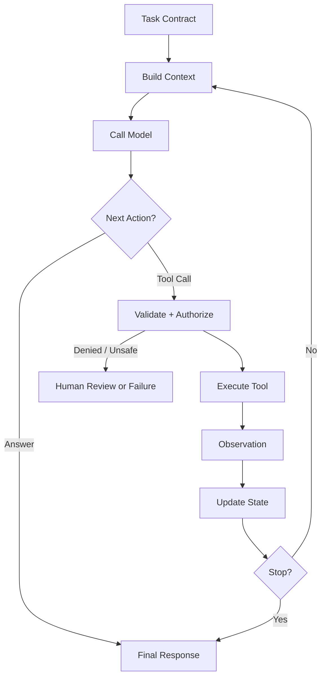

# 03. Minimal Harness / 最小 Agent Harness

> **本章副标题 / Subtitle**  
> 中文：一个 Agent Harness 的最小闭环  
> English: The minimal closed loop of an Agent Harness

## 1. Chapter Thesis / 本章命题

**中文**：最小 Harness 不是一堆功能模块，而是一个闭环：构造上下文、调用模型、选择动作、执行工具、观察结果、更新状态、决定继续或停止。

**English**: A minimal harness is not a collection of modules. It is a closed loop: build context, call the model, select an action, execute tools, observe results, update state, and decide whether to continue or stop.

## 2. How This Chapter Connects / 前后关联

**中文**：上一章定义了任务和边界。本章把这些定义落到一个最小执行系统。后续章节会分别展开上下文、工具、状态、运行时和评测等部件。

**English**: The previous chapter defined tasks and boundaries. This chapter turns those definitions into a minimal execution system. Later chapters expand context, tools, state, runtime, and evaluation.

Previous / 上一章：[02. Task, Environment and Boundary](course-02.html) | Next / 下一章：[04. Context as Information Boundary](course-04.html)

## 3. Learning Outcomes / 学习目标

- 中文：解释 `Minimal Harness` 在 Agent Harness 中解决的工程问题。  
  English: Explain the engineering problem solved by `Minimal Harness` inside an Agent Harness.
- 中文：用本章思维模型审查一个真实 Agent 设计。  
  English: Use this chapter's mental model to review a real agent design.
- 中文：产出本章对应的设计 artifact，并把它接入 Course Builder Harness 贯穿案例。  
  English: Produce the chapter artifact and connect it to the Course Builder Harness case study.
- 中文：识别本章相关的典型失败模式。  
  English: Identify typical failure modes related to this chapter.

## 4. The Engineering Problem / 工程问题

**中文**：如果没有最小闭环，团队很容易把 Agent 系统理解成一次模型调用。实际 Agent 任务往往需要多步执行，每一步都可能引入新信息、新错误和新风险。Harness 的最小形态必须显式管理这些步骤。

**English**: Without a minimal loop, teams often treat an agent system as a single model call. Real agent tasks frequently require multi-step execution, and each step can introduce new information, new errors, and new risks. The minimal harness must explicitly manage these steps.

## 5. Mental Model / 思维模型

**中文**：把 Harness 看成一个小型操作系统。模型不是操作系统本身，而是其中的推理进程。Harness 负责任务调度、输入构造、外部调用、状态保存、错误处理和终止判断。

**English**: Think of the harness as a small operating system. The model is not the operating system; it is a reasoning process inside it. The harness handles task scheduling, input construction, external calls, state persistence, error handling, and termination.

## 6. Harness Abstraction / Harness 抽象

### Context Builder / 上下文构造器
- 中文：根据任务、状态、环境和策略选择模型本轮应看到的信息。
- English: Selects what the model should see in the current step based on task, state, environment, and policy.

### Model Step / 模型步骤
- 中文：根据上下文生成下一步判断：回答、调用工具、请求澄清或停止。
- English: Generates the next decision from context: answer, tool call, clarification, or stop.

### Action Selector / 动作选择器
- 中文：把模型意图映射到受控动作，并进行 schema 校验、权限判断和风险分类。
- English: Maps model intent to a controlled action and performs schema validation, permission checks, and risk classification.

### Tool Executor / 工具执行器
- 中文：执行外部动作并返回结构化观察结果。
- English: Executes external actions and returns structured observations.

### State Update / 状态更新
- 中文：把每一步结果写入显式状态，使下一步不依赖隐含上下文。
- English: Writes each step result into explicit state so the next step does not depend on hidden context.

### Stop Condition / 停止条件
- 中文：判断任务完成、失败、超时、需要人工介入或成本超限。
- English: Determines whether the task is complete, failed, timed out, requires human intervention, or exceeded budget.

## 7. Reference Diagram / 参考图



## 8. Design Principles / 设计原则

- **中文**：每一步都应该显式化：输入、决策、动作、观察、状态。  
  **English**: Make every step explicit: input, decision, action, observation, and state.
- **中文**：模型输出不是动作本身，动作必须经过 Harness 验证。  
  **English**: Model output is not the action itself; actions must be validated by the harness.
- **中文**：停止条件与继续条件同样重要。  
  **English**: Stop conditions are as important as continuation conditions.
- **中文**：最小闭环应框架无关，具体框架只是实现选择。  
  **English**: The minimal loop should be framework-independent; specific frameworks are implementation choices.

## 9. Reference Implementation Direction / 参考实现方向

**中文**：本课程强调“思维 > 具体方案”。参考实现的作用是帮助理解抽象，不应把某个框架、SDK 或协议等同于 Harness 本身。实现时建议先写清楚边界、状态和失败路径，再选择具体技术。

**English**: This course emphasizes “thinking > specific solution.” A reference implementation exists to explain the abstraction; no framework, SDK, or protocol should be equated with the harness itself. In implementation, specify boundaries, state, and failure paths before choosing technologies.

Recommended implementation notes / 推荐实现备注：
- 中文：用 Markdown 或 YAML 保存设计决策，便于版本化和评审。  
  English: Store design decisions in Markdown or YAML so they can be versioned and reviewed.
- 中文：把本章 artifact 放入仓库的 `docs/design/` 或 `labs/` 目录。  
  English: Place this chapter artifact under `docs/design/` or `labs/` in the repository.
- 中文：每次修改抽象边界后，都要更新相邻章节的接口假设。  
  English: Whenever an abstraction boundary changes, update the interface assumptions of adjacent chapters.

## 10. Failure Modes / 失效模式

### Single-call illusion
- 中文：把多步任务压成一次模型调用，导致错误无法分解和恢复。
- English: Compresses a multi-step task into one model call, making errors hard to isolate and recover.

### Implicit state
- 中文：状态只存在于对话文本中，无法校验、迁移或恢复。
- English: State exists only in conversation text, making it hard to validate, migrate, or recover.

### Unvalidated actions
- 中文：模型生成的工具参数直接执行，缺少 schema、权限和风险检查。
- English: Tool arguments generated by the model are executed directly without schema, permission, or risk checks.

### No stop guard
- 中文：Agent 循环无法判断何时停止，产生无限循环或成本失控。
- English: The loop cannot decide when to stop, causing infinite loops or uncontrolled cost.

## 11. Lab: Course Builder Harness / 实验：课程构建 Harness

1. 中文：写一个最小 loop 伪代码。  
   English: Write minimal loop pseudocode.
2. 中文：定义 state 对象中至少五个字段，例如 task_id、current_step、files_touched、observations、risk_level。  
   English: Define at least five fields in the state object, such as task_id, current_step, files_touched, observations, and risk_level.
3. 中文：定义三类 next action：answer、tool_call、request_approval。  
   English: Define three next-action types: answer, tool_call, and request_approval.
4. 中文：定义三个 stop condition：success、failure、human_required。  
   English: Define three stop conditions: success, failure, and human_required.

**Expected artifact / 预期产物**：一个最小 Harness loop 的伪代码和状态 schema。 / Pseudocode and a state schema for a minimal harness loop.

## 12. Review Checklist / 复盘清单

- [ ] 中文：我能在自己的设计中落实：每一步都应该显式化：输入、决策、动作、观察、状态。  
      English: I can apply this principle in my own design: Make every step explicit: input, decision, action, observation, and state.
- [ ] 中文：我能在自己的设计中落实：模型输出不是动作本身，动作必须经过 Harness 验证。  
      English: I can apply this principle in my own design: Model output is not the action itself; actions must be validated by the harness.
- [ ] 中文：我能在自己的设计中落实：停止条件与继续条件同样重要。  
      English: I can apply this principle in my own design: Stop conditions are as important as continuation conditions.
- [ ] 中文：我能识别并避免 `Single-call illusion`：把多步任务压成一次模型调用，导致错误无法分解和恢复。  
      English: I can identify and avoid `Single-call illusion`: Compresses a multi-step task into one model call, making errors hard to isolate and recover.
- [ ] 中文：我能识别并避免 `Implicit state`：状态只存在于对话文本中，无法校验、迁移或恢复。  
      English: I can identify and avoid `Implicit state`: State exists only in conversation text, making it hard to validate, migrate, or recover.

## 13. Image Descriptions / 图片描述

### 闭环运行图
- 中文图像描述：用循环箭头表示 Build Context、Model、Tool、Observation、State、Stop Condition，强调 Harness 是循环系统。
- English image prompt: A closed-loop diagram showing Build Context, Model, Tool, Observation, State, and Stop Condition.

### 状态时间线
- 中文图像描述：横轴是 step 1、step 2、step 3，每一步显示 context、decision、tool call、observation、state diff。
- English image prompt: A timeline with step 1, step 2, and step 3, each showing context, decision, tool call, observation, and state diff.

## Reference Pseudocode / 参考伪代码

```python
state = initialize_state(task_contract)

while not state.done:
    context = build_context(task_contract, state)
    model_decision = call_model(context)
    action = parse_and_validate(model_decision)

    if action.requires_approval:
        state = request_human_review(state, action)
        continue

    if action.type == "tool_call":
        observation = execute_tool(action)
        state = update_state(state, observation)
    elif action.type == "final_answer":
        state.final_answer = action.content
        state.done = True
    else:
        state = mark_failure(state, reason="unknown_action")

    state = apply_stop_guards(state)
```

## 14. Key Takeaways / 关键总结

- 中文：`Minimal Harness` 不是孤立模块，而是 Agent Harness 处理不确定性的一层工程边界。
- English: `Minimal Harness` is not an isolated module; it is one engineering boundary through which the Agent Harness handles uncertainty.
- 中文：具体工具会变化，但本章的判断问题应保持稳定：边界是什么，证据在哪里，失败如何恢复。
- English: Specific tools will change, but the chapter’s judgment questions should remain stable: what is the boundary, where is the evidence, and how does failure recover?
