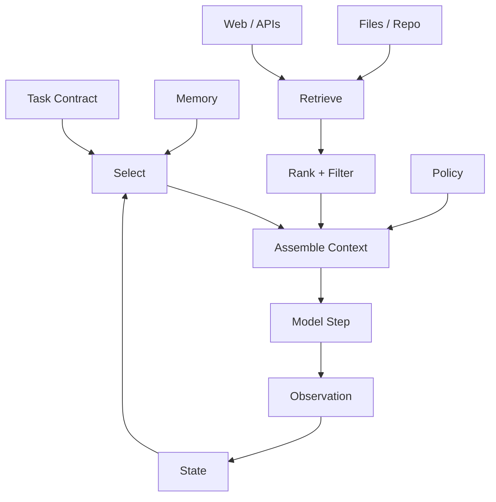

# 04. Context as Information Boundary / 上下文作为信息边界

> **本章副标题 / Subtitle**  
> 中文：Context Engineering 不只是 Prompt Engineering  
> English: Context engineering is more than prompt engineering

## 1. Chapter Thesis / 本章命题

**中文**：上下文不是把更多文字塞进窗口，而是决定 Agent 在某一步应该知道什么、不应该知道什么、以什么顺序知道、凭什么信任这些信息。

**English**: Context is not about stuffing more text into a window. It is the decision about what the agent should know at a step, what it should not know, in what order it should know it, and why it should trust that information.

## 2. How This Chapter Connects / 前后关联

**中文**：上一章的最小闭环从 Build Context 开始。本章展开这个环节：上下文是 Harness 的信息边界。下一章会讨论动作边界，即 Tools 和 MCP。

**English**: The previous chapter’s minimal loop begins with Build Context. This chapter expands that stage: context is the harness’s information boundary. The next chapter covers the action boundary: Tools and MCP.

Previous / 上一章：[03. Minimal Harness](course-03.html) | Next / 下一章：[05. Tools and MCP as Action Boundary](course-05.html)

## 3. Learning Outcomes / 学习目标

- 中文：解释 `Context as Information Boundary` 在 Agent Harness 中解决的工程问题。  
  English: Explain the engineering problem solved by `Context as Information Boundary` inside an Agent Harness.
- 中文：用本章思维模型审查一个真实 Agent 设计。  
  English: Use this chapter's mental model to review a real agent design.
- 中文：产出本章对应的设计 artifact，并把它接入 Course Builder Harness 贯穿案例。  
  English: Produce the chapter artifact and connect it to the Course Builder Harness case study.
- 中文：识别本章相关的典型失败模式。  
  English: Identify typical failure modes related to this chapter.

## 4. The Engineering Problem / 工程问题

**中文**：模型常常不是因为缺少能力而失败，而是因为看到的信息错误、过多、过旧、无关或被污染。Context Engineering 的目标不是最大化信息量，而是构造一个足够、相关、可信、低噪声的信息边界。

**English**: Models often fail not because they lack capability, but because they see information that is wrong, excessive, stale, irrelevant, or polluted. Context engineering is not about maximizing information volume; it is about constructing a sufficient, relevant, trustworthy, low-noise information boundary.

## 5. Mental Model / 思维模型

**中文**：把上下文看成 Agent 的工作台。工作台上应该摆放当前任务真正需要的资料、工具说明、约束、状态和证据，而不是把整个仓库、所有历史聊天和所有搜索结果堆上去。

**English**: Think of context as the agent’s workbench. The workbench should contain task-relevant materials, tool instructions, constraints, state, and evidence—not the entire repository, all past chats, and every search result.

## 6. Harness Abstraction / Harness 抽象

### Task context / 任务上下文
- 中文：当前目标、约束、输入、输出格式和成功标准。
- English: The current goal, constraints, inputs, output format, and success criteria.

### Environment context / 环境上下文
- 中文：来自文件、网页、数据库、API、repo 的当前事实。
- English: Current facts from files, web pages, databases, APIs, or repositories.

### Historical context / 历史上下文
- 中文：过去步骤、会话、决策和用户偏好。必须经过筛选，而不是全部注入。
- English: Past steps, sessions, decisions, and user preferences. It must be selected, not injected wholesale.

### Policy context / 策略上下文
- 中文：安全、权限、审批和输出规范。它决定模型不只是知道事实，还知道边界。
- English: Safety, permission, approval, and output rules. It tells the model not only facts but boundaries.

### Context budget / 上下文预算
- 中文：有限窗口中的信息分配策略，包含 token、注意力、顺序和噪声预算。
- English: The allocation strategy for a finite window, including token, attention, ordering, and noise budgets.

### Provenance / 来源可追溯性
- 中文：重要信息应保留来源、时间、置信度和使用理由。
- English: Important information should retain source, time, confidence, and reason for use.

## 7. Reference Diagram / 参考图

## 8. Design Principles / 设计原则

- **中文**：相关性优先于数量。  
  **English**: Relevance over volume.
- **中文**：新鲜度、来源和置信度应成为上下文的一部分。  
  **English**: Freshness, provenance, and confidence should be part of context.
- **中文**：上下文应分层：任务、状态、证据、策略不要混在一起。  
  **English**: Context should be layered: task, state, evidence, and policy should not be mixed together.
- **中文**：避免把长期记忆直接当作事实注入。  
  **English**: Avoid injecting long-term memory as facts without validation.
- **中文**：上下文构造必须可回放。  
  **English**: Context construction must be replayable.

## 9. Reference Implementation Direction / 参考实现方向

**中文**：本课程强调“思维 > 具体方案”。参考实现的作用是帮助理解抽象，不应把某个框架、SDK 或协议等同于 Harness 本身。实现时建议先写清楚边界、状态和失败路径，再选择具体技术。

**English**: This course emphasizes “thinking > specific solution.” A reference implementation exists to explain the abstraction; no framework, SDK, or protocol should be equated with the harness itself. In implementation, specify boundaries, state, and failure paths before choosing technologies.

Recommended implementation notes / 推荐实现备注：
- 中文：用 Markdown 或 YAML 保存设计决策，便于版本化和评审。  
  English: Store design decisions in Markdown or YAML so they can be versioned and reviewed.
- 中文：把本章 artifact 放入仓库的 `docs/design/` 或 `labs/` 目录。  
  English: Place this chapter artifact under `docs/design/` or `labs/` in the repository.
- 中文：每次修改抽象边界后，都要更新相邻章节的接口假设。  
  English: Whenever an abstraction boundary changes, update the interface assumptions of adjacent chapters.

## 10. Failure Modes / 失效模式

### Context overload
- 中文：塞入大量无关资料，稀释模型注意力。
- English: Injects large amounts of irrelevant material and dilutes model attention.

### Context poisoning
- 中文：不可信来源或 prompt injection 混入上下文。
- English: Untrusted sources or prompt injection enter the context.

### Stale context
- 中文：使用过期资料，导致 Agent 依据旧事实行动。
- English: Uses stale information, causing the agent to act on old facts.

### Hidden context dependency
- 中文：系统表现依赖某段未记录或不可复现的上下文。
- English: System behavior depends on context that is not recorded or reproducible.

## 11. Lab: Course Builder Harness / 实验：课程构建 Harness

1. 中文：为课程维护场景设计 context layers：task、repo snapshot、style guide、chapter state、policy。  
   English: Design context layers for the course-maintenance case: task, repo snapshot, style guide, chapter state, and policy.
2. 中文：为每层定义来源、刷新频率、最大 token 预算和可信度。  
   English: Define source, refresh frequency, max token budget, and trust level for each layer.
3. 中文：写一个 context assembly order，说明哪类信息放前面、哪类放后面。  
   English: Write a context assembly order and explain which information goes first or later.
4. 中文：设计一个上下文污染防护规则。  
   English: Design one rule to defend against context pollution.

**Expected artifact / 预期产物**：Context Pipeline 设计文档。 / A Context Pipeline design document.

## 12. Review Checklist / 复盘清单

- [ ] 中文：我能在自己的设计中落实：相关性优先于数量。  
      English: I can apply this principle in my own design: Relevance over volume.
- [ ] 中文：我能在自己的设计中落实：新鲜度、来源和置信度应成为上下文的一部分。  
      English: I can apply this principle in my own design: Freshness, provenance, and confidence should be part of context.
- [ ] 中文：我能在自己的设计中落实：上下文应分层：任务、状态、证据、策略不要混在一起。  
      English: I can apply this principle in my own design: Context should be layered: task, state, evidence, and policy should not be mixed together.
- [ ] 中文：我能识别并避免 `Context overload`：塞入大量无关资料，稀释模型注意力。  
      English: I can identify and avoid `Context overload`: Injects large amounts of irrelevant material and dilutes model attention.
- [ ] 中文：我能识别并避免 `Context poisoning`：不可信来源或 prompt injection 混入上下文。  
      English: I can identify and avoid `Context poisoning`: Untrusted sources or prompt injection enter the context.

## 13. Image Descriptions / 图片描述

### 信息边界剖面图
- 中文图像描述：像洋葱层一样展示 system policy、task contract、state、retrieved evidence、tool observations，不同颜色表示不同可信级别。
- English image prompt: An onion-layer diagram showing system policy, task contract, state, retrieved evidence, and tool observations with different trust levels.

### 上下文工作台
- 中文图像描述：一张桌面上有任务卡、证据卡、状态板、策略手册，远处堆着未选入的资料。
- English image prompt: A workbench with task cards, evidence cards, state board, and policy manual, while unused materials remain outside the desk.

## 14. Key Takeaways / 关键总结

- 中文：`Context as Information Boundary` 不是孤立模块，而是 Agent Harness 处理不确定性的一层工程边界。
- English: `Context as Information Boundary` is not an isolated module; it is one engineering boundary through which the Agent Harness handles uncertainty.
- 中文：具体工具会变化，但本章的判断问题应保持稳定：边界是什么，证据在哪里，失败如何恢复。
- English: Specific tools will change, but the chapter’s judgment questions should remain stable: what is the boundary, where is the evidence, and how does failure recover?
