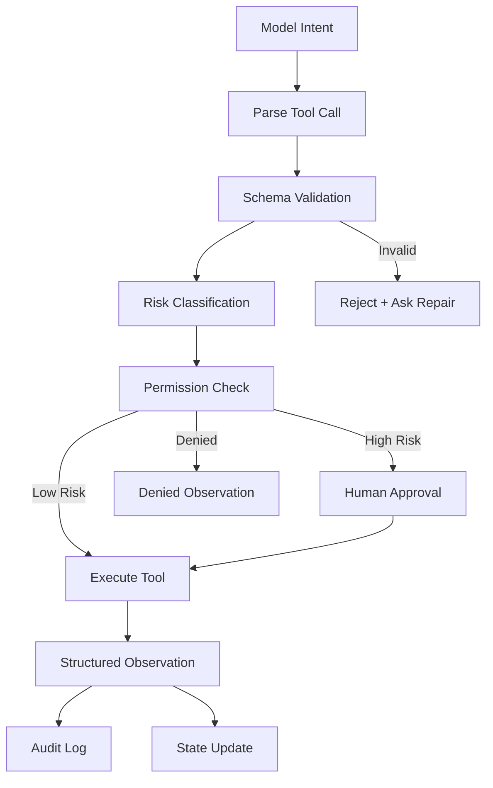

# 05. Tools and MCP as Action Boundary / 工具与 MCP 作为动作边界

> **本章副标题 / Subtitle**  
> 中文：工具不是插件，而是受控副作用  
> English: Tools are not plugins; they are controlled side effects

## 1. Chapter Thesis / 本章命题

**中文**：工具让 Agent 从“会说”变成“会做”。一旦 Agent 能做事，就必须把工具视为动作边界：每个动作都需要契约、权限、审计、隔离和恢复策略。

**English**: Tools turn an agent from something that can speak into something that can act. Once an agent can act, tools must be treated as action boundaries: every action needs a contract, permission, audit, isolation, and recovery strategy.

## 2. How This Chapter Connects / 前后关联

**中文**：上一章讨论 Agent 能看到什么。本章讨论 Agent 能改变什么。下一章会讨论这些动作结果如何进入状态、会话和记忆。

**English**: The previous chapter covered what the agent can see. This chapter covers what the agent can change. The next chapter explains how action results enter state, sessions, and memory.

Previous / 上一章：[04. Context as Information Boundary](course-04.html) | Next / 下一章：[06. State, Session and Memory](course-06.html)

## 3. Learning Outcomes / 学习目标

- 中文：解释 `Tools and MCP as Action Boundary` 在 Agent Harness 中解决的工程问题。  
  English: Explain the engineering problem solved by `Tools and MCP as Action Boundary` inside an Agent Harness.
- 中文：用本章思维模型审查一个真实 Agent 设计。  
  English: Use this chapter's mental model to review a real agent design.
- 中文：产出本章对应的设计 artifact，并把它接入 Course Builder Harness 贯穿案例。  
  English: Produce the chapter artifact and connect it to the Course Builder Harness case study.
- 中文：识别本章相关的典型失败模式。  
  English: Identify typical failure modes related to this chapter.

## 4. The Engineering Problem / 工程问题

**中文**：很多系统把工具调用当作“给模型增加功能”。但工具连接的是真实外部世界：文件会被改、邮件会被发、数据会被泄露、服务会被调用。工具带来的是副作用，因此必须被工程化控制。

**English**: Many systems treat tool calling as adding features to the model. But tools connect to the real external world: files can be modified, emails sent, data leaked, and services called. Tools create side effects, so they must be engineered and controlled.

## 5. Mental Model / 思维模型

**中文**：把工具看成 Agent 的机械臂。模型可以提出动作意图，但机械臂不能直接听命于模型。它必须经过动作解析、参数校验、权限检查、风险分类、可能的人工审批，再执行。

**English**: Think of tools as the agent’s robotic arms. The model may propose an action, but the arm should not obey the model directly. It must pass through action parsing, argument validation, permission checks, risk classification, possible human approval, and then execution.

## 6. Harness Abstraction / Harness 抽象

### Tool schema / 工具契约
- 中文：定义工具名称、参数、类型、约束、返回值和错误。它是模型与外部动作之间的协议。
- English: Defines tool name, arguments, types, constraints, return values, and errors. It is the contract between model intent and external action.

### Tool gateway / 工具网关
- 中文：所有工具调用进入统一控制层，进行权限、日志、限流、隔离和审计。
- English: A unified control layer through which all tool calls pass for permission, logging, rate limiting, isolation, and audit.

### MCP / 工具协议
- 中文：用于标准化模型应用与外部工具、资源、上下文之间的连接方式。课程中应把它作为一种协议思想，而不是唯一方案。
- English: A protocol approach for standardizing connections between model applications and external tools, resources, and context. Treat it as a protocol idea, not the only solution.

### Side effect / 副作用
- 中文：工具执行后对外部世界造成的变化，例如写文件、提交 PR、发送消息、发布页面。
- English: A change made to the external world after tool execution, such as writing files, opening PRs, sending messages, or publishing pages.

### Idempotency / 幂等性
- 中文：同一动作重复执行是否安全。它决定 retry 策略。
- English: Whether repeating the same action is safe. It determines retry strategy.

### Approval gate / 审批门
- 中文：高风险动作必须在人类确认后执行。
- English: A control point where high-risk actions require human approval before execution.

## 7. Reference Diagram / 参考图

## 8. Design Principles / 设计原则

- **中文**：模型可以提出动作，Harness 决定是否执行。  
  **English**: The model may propose actions; the harness decides whether to execute.
- **中文**：所有工具调用都要结构化、可校验、可记录。  
  **English**: All tool calls should be structured, validated, and recorded.
- **中文**：高风险动作默认需要人工审批。  
  **English**: High-risk actions require human approval by default.
- **中文**：工具越强，权限越细。  
  **English**: The more powerful the tool, the finer the permissions should be.
- **中文**：重试前先判断幂等性。  
  **English**: Check idempotency before retrying.

## 9. Reference Implementation Direction / 参考实现方向

**中文**：本课程强调“思维 > 具体方案”。参考实现的作用是帮助理解抽象，不应把某个框架、SDK 或协议等同于 Harness 本身。实现时建议先写清楚边界、状态和失败路径，再选择具体技术。

**English**: This course emphasizes “thinking > specific solution.” A reference implementation exists to explain the abstraction; no framework, SDK, or protocol should be equated with the harness itself. In implementation, specify boundaries, state, and failure paths before choosing technologies.

Recommended implementation notes / 推荐实现备注：
- 中文：用 Markdown 或 YAML 保存设计决策，便于版本化和评审。  
  English: Store design decisions in Markdown or YAML so they can be versioned and reviewed.
- 中文：把本章 artifact 放入仓库的 `docs/design/` 或 `labs/` 目录。  
  English: Place this chapter artifact under `docs/design/` or `labs/` in the repository.
- 中文：每次修改抽象边界后，都要更新相邻章节的接口假设。  
  English: Whenever an abstraction boundary changes, update the interface assumptions of adjacent chapters.

## 10. Failure Modes / 失效模式

### Tool soup
- 中文：工具很多，但没有统一网关、命名规范或风险分层。
- English: Many tools exist without a unified gateway, naming convention, or risk classification.

### Direct execution
- 中文：模型参数未经验证直接执行，造成误写、误删或误发。
- English: Model-generated arguments are executed without validation, causing wrong writes, deletions, or sends.

### Over-broad permissions
- 中文：Agent 获得远超任务所需的权限。
- English: The agent receives permissions far broader than the task requires.

### Unlogged side effects
- 中文：外部系统发生变化，但没有审计记录。
- English: External systems change without audit records.

## 11. Lab: Course Builder Harness / 实验：课程构建 Harness

1. 中文：为 Course Builder Harness 设计 6 个工具：read_file、search_repo、write_draft、run_build、open_pull_request、publish_pages。  
   English: Design six tools for Course Builder Harness: read_file, search_repo, write_draft, run_build, open_pull_request, and publish_pages.
2. 中文：给每个工具标记风险级别：read、draft、write、publish。  
   English: Assign a risk level to each tool: read, draft, write, or publish.
3. 中文：为 open_pull_request 和 publish_pages 设计 approval gate。  
   English: Design approval gates for open_pull_request and publish_pages.
4. 中文：写出一个工具调用失败时的 structured observation 格式。  
   English: Write a structured observation format for a failed tool call.

**Expected artifact / 预期产物**：Tool Registry 与 Permission Matrix。 / A Tool Registry and Permission Matrix.

## 12. Review Checklist / 复盘清单

- [ ] 中文：我能在自己的设计中落实：模型可以提出动作，Harness 决定是否执行。  
      English: I can apply this principle in my own design: The model may propose actions; the harness decides whether to execute.
- [ ] 中文：我能在自己的设计中落实：所有工具调用都要结构化、可校验、可记录。  
      English: I can apply this principle in my own design: All tool calls should be structured, validated, and recorded.
- [ ] 中文：我能在自己的设计中落实：高风险动作默认需要人工审批。  
      English: I can apply this principle in my own design: High-risk actions require human approval by default.
- [ ] 中文：我能识别并避免 `Tool soup`：工具很多，但没有统一网关、命名规范或风险分层。  
      English: I can identify and avoid `Tool soup`: Many tools exist without a unified gateway, naming convention, or risk classification.
- [ ] 中文：我能识别并避免 `Direct execution`：模型参数未经验证直接执行，造成误写、误删或误发。  
      English: I can identify and avoid `Direct execution`: Model-generated arguments are executed without validation, causing wrong writes, deletions, or sends.

## 13. Image Descriptions / 图片描述

### 工具网关图
- 中文图像描述：模型意图经过 schema validation、permission check、approval gate、executor、audit log，像机场安检一样层层通过。
- English image prompt: A tool gateway diagram where model intent passes through schema validation, permission check, approval gate, executor, and audit log like an airport security process.

### 副作用风险阶梯
- 中文图像描述：从 read 到 draft 到 write 到 publish 的四级阶梯，每一级对应不同权限和审批要求。
- English image prompt: A side-effect risk ladder from read to draft to write to publish, with different permissions and approval requirements at each level.

## 14. Key Takeaways / 关键总结

- 中文：`Tools and MCP as Action Boundary` 不是孤立模块，而是 Agent Harness 处理不确定性的一层工程边界。
- English: `Tools and MCP as Action Boundary` is not an isolated module; it is one engineering boundary through which the Agent Harness handles uncertainty.
- 中文：具体工具会变化，但本章的判断问题应保持稳定：边界是什么，证据在哪里，失败如何恢复。
- English: Specific tools will change, but the chapter’s judgment questions should remain stable: what is the boundary, where is the evidence, and how does failure recover?
