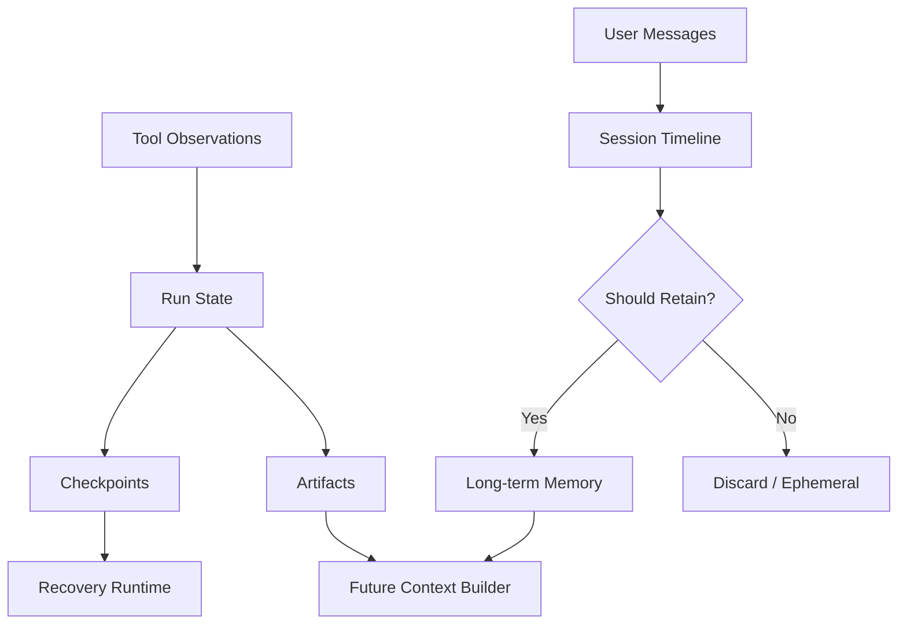

# 06. State, Session and Memory / 状态、会话与记忆

> **本章副标题 / Subtitle**  
> 中文：连续性不是记住更多，而是管理状态  
> English: Continuity is state management, not remembering more

## 1. Chapter Thesis / 本章命题

**中文**：Agent 的连续性来自显式状态管理，而不是把所有历史都塞回上下文。Memory 的本质是策略：什么值得带到未来、保留多久、如何纠错、何时删除。

**English**: Agent continuity comes from explicit state management, not from injecting all history back into context. Memory is fundamentally a policy: what is worth carrying into the future, how long to keep it, how to correct it, and when to delete it.

## 2. How This Chapter Connects / 前后关联

**中文**：上一章说明工具动作如何产生 observation。本章讨论这些 observation 如何成为状态、会话、记忆或 artifact。下一章会讨论运行时如何使用这些状态进行规划、恢复和终止。

**English**: The previous chapter explained how tool actions produce observations. This chapter explains how observations become state, sessions, memory, or artifacts. The next chapter shows how runtime uses state for planning, recovery, and termination.

Previous / 上一章：[05. Tools and MCP as Action Boundary](course-05.html) | Next / 下一章：[07. Runtime Control](course-07.html)

## 3. Learning Outcomes / 学习目标

- 中文：解释 `State, Session and Memory` 在 Agent Harness 中解决的工程问题。  
  English: Explain the engineering problem solved by `State, Session and Memory` inside an Agent Harness.
- 中文：用本章思维模型审查一个真实 Agent 设计。  
  English: Use this chapter's mental model to review a real agent design.
- 中文：产出本章对应的设计 artifact，并把它接入 Course Builder Harness 贯穿案例。  
  English: Produce the chapter artifact and connect it to the Course Builder Harness case study.
- 中文：识别本章相关的典型失败模式。  
  English: Identify typical failure modes related to this chapter.

## 4. The Engineering Problem / 工程问题

**中文**：Agent 需要跨步骤保持连续性，但简单地把所有聊天记录、工具结果和用户偏好拼接回来，会造成噪声、隐私风险、错误固化和不可控行为。Harness 必须区分运行状态、会话历史、长期记忆和产物，并对每类信息设置生命周期。

**English**: Agents need continuity across steps, but simply concatenating all chat history, tool results, and user preferences creates noise, privacy risk, error fossilization, and uncontrolled behavior. The harness must distinguish runtime state, session history, long-term memory, and artifacts, and assign lifecycle rules to each.

## 5. Mental Model / 思维模型

**中文**：把状态看成正在执行任务的白板，把会话看成一次工作期间的时间线，把记忆看成经过批准进入长期档案的信息，把 artifact 看成任务产生的外部产物。它们都不是同一种东西。

**English**: Think of state as a whiteboard for the current task, session as the timeline of a work period, memory as approved information entering long-term records, and artifacts as external outputs created by the task. They are not the same thing.

## 6. Harness Abstraction / Harness 抽象

### State / 状态
- 中文：当前 run 的显式变量：目标、步骤、已完成动作、待处理错误、文件变更、风险级别。
- English: Explicit variables for the current run: goal, steps, completed actions, pending errors, file changes, and risk level.

### Session / 会话
- 中文：一次连续交互或工作过程的上下文边界。Session 不一定都要进入长期记忆。
- English: The contextual boundary of one continuous interaction or work period. A session does not necessarily become long-term memory.

### Memory / 记忆
- 中文：跨会话保留的信息。它应该经过选择、验证、过期和删除策略。
- English: Information retained across sessions. It should pass through selection, validation, expiration, and deletion policies.

### Profile / 用户画像
- 中文：相对稳定的用户偏好、风格、约束和常用环境，但必须可编辑和可撤销。
- English: Relatively stable user preferences, style, constraints, and common environments, but it must be editable and revocable.

### Artifact / 产物
- 中文：Agent 创建或修改的持久对象，例如 Markdown、PR、报告、表格、图像。
- English: Persistent objects created or modified by the agent, such as Markdown, PRs, reports, spreadsheets, or images.

### Checkpoint / 检查点
- 中文：可恢复的中间状态，用于中断、回滚、重试和调试。
- English: A recoverable intermediate state used for interruption, rollback, retry, and debugging.

## 7. Reference Diagram / 参考图

## 8. Design Principles / 设计原则

- **中文**：状态必须显式化，不要隐含在聊天文本中。  
  **English**: State must be explicit, not hidden in chat text.
- **中文**：记忆需要写入策略，不是默认全量保存。  
  **English**: Memory requires write policy, not default full retention.
- **中文**：长期记忆必须可纠错、可过期、可删除。  
  **English**: Long-term memory must be correctable, expirable, and deletable.
- **中文**：区分用户偏好、事实、推断和临时任务信息。  
  **English**: Distinguish user preferences, facts, inferences, and temporary task information.
- **中文**：Artifacts 是真实结果，不应与内部状态混淆。  
  **English**: Artifacts are real outputs and should not be confused with internal state.

## 9. Reference Implementation Direction / 参考实现方向

**中文**：本课程强调“思维 > 具体方案”。参考实现的作用是帮助理解抽象，不应把某个框架、SDK 或协议等同于 Harness 本身。实现时建议先写清楚边界、状态和失败路径，再选择具体技术。

**English**: This course emphasizes “thinking > specific solution.” A reference implementation exists to explain the abstraction; no framework, SDK, or protocol should be equated with the harness itself. In implementation, specify boundaries, state, and failure paths before choosing technologies.

Recommended implementation notes / 推荐实现备注：
- 中文：用 Markdown 或 YAML 保存设计决策，便于版本化和评审。  
  English: Store design decisions in Markdown or YAML so they can be versioned and reviewed.
- 中文：把本章 artifact 放入仓库的 `docs/design/` 或 `labs/` 目录。  
  English: Place this chapter artifact under `docs/design/` or `labs/` in the repository.
- 中文：每次修改抽象边界后，都要更新相邻章节的接口假设。  
  English: Whenever an abstraction boundary changes, update the interface assumptions of adjacent chapters.

## 10. Failure Modes / 失效模式

### Memory dump
- 中文：把全部历史塞入上下文，产生噪声和隐私风险。
- English: Injects all history into context, creating noise and privacy risk.

### False memory
- 中文：Agent 把一次错误推断固化成长期事实。
- English: The agent turns a mistaken inference into a long-term fact.

### State hidden in prompt
- 中文：关键执行状态只存在于 prompt 中，无法恢复和审计。
- English: Key execution state exists only in the prompt, making recovery and audit hard.

### No forgetting
- 中文：过期、不再适用或用户撤销的信息仍被使用。
- English: Expired, obsolete, or revoked information continues to be used.

## 11. Lab: Course Builder Harness / 实验：课程构建 Harness

1. 中文：为课程维护任务定义 run_state schema。  
   English: Define a run_state schema for the course-maintenance task.
2. 中文：设计 memory write policy：哪些信息可以写入长期记忆，哪些只能保留在 session 中。  
   English: Design a memory write policy: which information may enter long-term memory and which stays only in the session.
3. 中文：定义 artifact 类型：chapter markdown、image prompt、evaluation report、build log。  
   English: Define artifact types: chapter Markdown, image prompt, evaluation report, and build log.
4. 中文：设计一个 memory correction 流程。  
   English: Design a memory correction flow.

**Expected artifact / 预期产物**：State Schema 与 Memory Policy。 / A State Schema and Memory Policy.

## 12. Review Checklist / 复盘清单

- [ ] 中文：我能在自己的设计中落实：状态必须显式化，不要隐含在聊天文本中。  
      English: I can apply this principle in my own design: State must be explicit, not hidden in chat text.
- [ ] 中文：我能在自己的设计中落实：记忆需要写入策略，不是默认全量保存。  
      English: I can apply this principle in my own design: Memory requires write policy, not default full retention.
- [ ] 中文：我能在自己的设计中落实：长期记忆必须可纠错、可过期、可删除。  
      English: I can apply this principle in my own design: Long-term memory must be correctable, expirable, and deletable.
- [ ] 中文：我能识别并避免 `Memory dump`：把全部历史塞入上下文，产生噪声和隐私风险。  
      English: I can identify and avoid `Memory dump`: Injects all history into context, creating noise and privacy risk.
- [ ] 中文：我能识别并避免 `False memory`：Agent 把一次错误推断固化成长期事实。  
      English: I can identify and avoid `False memory`: The agent turns a mistaken inference into a long-term fact.

## 13. Image Descriptions / 图片描述

### 连续性分层图
- 中文图像描述：白板表示 state，时间线表示 session，档案柜表示 memory，文件夹表示 artifacts，展示它们之间的数据流。
- English image prompt: A layered continuity diagram: a whiteboard for state, a timeline for session, a filing cabinet for memory, and folders for artifacts, showing data flow among them.

### 记忆生命周期图
- 中文图像描述：候选记忆经过 select、verify、store、expire、correct、delete 六个阶段。
- English image prompt: A memory lifecycle diagram where candidate memory passes through select, verify, store, expire, correct, and delete.

## 14. Key Takeaways / 关键总结

- 中文：`State, Session and Memory` 不是孤立模块，而是 Agent Harness 处理不确定性的一层工程边界。
- English: `State, Session and Memory` is not an isolated module; it is one engineering boundary through which the Agent Harness handles uncertainty.
- 中文：具体工具会变化，但本章的判断问题应保持稳定：边界是什么，证据在哪里，失败如何恢复。
- English: Specific tools will change, but the chapter’s judgment questions should remain stable: what is the boundary, where is the evidence, and how does failure recover?
