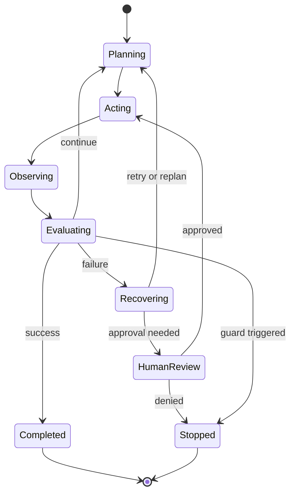

# 07. Runtime Control / 运行时控制

> **本章副标题 / Subtitle**  
> 中文：规划、执行与恢复  
> English: Planning, execution, and recovery

## 1. Chapter Thesis / 本章命题

**中文**：Agent 的智能来自模型，但可靠性来自运行时。Runtime Control 负责管理步骤、循环、错误、重试、回滚、中断、成本和人工介入。

**English**: Agent intelligence comes from the model, but reliability comes from the runtime. Runtime Control manages steps, loops, errors, retries, rollback, interruption, cost, and human intervention.

## 2. How This Chapter Connects / 前后关联

**中文**：前几章定义了上下文、工具和状态。本章把它们组织成可执行的运行时纪律。下一部分会讨论如何把能力封装成 skills 和 workflows。

**English**: The previous chapters defined context, tools, and state. This chapter organizes them into executable runtime discipline. The next part discusses packaging capability into skills and workflows.

Previous / 上一章：[06. State, Session and Memory](course-06.html) | Next / 下一章：[08. Skills as Capability Packaging](course-08.html)

## 3. Learning Outcomes / 学习目标

- 中文：解释 `Runtime Control` 在 Agent Harness 中解决的工程问题。  
  English: Explain the engineering problem solved by `Runtime Control` inside an Agent Harness.
- 中文：用本章思维模型审查一个真实 Agent 设计。  
  English: Use this chapter's mental model to review a real agent design.
- 中文：产出本章对应的设计 artifact，并把它接入 Course Builder Harness 贯穿案例。  
  English: Produce the chapter artifact and connect it to the Course Builder Harness case study.
- 中文：识别本章相关的典型失败模式。  
  English: Identify typical failure modes related to this chapter.

## 4. The Engineering Problem / 工程问题

**中文**：多步 Agent 任务不会按照理想路径线性前进。工具会失败，网页会变化，文件会冲突，用户会打断，模型会过度规划或忘记目标。Runtime 的职责是让这些不确定性被限制在可管理范围内。

**English**: Multi-step agent tasks do not follow an ideal linear path. Tools fail, pages change, files conflict, users interrupt, models over-plan or forget the goal. The runtime keeps these uncertainties within a manageable boundary.

## 5. Mental Model / 思维模型

**中文**：把 runtime 看成飞行控制系统。模型给出方向判断，但 runtime 负责航线、燃料、警报、备降、自动驾驶限制和飞行员接管。

**English**: Think of runtime as a flight-control system. The model provides directional judgment, but runtime manages route, fuel, alerts, fallback airports, autopilot limits, and pilot takeover.

## 6. Harness Abstraction / Harness 抽象

### Planning / 规划
- 中文：把目标分解为步骤、依赖和检查点。规划可以由模型生成，也可以由 workflow 约束。
- English: Decomposes goals into steps, dependencies, and checkpoints. Planning can be model-generated or workflow-constrained.

### Execution / 执行
- 中文：按照当前状态和权限执行下一步动作。
- English: Executes the next action according to current state and permissions.

### Observation / 观察
- 中文：把外部结果转为结构化反馈，而不是非结构化文本堆叠。
- English: Converts external results into structured feedback rather than unstructured text accumulation.

### Recovery / 恢复
- 中文：失败后决定重试、降级、回滚、请求人工帮助或终止。
- English: After failure, decides whether to retry, degrade, rollback, ask for human help, or stop.

### Loop guard / 循环保卫
- 中文：限制最大步数、最大成本、最大时间、重复动作和低进展循环。
- English: Limits maximum steps, cost, time, repeated actions, and low-progress loops.

### Human-in-the-loop / 人类介入
- 中文：在不确定、高风险或价值判断处引入人类决策。
- English: Introduces human decision-making at uncertain, high-risk, or value-laden points.

## 7. Reference Diagram / 参考图



## 8. Design Principles / 设计原则

- **中文**：Runtime 管理不确定性，而不是让模型自由发挥。  
  **English**: The runtime manages uncertainty rather than letting the model roam freely.
- **中文**：每个 retry 都需要原因、上限和幂等性判断。  
  **English**: Every retry needs a reason, limit, and idempotency check.
- **中文**：规划应该足够指导执行，但不应替代观察。  
  **English**: Planning should guide execution but not replace observation.
- **中文**：人工介入不是失败，而是 Harness 的控制能力。  
  **English**: Human intervention is not failure; it is a control capability of the harness.
- **中文**：成本、时间和步数都是运行时资源。  
  **English**: Cost, time, and step count are runtime resources.

## 9. Reference Implementation Direction / 参考实现方向

**中文**：本课程强调“思维 > 具体方案”。参考实现的作用是帮助理解抽象，不应把某个框架、SDK 或协议等同于 Harness 本身。实现时建议先写清楚边界、状态和失败路径，再选择具体技术。

**English**: This course emphasizes “thinking > specific solution.” A reference implementation exists to explain the abstraction; no framework, SDK, or protocol should be equated with the harness itself. In implementation, specify boundaries, state, and failure paths before choosing technologies.

Recommended implementation notes / 推荐实现备注：
- 中文：用 Markdown 或 YAML 保存设计决策，便于版本化和评审。  
  English: Store design decisions in Markdown or YAML so they can be versioned and reviewed.
- 中文：把本章 artifact 放入仓库的 `docs/design/` 或 `labs/` 目录。  
  English: Place this chapter artifact under `docs/design/` or `labs/` in the repository.
- 中文：每次修改抽象边界后，都要更新相邻章节的接口假设。  
  English: Whenever an abstraction boundary changes, update the interface assumptions of adjacent chapters.

## 10. Failure Modes / 失效模式

### Infinite loop
- 中文：Agent 反复执行相似动作但没有进展。
- English: The agent repeats similar actions without progress.

### Over-planning
- 中文：Agent 花大量步骤规划却不执行可验证动作。
- English: The agent spends many steps planning without executing verifiable actions.

### Blind retry
- 中文：工具失败后不分析原因直接重试。
- English: After tool failure, the system retries without analyzing the cause.

### No interruption model
- 中文：用户或系统打断后无法安全保存和恢复。
- English: The system cannot safely save and recover after user or system interruption.

## 11. Lab: Course Builder Harness / 实验：课程构建 Harness

1. 中文：为 Course Builder Harness 定义最大步数、最大成本和最大运行时间。  
   English: Define maximum steps, maximum cost, and maximum runtime for the Course Builder Harness.
2. 中文：设计 replan 条件：例如构建失败、文件冲突、目标变化。  
   English: Design replan conditions such as build failure, file conflict, or goal change.
3. 中文：设计 retry policy：哪些工具可以重试，哪些必须人工确认。  
   English: Design a retry policy: which tools may retry and which require human confirmation.
4. 中文：定义 user interruption 的恢复流程。  
   English: Define a recovery flow for user interruption.

**Expected artifact / 预期产物**：Runtime Policy 与 Stop Guard 设计。 / A Runtime Policy and Stop Guard design.

## 12. Review Checklist / 复盘清单

- [ ] 中文：我能在自己的设计中落实：Runtime 管理不确定性，而不是让模型自由发挥。  
      English: I can apply this principle in my own design: The runtime manages uncertainty rather than letting the model roam freely.
- [ ] 中文：我能在自己的设计中落实：每个 retry 都需要原因、上限和幂等性判断。  
      English: I can apply this principle in my own design: Every retry needs a reason, limit, and idempotency check.
- [ ] 中文：我能在自己的设计中落实：规划应该足够指导执行，但不应替代观察。  
      English: I can apply this principle in my own design: Planning should guide execution but not replace observation.
- [ ] 中文：我能识别并避免 `Infinite loop`：Agent 反复执行相似动作但没有进展。  
      English: I can identify and avoid `Infinite loop`: The agent repeats similar actions without progress.
- [ ] 中文：我能识别并避免 `Over-planning`：Agent 花大量步骤规划却不执行可验证动作。  
      English: I can identify and avoid `Over-planning`: The agent spends many steps planning without executing verifiable actions.

## 13. Image Descriptions / 图片描述

### 飞行控制类比图
- 中文图像描述：模型是导航判断，runtime 是仪表盘、燃料、警报、自动驾驶限制和人工接管按钮。
- English image prompt: A flight-control analogy: the model provides navigation judgment, while runtime provides dashboard, fuel, alerts, autopilot constraints, and manual takeover button.

### 运行时状态机
- 中文图像描述：Planning、Acting、Observing、Recovering、Human Review、Completed 之间的状态转换图。
- English image prompt: A runtime state machine showing transitions among Planning, Acting, Observing, Recovering, Human Review, and Completed.

## Runtime Guard Example / 运行时保护示例

```yaml
runtime_policy:
  max_steps: 20
  max_tool_calls: 12
  timeout_seconds: 300
  retry:
    read_file:
      max_attempts: 2
      idempotent: true
    publish_pages:
      max_attempts: 0
      requires_approval: true
  stop_when:
    - success_criteria_met
    - human_approval_denied
    - repeated_no_progress_steps >= 3
```

## 14. Key Takeaways / 关键总结

- 中文：`Runtime Control` 不是孤立模块，而是 Agent Harness 处理不确定性的一层工程边界。
- English: `Runtime Control` is not an isolated module; it is one engineering boundary through which the Agent Harness handles uncertainty.
- 中文：具体工具会变化，但本章的判断问题应保持稳定：边界是什么，证据在哪里，失败如何恢复。
- English: Specific tools will change, but the chapter’s judgment questions should remain stable: what is the boundary, where is the evidence, and how does failure recover?
