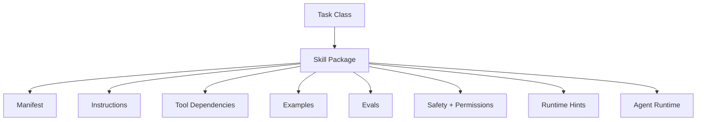

# 08. Skills as Capability Packaging / 技能作为能力封装

> **本章副标题 / Subtitle**  
> 中文：从一次性动作到可复用能力单元  
> English: From one-off action to reusable capability unit

## 1. Chapter Thesis / 本章命题

**中文**：Skill 不是单个 prompt，也不是单个 tool。Skill 是围绕一类任务目标封装的上下文、工具、步骤、约束、示例和评测标准。

**English**: A skill is not a single prompt and not a single tool. A skill packages context, tools, steps, constraints, examples, and evaluation criteria around a class of task goals.

## 2. How This Chapter Connects / 前后关联

**中文**：上一章建立了运行时控制。本章进入组合层：如何把多次成功经验封装为可复用能力。下一章会讨论 workflow 如何提供确定性支架。

**English**: The previous chapter established runtime control. This chapter moves into composition: how to package repeated successful behavior into reusable capability. The next chapter covers workflows as deterministic scaffolding.

Previous / 上一章：[07. Runtime Control](course-07.html) | Next / 下一章：[09. Workflows as Deterministic Scaffolding](course-09.html)

## 3. Learning Outcomes / 学习目标

- 中文：解释 `Skills as Capability Packaging` 在 Agent Harness 中解决的工程问题。  
  English: Explain the engineering problem solved by `Skills as Capability Packaging` inside an Agent Harness.
- 中文：用本章思维模型审查一个真实 Agent 设计。  
  English: Use this chapter's mental model to review a real agent design.
- 中文：产出本章对应的设计 artifact，并把它接入 Course Builder Harness 贯穿案例。  
  English: Produce the chapter artifact and connect it to the Course Builder Harness case study.
- 中文：识别本章相关的典型失败模式。  
  English: Identify typical failure modes related to this chapter.

## 4. The Engineering Problem / 工程问题

**中文**：如果每次任务都重新写 prompt、重新选择工具、重新解释流程，系统就无法积累能力。Skill 的意义是把一类任务的成功路径沉淀下来，让 Agent 能稳定复用，而不是每次从零探索。

**English**: If every task rewrites prompts, reselects tools, and re-explains the process, the system cannot accumulate capability. A skill captures a successful path for a class of tasks so the agent can reuse it reliably instead of exploring from scratch every time.

## 5. Mental Model / 思维模型

**中文**：把 skill 看成工程团队中的“标准作业能力包”。它告诉 Agent：面对这类任务，应该使用哪些信息、哪些工具、哪些步骤、哪些限制，以及如何判断结果好坏。

**English**: Think of a skill as a standard operating capability package. It tells the agent what information, tools, steps, constraints, and quality criteria to use for this class of task.

## 6. Harness Abstraction / Harness 抽象

### Skill manifest / 技能清单
- 中文：描述 skill 名称、目标、输入输出、依赖工具、权限、运行策略和版本。
- English: Describes skill name, goal, inputs, outputs, required tools, permissions, runtime policy, and version.

### Instruction bundle / 指令包
- 中文：该 skill 的具体操作原则、风格、约束和错误处理建议。
- English: The skill’s operating principles, style, constraints, and error-handling guidance.

### Examples / 示例
- 中文：高质量输入输出样例，帮助模型理解任务分布和质量标准。
- English: High-quality input-output examples that help the model understand task distribution and quality criteria.

### Evals / 评测
- 中文：用于判断 skill 是否仍然有效的测试集和 rubric。
- English: Tests and rubrics used to judge whether the skill remains effective.

### Skill registry / 技能注册表
- 中文：集中管理可用 skill、版本、依赖和授权范围。
- English: A central registry that manages available skills, versions, dependencies, and authorization scope.

## 7. Reference Diagram / 参考图



## 8. Design Principles / 设计原则

- **中文**：Skill 封装的是完成任务的方法，不只是调用工具的方法。  
  **English**: A skill packages how to complete a task, not only how to call tools.
- **中文**：每个 skill 都应该有适用范围和不适用范围。  
  **English**: Every skill should define where it applies and where it does not.
- **中文**：可复用能力必须可评测。  
  **English**: Reusable capability must be evaluable.
- **中文**：Skill 需要版本管理，因为能力封装会演化。  
  **English**: Skills need versioning because capability packages evolve.
- **中文**：不要把高风险权限隐含在 skill 中。  
  **English**: Do not hide high-risk permissions inside a skill.

## 9. Reference Implementation Direction / 参考实现方向

**中文**：本课程强调“思维 > 具体方案”。参考实现的作用是帮助理解抽象，不应把某个框架、SDK 或协议等同于 Harness 本身。实现时建议先写清楚边界、状态和失败路径，再选择具体技术。

**English**: This course emphasizes “thinking > specific solution.” A reference implementation exists to explain the abstraction; no framework, SDK, or protocol should be equated with the harness itself. In implementation, specify boundaries, state, and failure paths before choosing technologies.

Recommended implementation notes / 推荐实现备注：
- 中文：用 Markdown 或 YAML 保存设计决策，便于版本化和评审。  
  English: Store design decisions in Markdown or YAML so they can be versioned and reviewed.
- 中文：把本章 artifact 放入仓库的 `docs/design/` 或 `labs/` 目录。  
  English: Place this chapter artifact under `docs/design/` or `labs/` in the repository.
- 中文：每次修改抽象边界后，都要更新相邻章节的接口假设。  
  English: Whenever an abstraction boundary changes, update the interface assumptions of adjacent chapters.

## 10. Failure Modes / 失效模式

### Prompt fragment as skill
- 中文：只保存一段 prompt，却没有输入输出、工具、权限和评测。
- English: Stores only a prompt fragment without inputs, outputs, tools, permissions, or evaluation.

### Over-general skill
- 中文：一个 skill 试图覆盖过多任务，导致行为不稳定。
- English: One skill tries to cover too many tasks, causing unstable behavior.

### Unversioned skill
- 中文：修改 skill 后无法知道哪个版本导致回归。
- English: After modifying a skill, the team cannot know which version caused regression.

### Unsafe reuse
- 中文：在低风险场景设计的 skill 被复用到高风险场景。
- English: A skill designed for low-risk scenarios is reused in high-risk scenarios.

## 11. Lab: Course Builder Harness / 实验：课程构建 Harness

1. 中文：为 Course Builder Harness 定义 lesson_writer skill。  
   English: Define a lesson_writer skill for the Course Builder Harness.
2. 中文：写出 input_schema：topic、audience、chapter_position、source_materials、style_guide。  
   English: Write an input_schema: topic, audience, chapter_position, source_materials, and style_guide.
3. 中文：写出 output_schema：markdown、summary、image_descriptions、self_check。  
   English: Write an output_schema: markdown, summary, image_descriptions, and self_check.
4. 中文：设计三个 eval cases，用来判断 skill 是否稳定。  
   English: Design three eval cases to judge whether the skill is stable.

**Expected artifact / 预期产物**：一个完整 Skill Manifest。 / A complete Skill Manifest.

## 12. Review Checklist / 复盘清单

- [ ] 中文：我能在自己的设计中落实：Skill 封装的是完成任务的方法，不只是调用工具的方法。  
      English: I can apply this principle in my own design: A skill packages how to complete a task, not only how to call tools.
- [ ] 中文：我能在自己的设计中落实：每个 skill 都应该有适用范围和不适用范围。  
      English: I can apply this principle in my own design: Every skill should define where it applies and where it does not.
- [ ] 中文：我能在自己的设计中落实：可复用能力必须可评测。  
      English: I can apply this principle in my own design: Reusable capability must be evaluable.
- [ ] 中文：我能识别并避免 `Prompt fragment as skill`：只保存一段 prompt，却没有输入输出、工具、权限和评测。  
      English: I can identify and avoid `Prompt fragment as skill`: Stores only a prompt fragment without inputs, outputs, tools, permissions, or evaluation.
- [ ] 中文：我能识别并避免 `Over-general skill`：一个 skill 试图覆盖过多任务，导致行为不稳定。  
      English: I can identify and avoid `Over-general skill`: One skill tries to cover too many tasks, causing unstable behavior.

## 13. Image Descriptions / 图片描述

### 技能包 exploded view
- 中文图像描述：一个 skill 被拆开展示为 manifest、instructions、tools、examples、evals、policy、runtime hints。
- English image prompt: An exploded view of a skill package showing manifest, instructions, tools, examples, evals, policy, and runtime hints.

### 工具与技能对比图
- 中文图像描述：左边是单个 tool 的扳手图标，右边是 skill 的工具箱，强调 skill 是更高层能力封装。
- English image prompt: A comparison: a single wrench icon for a tool on the left, and a toolbox for a skill on the right, emphasizing that a skill is a higher-level capability package.

## Skill Manifest Template / 技能清单模板

```yaml
name: lesson_writer
version: 0.1.0
goal: Generate a bilingual course lesson in Markdown.
inputs:
  - topic
  - audience
  - chapter_position
  - source_materials
  - style_guide
outputs:
  - markdown
  - summary
  - image_descriptions
  - self_check
tools:
  - read_file
  - search_repo
  - write_draft
permissions:
  default: draft_only
evals:
  - structure_completeness
  - bilingual_consistency
  - philosophy_alignment
```

## 14. Key Takeaways / 关键总结

- 中文：`Skills as Capability Packaging` 不是孤立模块，而是 Agent Harness 处理不确定性的一层工程边界。
- English: `Skills as Capability Packaging` is not an isolated module; it is one engineering boundary through which the Agent Harness handles uncertainty.
- 中文：具体工具会变化，但本章的判断问题应保持稳定：边界是什么，证据在哪里，失败如何恢复。
- English: Specific tools will change, but the chapter’s judgment questions should remain stable: what is the boundary, where is the evidence, and how does failure recover?
