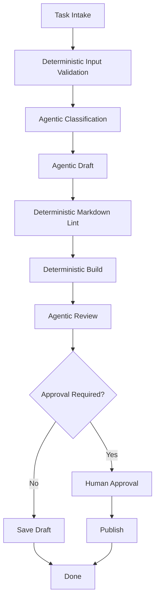

# 09. Workflows as Deterministic Scaffolding / 工作流作为确定性支架

> **本章副标题 / Subtitle**  
> 中文：把确定性留给代码，把不确定性留给模型  
> English: Leave determinism to code and uncertainty to the model

## 1. Chapter Thesis / 本章命题

**中文**：Workflow 不是 Agent 的反面，而是 Agent 的支架。好的 Harness 会把可确定、可枚举、可验证的部分写成流程，把开放判断、解释和生成交给模型。

**English**: A workflow is not the opposite of an agent; it is the agent’s scaffold. A good harness encodes deterministic, enumerable, and verifiable parts as workflow, while leaving open-ended judgment, explanation, and generation to the model.

## 2. How This Chapter Connects / 前后关联

**中文**：上一章讲 skill 如何封装能力。本章讲 workflow 如何组织这些能力并约束执行顺序。下一章会讨论多 Agent 如何在更复杂组织中分工。

**English**: The previous chapter explained how skills package capability. This chapter explains how workflows organize those capabilities and constrain execution order. The next chapter covers multi-agent division of labor in more complex organizations.

Previous / 上一章：[08. Skills as Capability Packaging](course-08.html) | Next / 下一章：[10. Multi-agent Orchestration](course-10.html)

## 3. Learning Outcomes / 学习目标

- 中文：解释 `Workflows as Deterministic Scaffolding` 在 Agent Harness 中解决的工程问题。  
  English: Explain the engineering problem solved by `Workflows as Deterministic Scaffolding` inside an Agent Harness.
- 中文：用本章思维模型审查一个真实 Agent 设计。  
  English: Use this chapter's mental model to review a real agent design.
- 中文：产出本章对应的设计 artifact，并把它接入 Course Builder Harness 贯穿案例。  
  English: Produce the chapter artifact and connect it to the Course Builder Harness case study.
- 中文：识别本章相关的典型失败模式。  
  English: Identify typical failure modes related to this chapter.

## 4. The Engineering Problem / 工程问题

**中文**：很多 Agent 系统不稳定，是因为把确定性流程也交给模型决定。例如文件读取顺序、构建命令、审批流程、输出校验、提交前检查，这些并不需要模型自由发挥。Workflow 的价值是降低不确定性。

**English**: Many agent systems are unstable because deterministic procedures are delegated to the model: file-read order, build commands, approval flow, output validation, pre-commit checks. These do not need model creativity. The value of workflow is to reduce uncertainty.

## 5. Mental Model / 思维模型

**中文**：把 workflow 看成轨道，把 Agent 看成在轨道上做判断的驾驶员。轨道限制了危险空间，驾驶员处理开放情境。没有轨道，驾驶员会乱跑；没有驾驶员，轨道只能处理固定路径。

**English**: Think of workflow as rails and the agent as a driver making judgments on the rails. Rails limit dangerous space; the driver handles open situations. Without rails, the driver wanders; without a driver, rails only handle fixed paths.

## 6. Harness Abstraction / Harness 抽象

### Deterministic step / 确定性步骤
- 中文：输入输出明确、规则固定、无需模型判断的步骤。
- English: A step with clear input-output behavior and fixed rules that does not require model judgment.

### Agentic step / Agent 步骤
- 中文：需要开放判断、语义理解、生成、解释或探索的步骤。
- English: A step requiring open-ended judgment, semantic understanding, generation, explanation, or exploration.

### Workflow graph / 工作流图
- 中文：步骤、依赖、分支和终止条件的显式结构。
- English: An explicit structure of steps, dependencies, branches, and termination conditions.

### Validator / 校验器
- 中文：用确定性规则检查模型输出或工具结果。
- English: Uses deterministic rules to check model output or tool results.

### Router / 路由器
- 中文：根据任务类型、风险、上下文或结果选择下一条路径。
- English: Selects the next path based on task type, risk, context, or result.

## 7. Reference Diagram / 参考图

## 8. Design Principles / 设计原则

- **中文**：确定性流程不应交给模型即兴决定。  
  **English**: Deterministic procedures should not be improvised by the model.
- **中文**：Workflow 负责结构，Agent 负责判断。  
  **English**: Workflow owns structure; the agent owns judgment.
- **中文**：每个 Agentic step 后最好有 validator。  
  **English**: Each agentic step should ideally be followed by a validator.
- **中文**：高风险分支应显式建模，而不是靠模型自觉。  
  **English**: High-risk branches should be explicitly modeled, not left to model self-discipline.
- **中文**：不要为了显得智能而放弃可预测性。  
  **English**: Do not abandon predictability just to appear intelligent.

## 9. Reference Implementation Direction / 参考实现方向

**中文**：本课程强调“思维 > 具体方案”。参考实现的作用是帮助理解抽象，不应把某个框架、SDK 或协议等同于 Harness 本身。实现时建议先写清楚边界、状态和失败路径，再选择具体技术。

**English**: This course emphasizes “thinking > specific solution.” A reference implementation exists to explain the abstraction; no framework, SDK, or protocol should be equated with the harness itself. In implementation, specify boundaries, state, and failure paths before choosing technologies.

Recommended implementation notes / 推荐实现备注：
- 中文：用 Markdown 或 YAML 保存设计决策，便于版本化和评审。  
  English: Store design decisions in Markdown or YAML so they can be versioned and reviewed.
- 中文：把本章 artifact 放入仓库的 `docs/design/` 或 `labs/` 目录。  
  English: Place this chapter artifact under `docs/design/` or `labs/` in the repository.
- 中文：每次修改抽象边界后，都要更新相邻章节的接口假设。  
  English: Whenever an abstraction boundary changes, update the interface assumptions of adjacent chapters.

## 10. Failure Modes / 失效模式

### Agent does everything
- 中文：把所有流程控制交给模型，导致不可复现。
- English: Hands all process control to the model, causing poor reproducibility.

### Rigid workflow
- 中文：完全写死流程，无法处理开放任务。
- English: Hard-codes the entire process and cannot handle open-ended tasks.

### No validation after generation
- 中文：生成结果直接进入下一步，错误被放大。
- English: Generated output directly enters the next step and errors amplify.

### Hidden branch logic
- 中文：分支条件藏在 prompt 中，而不是 workflow graph 中。
- English: Branch conditions are hidden in prompts instead of workflow graphs.

## 11. Lab: Course Builder Harness / 实验：课程构建 Harness

1. 中文：设计一个章节生成 workflow：intake、context build、draft、review、lint、build、approval、publish。  
   English: Design a chapter-generation workflow: intake, context build, draft, review, lint, build, approval, publish.
2. 中文：标记哪些步骤是 deterministic，哪些步骤是 agentic。  
   English: Mark which steps are deterministic and which are agentic.
3. 中文：为 draft 输出设计一个 validator。  
   English: Design a validator for draft output.
4. 中文：为 publish 步骤设计人工审批。  
   English: Design human approval for the publish step.

**Expected artifact / 预期产物**：Course Publishing Hybrid Workflow 图和步骤说明。 / A Course Publishing Hybrid Workflow diagram and step description.

## 12. Review Checklist / 复盘清单

- [ ] 中文：我能在自己的设计中落实：确定性流程不应交给模型即兴决定。  
      English: I can apply this principle in my own design: Deterministic procedures should not be improvised by the model.
- [ ] 中文：我能在自己的设计中落实：Workflow 负责结构，Agent 负责判断。  
      English: I can apply this principle in my own design: Workflow owns structure; the agent owns judgment.
- [ ] 中文：我能在自己的设计中落实：每个 Agentic step 后最好有 validator。  
      English: I can apply this principle in my own design: Each agentic step should ideally be followed by a validator.
- [ ] 中文：我能识别并避免 `Agent does everything`：把所有流程控制交给模型，导致不可复现。  
      English: I can identify and avoid `Agent does everything`: Hands all process control to the model, causing poor reproducibility.
- [ ] 中文：我能识别并避免 `Rigid workflow`：完全写死流程，无法处理开放任务。  
      English: I can identify and avoid `Rigid workflow`: Hard-codes the entire process and cannot handle open-ended tasks.

## 13. Image Descriptions / 图片描述

### 轨道与驾驶员类比
- 中文图像描述：轨道代表 workflow，驾驶员代表 Agent，路牌代表 validators，收费站代表 approval gates。
- English image prompt: Rails represent workflow, a driver represents the agent, road signs represent validators, and toll gates represent approval gates.

### 混合工作流图
- 中文图像描述：用不同形状区分 deterministic steps、agentic steps、approval gates、validators。
- English image prompt: A hybrid workflow diagram using different shapes for deterministic steps, agentic steps, approval gates, and validators.

## 14. Key Takeaways / 关键总结

- 中文：`Workflows as Deterministic Scaffolding` 不是孤立模块，而是 Agent Harness 处理不确定性的一层工程边界。
- English: `Workflows as Deterministic Scaffolding` is not an isolated module; it is one engineering boundary through which the Agent Harness handles uncertainty.
- 中文：具体工具会变化，但本章的判断问题应保持稳定：边界是什么，证据在哪里，失败如何恢复。
- English: Specific tools will change, but the chapter’s judgment questions should remain stable: what is the boundary, where is the evidence, and how does failure recover?
