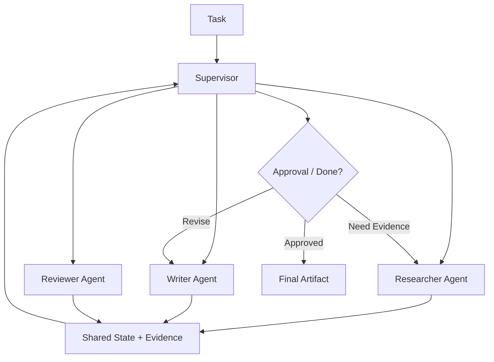

# 10. Multi-agent Orchestration / 多 Agent 编排

> **本章副标题 / Subtitle**  
> 中文：多 Agent 是组织设计，不是堆更多 Agent  
> English: Multi-agent design is organizational design, not more agents

## 1. Chapter Thesis / 本章命题

**中文**：多 Agent 只有在目标、上下文、权限或评测标准需要分离时才有价值。它不是能力越多越好，而是复杂性与协调成本之间的权衡。

**English**: Multi-agent design is valuable only when goals, contexts, permissions, or evaluation criteria need separation. It is not about adding more capability; it is a tradeoff between complexity and coordination cost.

## 2. How This Chapter Connects / 前后关联

**中文**：上一章讨论 workflow 如何提供确定性支架。本章讨论当单个 Agent 或单条 workflow 不足时，如何通过角色分工组织复杂任务。下一部分会进入可信系统：观察、评测和治理。

**English**: The previous chapter discussed workflows as deterministic scaffolding. This chapter covers role division when a single agent or workflow is insufficient. The next part enters trusted systems: observation, evaluation, and governance.

Previous / 上一章：[09. Workflows as Deterministic Scaffolding](course-09.html) | Next / 下一章：[11. Observability and Debugging](course-11.html)

## 3. Learning Outcomes / 学习目标

- 中文：解释 `Multi-agent Orchestration` 在 Agent Harness 中解决的工程问题。  
  English: Explain the engineering problem solved by `Multi-agent Orchestration` inside an Agent Harness.
- 中文：用本章思维模型审查一个真实 Agent 设计。  
  English: Use this chapter's mental model to review a real agent design.
- 中文：产出本章对应的设计 artifact，并把它接入 Course Builder Harness 贯穿案例。  
  English: Produce the chapter artifact and connect it to the Course Builder Harness case study.
- 中文：识别本章相关的典型失败模式。  
  English: Identify typical failure modes related to this chapter.

## 4. The Engineering Problem / 工程问题

**中文**：多 Agent 经常被误用为展示复杂度：planner、researcher、writer、critic、executor 全都加上，但缺少清晰边界。结果是上下文重复、冲突增加、成本上升、责任不清。多 Agent 的正确问题是：哪些不确定性需要隔离？

**English**: Multi-agent systems are often misused as complexity theater: planner, researcher, writer, critic, executor are all added without clear boundaries. The result is duplicated context, more conflicts, higher cost, and unclear responsibility. The right question is: which uncertainties need separation?

## 5. Mental Model / 思维模型

**中文**：把多 Agent 看成组织结构设计。角色不是为了拟人化，而是为了隔离目标、权限、信息和评测标准。每个角色都应该有明确输入、输出、责任和停止条件。

**English**: Think of multi-agent design as organizational structure. Roles are not for anthropomorphism; they isolate goals, permissions, information, and evaluation criteria. Each role should have clear input, output, responsibility, and stop conditions.

## 6. Harness Abstraction / Harness 抽象

### Supervisor / 监督者
- 中文：负责分派任务、汇总状态、处理冲突和决定何时停止。
- English: Assigns tasks, summarizes state, handles conflicts, and decides when to stop.

### Specialist / 专家
- 中文：在某一任务类型、上下文或工具集合内执行高质量工作。
- English: Performs high-quality work within a specific task type, context, or tool set.

### Reviewer / 审查者
- 中文：独立检查结果，不应与生成者共享完全相同的判断路径。
- English: Independently checks results and should not share exactly the same judgment path as the generator.

### Handoff protocol / 交接协议
- 中文：一个 Agent 向另一个 Agent 交付任务时的结构化格式，包括目标、状态、证据、风险和期望输出。
- English: A structured format for one agent handing work to another, including goal, state, evidence, risk, and expected output.

### Shared state / 共享状态
- 中文：所有角色共同可见的任务状态。它必须小而明确，避免互相污染。
- English: Task state visible to all roles. It must be small and explicit to avoid cross-contamination.

### Private context / 私有上下文
- 中文：某个角色专属的信息或评估视角，用于减少偏见和职责混乱。
- English: Information or evaluation perspective specific to one role, used to reduce bias and responsibility confusion.

## 7. Reference Diagram / 参考图

## 8. Design Principles / 设计原则

- **中文**：只有边界不同，才值得角色不同。  
  **English**: Different roles are justified only when boundaries differ.
- **中文**：多 Agent 增加协调成本，必须换来更清晰的责任或更高质量的判断。  
  **English**: Multi-agent design increases coordination cost and must buy clearer responsibility or higher-quality judgment.
- **中文**：Reviewer 应该有独立标准，而不是重复 writer 的 prompt。  
  **English**: A reviewer should have independent criteria, not a copy of the writer’s prompt.
- **中文**：所有 handoff 都应该结构化。  
  **English**: All handoffs should be structured.
- **中文**：共享状态应最小化，私有上下文应明确化。  
  **English**: Shared state should be minimized; private context should be explicit.

## 9. Reference Implementation Direction / 参考实现方向

**中文**：本课程强调“思维 > 具体方案”。参考实现的作用是帮助理解抽象，不应把某个框架、SDK 或协议等同于 Harness 本身。实现时建议先写清楚边界、状态和失败路径，再选择具体技术。

**English**: This course emphasizes “thinking > specific solution.” A reference implementation exists to explain the abstraction; no framework, SDK, or protocol should be equated with the harness itself. In implementation, specify boundaries, state, and failure paths before choosing technologies.

Recommended implementation notes / 推荐实现备注：
- 中文：用 Markdown 或 YAML 保存设计决策，便于版本化和评审。  
  English: Store design decisions in Markdown or YAML so they can be versioned and reviewed.
- 中文：把本章 artifact 放入仓库的 `docs/design/` 或 `labs/` 目录。  
  English: Place this chapter artifact under `docs/design/` or `labs/` in the repository.
- 中文：每次修改抽象边界后，都要更新相邻章节的接口假设。  
  English: Whenever an abstraction boundary changes, update the interface assumptions of adjacent chapters.

## 10. Failure Modes / 失效模式

### Multi-agent theater
- 中文：角色很多，但边界、权限和输出没有区别。
- English: Many roles exist, but boundaries, permissions, and outputs are not meaningfully different.

### Consensus illusion
- 中文：多个 Agent 互相附和，被误认为独立验证。
- English: Multiple agents agree with each other and are mistaken for independent verification.

### Coordination explosion
- 中文：交接、汇总和冲突处理成本超过收益。
- English: Handoff, summarization, and conflict-resolution costs exceed benefits.

### Shared context pollution
- 中文：一个 Agent 的错误推断污染所有角色。
- English: One agent’s wrong inference pollutes all roles.

## 11. Lab: Course Builder Harness / 实验：课程构建 Harness

1. 中文：为课程维护设计四个角色：Researcher、Writer、Reviewer、Publisher。  
   English: Design four roles for course maintenance: Researcher, Writer, Reviewer, Publisher.
2. 中文：为每个角色定义目标、输入、输出、工具权限和评测标准。  
   English: Define goal, input, output, tool permissions, and evaluation criteria for each role.
3. 中文：设计一个 handoff payload。  
   English: Design a handoff payload.
4. 中文：列出三个不应拆成多 Agent 的场景。  
   English: List three scenarios that should not be split into multiple agents.

**Expected artifact / 预期产物**：Multi-agent Role Charter 与 Handoff Protocol。 / A Multi-agent Role Charter and Handoff Protocol.

## 12. Review Checklist / 复盘清单

- [ ] 中文：我能在自己的设计中落实：只有边界不同，才值得角色不同。  
      English: I can apply this principle in my own design: Different roles are justified only when boundaries differ.
- [ ] 中文：我能在自己的设计中落实：多 Agent 增加协调成本，必须换来更清晰的责任或更高质量的判断。  
      English: I can apply this principle in my own design: Multi-agent design increases coordination cost and must buy clearer responsibility or higher-quality judgment.
- [ ] 中文：我能在自己的设计中落实：Reviewer 应该有独立标准，而不是重复 writer 的 prompt。  
      English: I can apply this principle in my own design: A reviewer should have independent criteria, not a copy of the writer’s prompt.
- [ ] 中文：我能识别并避免 `Multi-agent theater`：角色很多，但边界、权限和输出没有区别。  
      English: I can identify and avoid `Multi-agent theater`: Many roles exist, but boundaries, permissions, and outputs are not meaningfully different.
- [ ] 中文：我能识别并避免 `Consensus illusion`：多个 Agent 互相附和，被误认为独立验证。  
      English: I can identify and avoid `Consensus illusion`: Multiple agents agree with each other and are mistaken for independent verification.

## 13. Image Descriptions / 图片描述

### 组织结构图
- 中文图像描述：Supervisor 位于上方，Researcher、Writer、Reviewer、Publisher 分列下方，每个角色旁边有权限和输出标签。
- English image prompt: An organization chart with Supervisor at the top and Researcher, Writer, Reviewer, Publisher below, each with permission and output labels.

### 交接卡片
- 中文图像描述：一张 handoff card，包含 objective、state、evidence、risks、expected output、deadline。
- English image prompt: A handoff card containing objective, state, evidence, risks, expected output, and deadline.

## 14. Key Takeaways / 关键总结

- 中文：`Multi-agent Orchestration` 不是孤立模块，而是 Agent Harness 处理不确定性的一层工程边界。
- English: `Multi-agent Orchestration` is not an isolated module; it is one engineering boundary through which the Agent Harness handles uncertainty.
- 中文：具体工具会变化，但本章的判断问题应保持稳定：边界是什么，证据在哪里，失败如何恢复。
- English: Specific tools will change, but the chapter’s judgment questions should remain stable: what is the boundary, where is the evidence, and how does failure recover?
