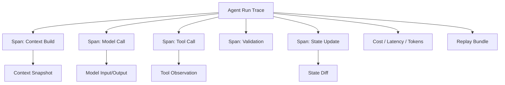

# 11. Observability and Debugging / 可观测性与调试

> **本章副标题 / Subtitle**  
> 中文：让 Agent Run 可见、可回放、可解释  
> English: Make agent runs visible, replayable, and explainable

## 1. Chapter Thesis / 本章命题

**中文**：不能观察的 Agent 不能调试，不能调试的 Agent 不能生产化。Observability 把一次 Agent run 变成可阅读、可回放、可比较的工程证据。

**English**: An agent that cannot be observed cannot be debugged; an agent that cannot be debugged cannot be productionized. Observability turns an agent run into readable, replayable, and comparable engineering evidence.

## 2. How This Chapter Connects / 前后关联

**中文**：前面章节定义了执行结构。本章进入信任层：系统运行时必须留下证据。下一章会基于这些证据做评测、测试和基准。

**English**: The previous chapters defined execution structure. This chapter enters the trust layer: system execution must leave evidence. The next chapter uses that evidence for evaluation, testing, and benchmarking.

Previous / 上一章：[10. Multi-agent Orchestration](course-10.html) | Next / 下一章：[12. Evaluation, Testing and Benchmarking](course-12.html)

## 3. Learning Outcomes / 学习目标

- 中文：解释 `Observability and Debugging` 在 Agent Harness 中解决的工程问题。  
  English: Explain the engineering problem solved by `Observability and Debugging` inside an Agent Harness.
- 中文：用本章思维模型审查一个真实 Agent 设计。  
  English: Use this chapter's mental model to review a real agent design.
- 中文：产出本章对应的设计 artifact，并把它接入 Course Builder Harness 贯穿案例。  
  English: Produce the chapter artifact and connect it to the Course Builder Harness case study.
- 中文：识别本章相关的典型失败模式。  
  English: Identify typical failure modes related to this chapter.

## 4. The Engineering Problem / 工程问题

**中文**：Agent 失败时，如果只看到最终回答，就无法判断问题来自任务定义、上下文、工具、状态、模型判断、权限还是 runtime。可观测性的目的不是收集更多日志，而是让失败原因可定位，让系统变化可比较。

**English**: When an agent fails, the final answer alone cannot tell whether the problem came from task definition, context, tools, state, model judgment, permissions, or runtime. Observability is not about collecting more logs; it is about locating causes of failure and comparing system changes.

## 5. Mental Model / 思维模型

**中文**：把 observability 看成 Agent 的黑匣子和时间线。每一次运行都应该能重建：它看到了什么、想做什么、做了什么、外部世界返回了什么、状态如何变化、为什么停止。

**English**: Think of observability as the agent’s black box and timeline. Every run should be reconstructable: what it saw, what it intended, what it did, what the external world returned, how state changed, and why it stopped.

## 6. Harness Abstraction / Harness 抽象

### Trace / 跟踪
- 中文：一次完整 Agent run 的顶层记录。
- English: The top-level record of one complete agent run.

### Span / 跨度
- 中文：一次子操作，例如 context build、model call、tool call、validation、approval。
- English: A sub-operation such as context build, model call, tool call, validation, or approval.

### Event / 事件
- 中文：运行中的离散事实，例如 retry、error、user interruption、policy denial。
- English: A discrete fact during execution, such as retry, error, user interruption, or policy denial.

### Context snapshot / 上下文快照
- 中文：模型调用时实际看到的上下文记录，用于回放和差异比较。
- English: A record of the exact context seen by the model call, used for replay and diffing.

### State diff / 状态差异
- 中文：每一步前后状态变化，帮助判断错误何时进入系统。
- English: The state changes before and after each step, helping identify when an error entered the system.

### Replay / 回放
- 中文：用同样输入、状态和上下文重跑或检查某次运行。
- English: Reruns or inspects a run using the same input, state, and context.

## 7. Reference Diagram / 参考图



## 8. Design Principles / 设计原则

- **中文**：记录足够回放的信息，而不是只记录最终答案。  
  **English**: Record enough information for replay, not only the final answer.
- **中文**：日志应结构化，能被检索、聚合和比较。  
  **English**: Logs should be structured so they can be searched, aggregated, and compared.
- **中文**：每次模型调用都要关联上下文快照。  
  **English**: Every model call should be associated with a context snapshot.
- **中文**：每次工具调用都要有关联 ID、参数、结果、错误和权限记录。  
  **English**: Every tool call needs a correlation ID, arguments, result, error, and permission record.
- **中文**：隐私与可观测性必须同时设计。  
  **English**: Privacy and observability must be designed together.

## 9. Reference Implementation Direction / 参考实现方向

**中文**：本课程强调“思维 > 具体方案”。参考实现的作用是帮助理解抽象，不应把某个框架、SDK 或协议等同于 Harness 本身。实现时建议先写清楚边界、状态和失败路径，再选择具体技术。

**English**: This course emphasizes “thinking > specific solution.” A reference implementation exists to explain the abstraction; no framework, SDK, or protocol should be equated with the harness itself. In implementation, specify boundaries, state, and failure paths before choosing technologies.

Recommended implementation notes / 推荐实现备注：
- 中文：用 Markdown 或 YAML 保存设计决策，便于版本化和评审。  
  English: Store design decisions in Markdown or YAML so they can be versioned and reviewed.
- 中文：把本章 artifact 放入仓库的 `docs/design/` 或 `labs/` 目录。  
  English: Place this chapter artifact under `docs/design/` or `labs/` in the repository.
- 中文：每次修改抽象边界后，都要更新相邻章节的接口假设。  
  English: Whenever an abstraction boundary changes, update the interface assumptions of adjacent chapters.

## 10. Failure Modes / 失效模式

### Final-answer-only logging
- 中文：只保存最终回答，无法分析中间步骤。
- English: Only final answers are saved, making intermediate analysis impossible.

### Unstructured logs
- 中文：日志是自然语言碎片，难以聚合和比较。
- English: Logs are natural-language fragments, hard to aggregate or compare.

### No context snapshot
- 中文：无法知道模型当时看到了什么。
- English: Cannot know what the model saw at the time.

### No correlation IDs
- 中文：无法把工具调用、状态变化和用户请求关联起来。
- English: Cannot connect tool calls, state changes, and user requests.

## 11. Lab: Course Builder Harness / 实验：课程构建 Harness

1. 中文：为 Course Builder Harness 设计 trace_id、run_id、step_id、tool_call_id。  
   English: Design trace_id, run_id, step_id, and tool_call_id for the Course Builder Harness.
2. 中文：定义每个 model_call span 应保存的字段。  
   English: Define fields to store for each model_call span.
3. 中文：定义 context diff：当章节质量退化时，如何比较两次上下文。  
   English: Define context diff: how to compare two contexts when chapter quality regresses.
4. 中文：设计一个 failure replay 页面或报告。  
   English: Design a failure replay page or report.

**Expected artifact / 预期产物**：Agent Run Trace Schema 与 Debugging Report 模板。 / An Agent Run Trace Schema and Debugging Report template.

## 12. Review Checklist / 复盘清单

- [ ] 中文：我能在自己的设计中落实：记录足够回放的信息，而不是只记录最终答案。  
      English: I can apply this principle in my own design: Record enough information for replay, not only the final answer.
- [ ] 中文：我能在自己的设计中落实：日志应结构化，能被检索、聚合和比较。  
      English: I can apply this principle in my own design: Logs should be structured so they can be searched, aggregated, and compared.
- [ ] 中文：我能在自己的设计中落实：每次模型调用都要关联上下文快照。  
      English: I can apply this principle in my own design: Every model call should be associated with a context snapshot.
- [ ] 中文：我能识别并避免 `Final-answer-only logging`：只保存最终回答，无法分析中间步骤。  
      English: I can identify and avoid `Final-answer-only logging`: Only final answers are saved, making intermediate analysis impossible.
- [ ] 中文：我能识别并避免 `Unstructured logs`：日志是自然语言碎片，难以聚合和比较。  
      English: I can identify and avoid `Unstructured logs`: Logs are natural-language fragments, hard to aggregate or compare.

## 13. Image Descriptions / 图片描述

### Agent 黑匣子
- 中文图像描述：一个黑匣子记录 task、context、model output、tool call、state diff、stop reason。
- English image prompt: A black-box recorder showing task, context, model output, tool call, state diff, and stop reason.

### 运行时间线
- 中文图像描述：横向时间线显示每个 span 的耗时、成本、输入、输出、错误。
- English image prompt: A horizontal timeline showing duration, cost, input, output, and errors for each span.

## Trace Schema Example / Trace Schema 示例

```json
{
  "run_id": "run_001",
  "task_id": "chapter_revision",
  "spans": [
    {"type": "context_build", "context_hash": "...", "sources": []},
    {"type": "model_call", "input_hash": "...", "output_hash": "..."},
    {"type": "tool_call", "tool": "write_draft", "risk": "draft"}
  ],
  "stop_reason": "success_criteria_met"
}
```

## 14. Key Takeaways / 关键总结

- 中文：`Observability and Debugging` 不是孤立模块，而是 Agent Harness 处理不确定性的一层工程边界。
- English: `Observability and Debugging` is not an isolated module; it is one engineering boundary through which the Agent Harness handles uncertainty.
- 中文：具体工具会变化，但本章的判断问题应保持稳定：边界是什么，证据在哪里，失败如何恢复。
- English: Specific tools will change, but the chapter’s judgment questions should remain stable: what is the boundary, where is the evidence, and how does failure recover?
