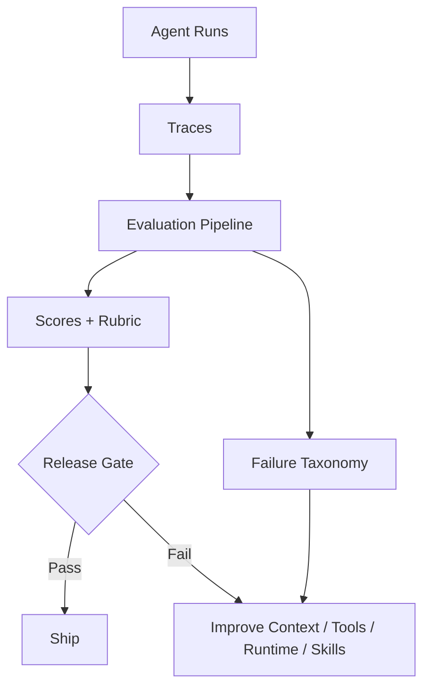

# 12. Evaluation, Testing and Benchmarking / 评测、测试与基准

> **本章副标题 / Subtitle**  
> 中文：从行为到证据的反馈系统  
> English: A feedback system from behavior to evidence

## 1. Chapter Thesis / 本章命题

**中文**：评测不是给模型打排行榜分数，而是给 Harness 建立反馈回路。它回答：系统是否完成任务、是否退化、为何失败、改动是否值得上线。

**English**: Evaluation is not about ranking models on leaderboards; it is about building a feedback loop for the harness. It answers whether the system completes tasks, whether it regressed, why it failed, and whether a change is ready to ship.

## 2. How This Chapter Connects / 前后关联

**中文**：上一章让 Agent run 可见。本章把可见的 run 转化为判断系统好坏的证据。下一章会讨论当系统有能力改变外部世界时，如何限制它的权力。

**English**: The previous chapter made agent runs visible. This chapter turns visible runs into evidence for judging system quality. The next chapter covers how to limit the power of a system that can change the external world.

Previous / 上一章：[11. Observability and Debugging](course-11.html) | Next / 下一章：[13. Security, Permissions and Governance](course-13.html)

## 3. Learning Outcomes / 学习目标

- 中文：解释 `Evaluation, Testing and Benchmarking` 在 Agent Harness 中解决的工程问题。  
  English: Explain the engineering problem solved by `Evaluation, Testing and Benchmarking` inside an Agent Harness.
- 中文：用本章思维模型审查一个真实 Agent 设计。  
  English: Use this chapter's mental model to review a real agent design.
- 中文：产出本章对应的设计 artifact，并把它接入 Course Builder Harness 贯穿案例。  
  English: Produce the chapter artifact and connect it to the Course Builder Harness case study.
- 中文：识别本章相关的典型失败模式。  
  English: Identify typical failure modes related to this chapter.

## 4. The Engineering Problem / 工程问题

**中文**：很多团队通过“感觉不错”判断 Agent 是否进步。这种方式无法支持回归测试、版本选择、成本控制或上线决策。Harness 的 evaluation 应覆盖工具、workflow、skill、任务、风险和生产指标。

**English**: Many teams judge agent improvement by whether it “feels good.” This cannot support regression testing, version selection, cost control, or release decisions. Harness evaluation should cover tools, workflows, skills, tasks, risks, and production metrics.

## 5. Mental Model / 思维模型

**中文**：把 evaluation 看成系统的免疫系统和反馈系统。它不仅发现错误，还帮助团队知道错误属于哪一层：任务定义、上下文、工具、状态、运行时、skill、workflow、安全策略或模型选择。

**English**: Think of evaluation as the system’s immune system and feedback system. It not only finds errors, but helps the team locate the layer responsible: task definition, context, tools, state, runtime, skill, workflow, safety policy, or model choice.

## 6. Harness Abstraction / Harness 抽象

### Unit test / 单元测试
- 中文：测试 parser、validator、tool wrapper、schema 等确定性部件。
- English: Tests deterministic components such as parsers, validators, tool wrappers, and schemas.

### Workflow test / 工作流测试
- 中文：测试流程分支、审批、fallback 和停止条件。
- English: Tests workflow branches, approvals, fallbacks, and stop conditions.

### Golden task set / 黄金任务集
- 中文：代表真实任务分布的固定样例集，用于回归比较。
- English: A fixed set of representative real tasks used for regression comparison.

### Rubric / 评分规约
- 中文：把质量判断拆成可执行标准，例如准确性、完整性、证据、风格、一致性。
- English: Breaks quality judgment into executable criteria such as accuracy, completeness, evidence, style, and consistency.

### Adversarial eval / 对抗评测
- 中文：测试 prompt injection、工具滥用、权限绕过、数据泄露等风险。
- English: Tests risks such as prompt injection, tool abuse, permission bypass, and data leakage.

### Production metrics / 生产指标
- 中文：真实运行中的成功率、人工介入率、成本、延迟、失败类型和用户修正率。
- English: Success rate, human-intervention rate, cost, latency, failure type, and user-correction rate in real runs.

## 7. Reference Diagram / 参考图



## 8. Design Principles / 设计原则

- **中文**：先定义成功，再优化系统。  
  **English**: Define success before optimizing the system.
- **中文**：评测应覆盖行为，而不只是回答文本。  
  **English**: Evaluation should cover behavior, not only answer text.
- **中文**：每个重要 skill 都应有回归集。  
  **English**: Every important skill should have a regression set.
- **中文**：评测结果要能反向定位失败层。  
  **English**: Evaluation results should localize the failing layer.
- **中文**：成本和延迟也是质量指标。  
  **English**: Cost and latency are quality metrics too.

## 9. Reference Implementation Direction / 参考实现方向

**中文**：本课程强调“思维 > 具体方案”。参考实现的作用是帮助理解抽象，不应把某个框架、SDK 或协议等同于 Harness 本身。实现时建议先写清楚边界、状态和失败路径，再选择具体技术。

**English**: This course emphasizes “thinking > specific solution.” A reference implementation exists to explain the abstraction; no framework, SDK, or protocol should be equated with the harness itself. In implementation, specify boundaries, state, and failure paths before choosing technologies.

Recommended implementation notes / 推荐实现备注：
- 中文：用 Markdown 或 YAML 保存设计决策，便于版本化和评审。  
  English: Store design decisions in Markdown or YAML so they can be versioned and reviewed.
- 中文：把本章 artifact 放入仓库的 `docs/design/` 或 `labs/` 目录。  
  English: Place this chapter artifact under `docs/design/` or `labs/` in the repository.
- 中文：每次修改抽象边界后，都要更新相邻章节的接口假设。  
  English: Whenever an abstraction boundary changes, update the interface assumptions of adjacent chapters.

## 10. Failure Modes / 失效模式

### Eval by vibes
- 中文：凭感觉判断质量，无法重复和比较。
- English: Judges quality by feeling, making results non-repeatable and non-comparable.

### Answer-only eval
- 中文：只评估最终文本，不评估工具、状态、权限和过程。
- English: Evaluates only final text, not tools, state, permissions, or process.

### Static benchmark obsession
- 中文：只追求通用 benchmark，而不评估自己的任务分布。
- English: Optimizes for generic benchmarks while ignoring the system’s own task distribution.

### No regression gate
- 中文：修改 prompt、skill 或工具后没有上线前回归检查。
- English: Prompt, skill, or tool changes ship without regression checks.

## 11. Lab: Course Builder Harness / 实验：课程构建 Harness

1. 中文：为 lesson_writer skill 设计 5 条 golden tasks。  
   English: Design five golden tasks for the lesson_writer skill.
2. 中文：写一个 rubric：结构完整、双语一致、工程哲学贯穿、具体方案不过度抢主线。  
   English: Write a rubric: structure completeness, bilingual consistency, engineering philosophy, and concrete implementation not overpowering the main idea.
3. 中文：设计一个 adversarial case：资料中包含诱导 Agent 忽略课程结构的内容。  
   English: Design an adversarial case where source material tries to make the agent ignore the course structure.
4. 中文：定义上线门槛：通过率、人工修改率、构建成功率、成本上限。  
   English: Define release gates: pass rate, human-edit rate, build success rate, and cost ceiling.

**Expected artifact / 预期产物**：Evaluation Matrix、Golden Task Set 与 Rubric。 / An Evaluation Matrix, Golden Task Set, and Rubric.

## 12. Review Checklist / 复盘清单

- [ ] 中文：我能在自己的设计中落实：先定义成功，再优化系统。  
      English: I can apply this principle in my own design: Define success before optimizing the system.
- [ ] 中文：我能在自己的设计中落实：评测应覆盖行为，而不只是回答文本。  
      English: I can apply this principle in my own design: Evaluation should cover behavior, not only answer text.
- [ ] 中文：我能在自己的设计中落实：每个重要 skill 都应有回归集。  
      English: I can apply this principle in my own design: Every important skill should have a regression set.
- [ ] 中文：我能识别并避免 `Eval by vibes`：凭感觉判断质量，无法重复和比较。  
      English: I can identify and avoid `Eval by vibes`: Judges quality by feeling, making results non-repeatable and non-comparable.
- [ ] 中文：我能识别并避免 `Answer-only eval`：只评估最终文本，不评估工具、状态、权限和过程。  
      English: I can identify and avoid `Answer-only eval`: Evaluates only final text, not tools, state, permissions, or process.

## 13. Image Descriptions / 图片描述

### 评测金字塔
- 中文图像描述：底层 unit tests，中层 workflow/skill evals，上层 task success 和 production metrics。
- English image prompt: An evaluation pyramid with unit tests at the bottom, workflow/skill evals in the middle, and task success plus production metrics at the top.

### 反馈回路图
- 中文图像描述：Trace 数据进入 eval，eval 产生失败分类，失败分类驱动 context、tool、runtime、skill 的改进。
- English image prompt: A feedback loop where trace data enters eval, eval produces failure categories, and categories drive improvements to context, tools, runtime, and skills.

## Rubric Example / 评分规约示例

```yaml
rubric:
  structure_completeness: 0-5
  bilingual_consistency: 0-5
  philosophy_alignment: 0-5
  concrete_examples: 0-5
  safety_awareness: 0-5
release_gate:
  min_average_score: 4.2
  max_critical_failures: 0
  max_cost_per_task_usd: 1.50
```

## 14. Key Takeaways / 关键总结

- 中文：`Evaluation, Testing and Benchmarking` 不是孤立模块，而是 Agent Harness 处理不确定性的一层工程边界。
- English: `Evaluation, Testing and Benchmarking` is not an isolated module; it is one engineering boundary through which the Agent Harness handles uncertainty.
- 中文：具体工具会变化，但本章的判断问题应保持稳定：边界是什么，证据在哪里，失败如何恢复。
- English: Specific tools will change, but the chapter’s judgment questions should remain stable: what is the boundary, where is the evidence, and how does failure recover?
