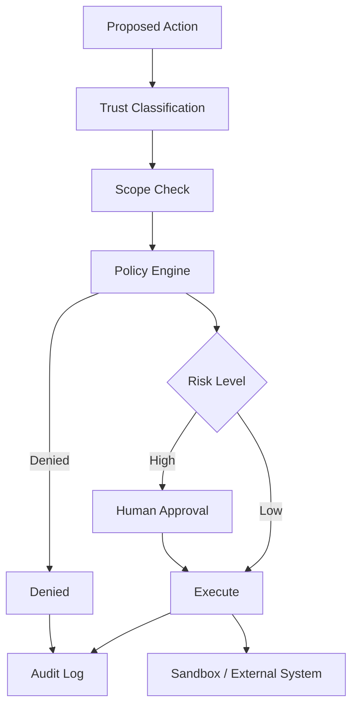

# 13. Security, Permissions and Governance / 安全、权限与治理

> **本章副标题 / Subtitle**  
> 中文：限制 Agent 的权力  
> English: Limit the agent’s power

## 1. Chapter Thesis / 本章命题

**中文**：Agent 安全不是让模型更听话，而是让系统即使在模型不可靠时仍然安全。权限、审批、沙箱、审计和策略引擎应当成为 Harness 架构的一部分。

**English**: Agent security is not about making the model more obedient; it is about keeping the system safe even when the model is unreliable. Permissions, approval, sandboxing, audit, and policy engines should be part of the harness architecture.

## 2. How This Chapter Connects / 前后关联

**中文**：上一章讨论如何判断系统是否有效。本章讨论系统在有效之外是否安全、合规、可控。下一章会把全部部件组织成生产架构。

**English**: The previous chapter covered judging whether the system works. This chapter asks whether the system is safe, compliant, and controllable. The next chapter organizes all components into production architecture.

Previous / 上一章：[12. Evaluation, Testing and Benchmarking](course-12.html) | Next / 下一章：[14. Production Architecture](course-14.html)

## 3. Learning Outcomes / 学习目标

- 中文：解释 `Security, Permissions and Governance` 在 Agent Harness 中解决的工程问题。  
  English: Explain the engineering problem solved by `Security, Permissions and Governance` inside an Agent Harness.
- 中文：用本章思维模型审查一个真实 Agent 设计。  
  English: Use this chapter's mental model to review a real agent design.
- 中文：产出本章对应的设计 artifact，并把它接入 Course Builder Harness 贯穿案例。  
  English: Produce the chapter artifact and connect it to the Course Builder Harness case study.
- 中文：识别本章相关的典型失败模式。  
  English: Identify typical failure modes related to this chapter.

## 4. The Engineering Problem / 工程问题

**中文**：一个能读取数据、调用工具、修改文件、发送消息或发布内容的 Agent 已经拥有实际权力。不能用提示词替代权限系统。必须假设模型可能被诱导、误解上下文或选择错误动作，然后用架构限制损害范围。

**English**: An agent that can read data, call tools, modify files, send messages, or publish content has real power. Prompts cannot replace permission systems. Assume the model may be induced, misunderstand context, or choose the wrong action, then use architecture to limit damage.

## 5. Mental Model / 思维模型

**中文**：把安全看成权力设计。每个能力都要回答：谁授权、允许什么范围、何时需要审批、如何记录、出事如何回滚、用户如何撤销。

**English**: Think of security as power design. Every capability must answer: who authorizes it, what scope is allowed, when approval is required, how it is recorded, how to recover, and how the user can revoke it.

## 6. Harness Abstraction / Harness 抽象

### Prompt injection / 提示注入
- 中文：不可信内容试图改变 Agent 指令、泄露数据或执行未授权动作。
- English: Untrusted content attempts to alter instructions, leak data, or execute unauthorized actions.

### Least privilege / 最小权限
- 中文：Agent 只获得完成当前任务所需的最小能力。
- English: The agent receives only the minimum capability needed for the current task.

### Permission scope / 权限范围
- 中文：权限应按资源、动作、时间、风险和用户意图细分。
- English: Permissions should be scoped by resource, action, time, risk, and user intent.

### Approval gate / 审批门
- 中文：高风险或不可逆动作前的人工确认。
- English: Human confirmation before high-risk or irreversible actions.

### Policy engine / 策略引擎
- 中文：用可审计规则判断某个动作是否允许。
- English: Uses auditable rules to decide whether an action is allowed.

### Audit log / 审计日志
- 中文：记录谁、何时、因为什么任务、请求和执行了什么动作。
- English: Records who requested and executed what action, when, and for which task.

## 7. Reference Diagram / 参考图

## 8. Design Principles / 设计原则

- **中文**：安全是架构，不是指令。  
  **English**: Security is architecture, not instruction.
- **中文**：默认拒绝高风险动作，显式授权后再执行。  
  **English**: Deny high-risk actions by default and execute only after explicit authorization.
- **中文**：不可信内容永远不能升级为系统指令。  
  **English**: Untrusted content must never be promoted to system instruction.
- **中文**：权限应随任务结束而过期。  
  **English**: Permissions should expire when the task ends.
- **中文**：审计日志应覆盖拒绝动作，而不仅是成功动作。  
  **English**: Audit logs should cover denied actions, not only successful ones.

## 9. Reference Implementation Direction / 参考实现方向

**中文**：本课程强调“思维 > 具体方案”。参考实现的作用是帮助理解抽象，不应把某个框架、SDK 或协议等同于 Harness 本身。实现时建议先写清楚边界、状态和失败路径，再选择具体技术。

**English**: This course emphasizes “thinking > specific solution.” A reference implementation exists to explain the abstraction; no framework, SDK, or protocol should be equated with the harness itself. In implementation, specify boundaries, state, and failure paths before choosing technologies.

Recommended implementation notes / 推荐实现备注：
- 中文：用 Markdown 或 YAML 保存设计决策，便于版本化和评审。  
  English: Store design decisions in Markdown or YAML so they can be versioned and reviewed.
- 中文：把本章 artifact 放入仓库的 `docs/design/` 或 `labs/` 目录。  
  English: Place this chapter artifact under `docs/design/` or `labs/` in the repository.
- 中文：每次修改抽象边界后，都要更新相邻章节的接口假设。  
  English: Whenever an abstraction boundary changes, update the interface assumptions of adjacent chapters.

## 10. Failure Modes / 失效模式

### Security as prompt
- 中文：用“不要泄露信息”代替数据访问控制。
- English: Uses “do not leak information” instead of data-access control.

### Permanent broad token
- 中文：给 Agent 一个长期、全量、高权限 token。
- English: Gives the agent a long-lived, broad, high-privilege token.

### No trust separation
- 中文：把网页内容、用户输入、系统策略混在同一指令层。
- English: Mixes web content, user input, and system policy in the same instruction layer.

### No approval trail
- 中文：执行高风险动作后无法证明用户曾批准。
- English: After high-risk actions, there is no proof that the user approved them.

## 11. Lab: Course Builder Harness / 实验：课程构建 Harness

1. 中文：为 Course Builder Harness 设计权限矩阵：read_repo、write_draft、open_pr、publish_pages、delete_file。  
   English: Design a permission matrix for Course Builder Harness: read_repo, write_draft, open_pr, publish_pages, delete_file.
2. 中文：标记哪些动作需要审批，哪些动作默认拒绝。  
   English: Mark which actions require approval and which are denied by default.
3. 中文：设计 prompt injection 防护：不可信资料只能作为 evidence，不可作为 instruction。  
   English: Design prompt-injection defense: untrusted material can be evidence, not instruction.
4. 中文：写一条 audit log 记录格式。  
   English: Write an audit-log record format.

**Expected artifact / 预期产物**：Permission Matrix、Approval Policy 与 Audit Log Schema。 / A Permission Matrix, Approval Policy, and Audit Log Schema.

## 12. Review Checklist / 复盘清单

- [ ] 中文：我能在自己的设计中落实：安全是架构，不是指令。  
      English: I can apply this principle in my own design: Security is architecture, not instruction.
- [ ] 中文：我能在自己的设计中落实：默认拒绝高风险动作，显式授权后再执行。  
      English: I can apply this principle in my own design: Deny high-risk actions by default and execute only after explicit authorization.
- [ ] 中文：我能在自己的设计中落实：不可信内容永远不能升级为系统指令。  
      English: I can apply this principle in my own design: Untrusted content must never be promoted to system instruction.
- [ ] 中文：我能识别并避免 `Security as prompt`：用“不要泄露信息”代替数据访问控制。  
      English: I can identify and avoid `Security as prompt`: Uses “do not leak information” instead of data-access control.
- [ ] 中文：我能识别并避免 `Permanent broad token`：给 Agent 一个长期、全量、高权限 token。  
      English: I can identify and avoid `Permanent broad token`: Gives the agent a long-lived, broad, high-privilege token.

## 13. Image Descriptions / 图片描述

### 权限同心圆
- 中文图像描述：中心是只读，向外依次是草稿、写入、发布、删除，越外层审批越严格。
- English image prompt: Permission concentric circles: read-only at the center, then draft, write, publish, delete, with stricter approval outward.

### 安全网关图
- 中文图像描述：所有工具调用经过 policy engine、scope check、approval、sandbox、audit。
- English image prompt: A security gateway diagram where all tool calls pass through policy engine, scope check, approval, sandbox, and audit.

## Permission Matrix Example / 权限矩阵示例

| Action | Default | Approval | Notes |
|---|---:|---:|---|
| read_repo | allow | no | Read-only. |
| write_draft | allow | no | Draft branch only. |
| open_pr | deny | yes | Requires summary and diff. |
| publish_pages | deny | yes | Requires build pass. |
| delete_file | deny | yes | Requires explicit file path and rollback plan. |

## 14. Key Takeaways / 关键总结

- 中文：`Security, Permissions and Governance` 不是孤立模块，而是 Agent Harness 处理不确定性的一层工程边界。
- English: `Security, Permissions and Governance` is not an isolated module; it is one engineering boundary through which the Agent Harness handles uncertainty.
- 中文：具体工具会变化，但本章的判断问题应保持稳定：边界是什么，证据在哪里，失败如何恢复。
- English: Specific tools will change, but the chapter’s judgment questions should remain stable: what is the boundary, where is the evidence, and how does failure recover?
