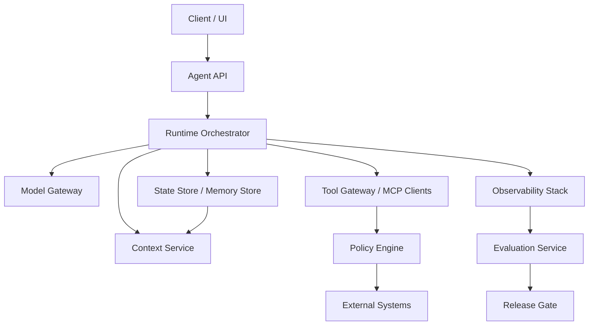

# 14. Production Architecture / 生产架构

> **本章副标题 / Subtitle**  
> 中文：从 Demo 到可交付系统  
> English: From demo to deliverable system

## 1. Chapter Thesis / 本章命题

**中文**：Agent 产品不是一个 prompt 加几个 tools，而是一套围绕不确定性构建的控制系统。生产架构需要把 API、runtime、context、model、tool、state、policy、eval、observability 组织成可维护边界。

**English**: An agent product is not a prompt plus several tools; it is a control system built around uncertainty. Production architecture must organize API, runtime, context, model, tools, state, policy, eval, and observability into maintainable boundaries.

## 2. How This Chapter Connects / 前后关联

**中文**：前面所有章节都在定义 Harness 的局部能力。本章把它们组合成生产系统。最后一章会抽象出 patterns、anti-patterns 和未来方向。

**English**: All previous chapters defined local harness capabilities. This chapter combines them into a production system. The final chapter abstracts patterns, anti-patterns, and future directions.

Previous / 上一章：[13. Security, Permissions and Governance](course-13.html) | Next / 下一章：[15. Patterns, Anti-patterns and Future](course-15.html)

## 3. Learning Outcomes / 学习目标

- 中文：解释 `Production Architecture` 在 Agent Harness 中解决的工程问题。  
  English: Explain the engineering problem solved by `Production Architecture` inside an Agent Harness.
- 中文：用本章思维模型审查一个真实 Agent 设计。  
  English: Use this chapter's mental model to review a real agent design.
- 中文：产出本章对应的设计 artifact，并把它接入 Course Builder Harness 贯穿案例。  
  English: Produce the chapter artifact and connect it to the Course Builder Harness case study.
- 中文：识别本章相关的典型失败模式。  
  English: Identify typical failure modes related to this chapter.

## 4. The Engineering Problem / 工程问题

**中文**：从 demo 到生产的主要挑战不是“能否调用模型”，而是并发、隔离、权限、队列、成本、延迟、状态恢复、版本管理、评测回归、日志隐私和发布流程。生产架构必须把这些问题前置。

**English**: The main challenge from demo to production is not whether the model can be called, but concurrency, isolation, permissions, queues, cost, latency, state recovery, versioning, evaluation regression, log privacy, and release workflow. Production architecture must bring these issues forward.

## 5. Mental Model / 思维模型

**中文**：把生产 Harness 看成多个受控服务的组合：Agent API 接任务，Runtime Orchestrator 管循环，Context Service 构造信息边界，Tool Gateway 管副作用，Policy Engine 管权力，Observability 和 Evaluation 形成反馈。

**English**: Think of a production harness as a composition of controlled services: Agent API receives tasks, Runtime Orchestrator manages loops, Context Service builds information boundaries, Tool Gateway manages side effects, Policy Engine controls power, and Observability plus Evaluation form feedback.

## 6. Harness Abstraction / Harness 抽象

### Agent API / Agent 接口
- 中文：对外暴露任务入口，隐藏内部模型和工具实现。
- English: Exposes a task interface while hiding internal model and tool implementation.

### Runtime Orchestrator / 运行时编排器
- 中文：管理步骤、状态、循环、重试、审批和停止条件。
- English: Manages steps, state, loops, retries, approvals, and stop conditions.

### Context Service / 上下文服务
- 中文：统一处理检索、压缩、分层、引用和上下文快照。
- English: Handles retrieval, compression, layering, citation, and context snapshots.

### Model Gateway / 模型网关
- 中文：管理模型选择、限流、fallback、成本和版本。
- English: Manages model selection, rate limits, fallback, cost, and versioning.

### Tool Gateway / 工具网关
- 中文：统一管理工具调用、MCP client、权限、审计和沙箱。
- English: Manages tool calls, MCP clients, permissions, audit, and sandboxing.

### State Store / 状态存储
- 中文：保存 run state、session、checkpoint、artifact metadata。
- English: Stores run state, session, checkpoints, and artifact metadata.

### Policy Engine / 策略引擎
- 中文：在动作执行前进行安全和权限判断。
- English: Performs safety and permission decisions before action execution.

### Eval + Observability / 评测与观测
- 中文：记录、回放、打分、回归和发布门禁。
- English: Records, replays, scores, regresses, and gates releases.

## 7. Reference Diagram / 参考图



## 8. Design Principles / 设计原则

- **中文**：生产架构应围绕边界而不是框架命名。  
  **English**: Production architecture should be organized around boundaries, not framework names.
- **中文**：所有外部动作必须经过统一工具网关。  
  **English**: All external actions must go through a unified tool gateway.
- **中文**：状态存储和日志存储要有隐私与保留策略。  
  **English**: State and log storage need privacy and retention policies.
- **中文**：模型、prompt、skill、workflow 都需要版本化。  
  **English**: Models, prompts, skills, and workflows all need versioning.
- **中文**：上线前先有 eval gate，生产中继续采集 metrics。  
  **English**: Use eval gates before release and continue collecting production metrics afterward.

## 9. Reference Implementation Direction / 参考实现方向

**中文**：本课程强调“思维 > 具体方案”。参考实现的作用是帮助理解抽象，不应把某个框架、SDK 或协议等同于 Harness 本身。实现时建议先写清楚边界、状态和失败路径，再选择具体技术。

**English**: This course emphasizes “thinking > specific solution.” A reference implementation exists to explain the abstraction; no framework, SDK, or protocol should be equated with the harness itself. In implementation, specify boundaries, state, and failure paths before choosing technologies.

Recommended implementation notes / 推荐实现备注：
- 中文：用 Markdown 或 YAML 保存设计决策，便于版本化和评审。  
  English: Store design decisions in Markdown or YAML so they can be versioned and reviewed.
- 中文：把本章 artifact 放入仓库的 `docs/design/` 或 `labs/` 目录。  
  English: Place this chapter artifact under `docs/design/` or `labs/` in the repository.
- 中文：每次修改抽象边界后，都要更新相邻章节的接口假设。  
  English: Whenever an abstraction boundary changes, update the interface assumptions of adjacent chapters.

## 10. Failure Modes / 失效模式

### Monolith prompt app
- 中文：所有逻辑都在一个 prompt 和一个 handler 中，无法隔离责任。
- English: All logic lives in one prompt and one handler, making responsibility impossible to isolate.

### No async model
- 中文：长任务阻塞请求，无法恢复或取消。
- English: Long tasks block requests and cannot be recovered or canceled.

### No release discipline
- 中文：prompt 和 skill 修改直接上线，没有回归和版本。
- English: Prompt and skill changes go live without regression and versions.

### Tool integration sprawl
- 中文：各业务直接接工具，绕过权限和审计。
- English: Business code integrates tools directly, bypassing permission and audit.

## 11. Lab: Course Builder Harness / 实验：课程构建 Harness

1. 中文：画出 Course Builder Harness 的 production architecture。  
   English: Draw the production architecture for the Course Builder Harness.
2. 中文：定义每个服务的责任边界和数据流。  
   English: Define responsibility boundaries and data flow for each service.
3. 中文：列出同步任务和异步任务：即时回答、章节生成、构建、发布。  
   English: List synchronous and asynchronous tasks: immediate answer, chapter generation, build, publish.
4. 中文：写一个 ADR：为什么采用 Tool Gateway 和 Policy Engine。  
   English: Write an ADR: why use a Tool Gateway and Policy Engine.

**Expected artifact / 预期产物**：Production Architecture Diagram 与 ADR。 / A Production Architecture Diagram and ADR.

## 12. Review Checklist / 复盘清单

- [ ] 中文：我能在自己的设计中落实：生产架构应围绕边界而不是框架命名。  
      English: I can apply this principle in my own design: Production architecture should be organized around boundaries, not framework names.
- [ ] 中文：我能在自己的设计中落实：所有外部动作必须经过统一工具网关。  
      English: I can apply this principle in my own design: All external actions must go through a unified tool gateway.
- [ ] 中文：我能在自己的设计中落实：状态存储和日志存储要有隐私与保留策略。  
      English: I can apply this principle in my own design: State and log storage need privacy and retention policies.
- [ ] 中文：我能识别并避免 `Monolith prompt app`：所有逻辑都在一个 prompt 和一个 handler 中，无法隔离责任。  
      English: I can identify and avoid `Monolith prompt app`: All logic lives in one prompt and one handler, making responsibility impossible to isolate.
- [ ] 中文：我能识别并避免 `No async model`：长任务阻塞请求，无法恢复或取消。  
      English: I can identify and avoid `No async model`: Long tasks block requests and cannot be recovered or canceled.

## 13. Image Descriptions / 图片描述

### 生产架构总图
- 中文图像描述：Client、Agent API、Runtime Orchestrator、Context Service、Model Gateway、Tool Gateway、State Store、Policy Engine、Eval、Observability 的服务图。
- English image prompt: A service diagram showing Client, Agent API, Runtime Orchestrator, Context Service, Model Gateway, Tool Gateway, State Store, Policy Engine, Eval, and Observability.

### 从 demo 到 production 阶梯
- 中文图像描述：四层阶梯：prompt demo、tool agent、observable harness、governed production system。
- English image prompt: A staircase from prompt demo to tool agent to observable harness to governed production system.

## Architecture Decision Record Template / ADR 模板

```markdown
# ADR: Use a Tool Gateway for All External Actions

## Context
Agents need to call multiple tools with different risk levels.

## Decision
All tool calls must pass through a Tool Gateway.

## Consequences
- Centralized permission and audit
- Easier replay and debugging
- Additional service boundary and latency
```

## 14. Key Takeaways / 关键总结

- 中文：`Production Architecture` 不是孤立模块，而是 Agent Harness 处理不确定性的一层工程边界。
- English: `Production Architecture` is not an isolated module; it is one engineering boundary through which the Agent Harness handles uncertainty.
- 中文：具体工具会变化，但本章的判断问题应保持稳定：边界是什么，证据在哪里，失败如何恢复。
- English: Specific tools will change, but the chapter’s judgment questions should remain stable: what is the boundary, where is the evidence, and how does failure recover?
