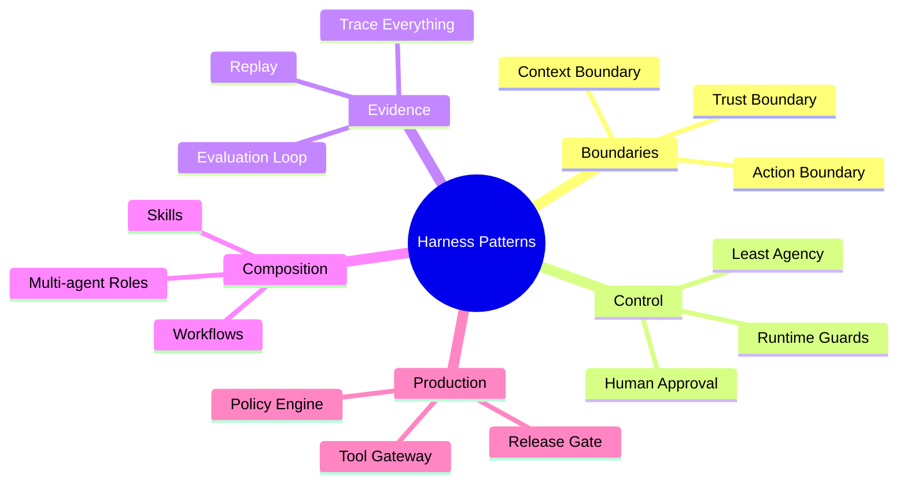

# 15. Patterns, Anti-patterns and Future / 模式、反模式与未来

> **本章副标题 / Subtitle**  
> 中文：设计原则、反模式与未来方向  
> English: Design principles, anti-patterns, and future directions

## 1. Chapter Thesis / 本章命题

**中文**：Harness 的未来不是“更大的 Agent”，而是“更好的控制层”。本章把前面所有内容抽象成可复用设计模式、常见反模式和未来演化方向。

**English**: The future of the harness is not “larger agents,” but better control layers. This chapter abstracts the entire course into reusable design patterns, common anti-patterns, and future directions.

## 2. How This Chapter Connects / 前后关联

**中文**：上一章完成生产架构。本章回收全课思想：如何判断一个 Harness 设计好坏，以及如何面向未来扩展，而不丢失边界、控制和证据。

**English**: The previous chapter completed production architecture. This chapter consolidates the course: how to judge whether a harness design is good, and how to extend toward the future without losing boundaries, control, and evidence.

Previous / 上一章：[14. Production Architecture](course-14.html)

## 3. Learning Outcomes / 学习目标

- 中文：解释 `Patterns, Anti-patterns and Future` 在 Agent Harness 中解决的工程问题。  
  English: Explain the engineering problem solved by `Patterns, Anti-patterns and Future` inside an Agent Harness.
- 中文：用本章思维模型审查一个真实 Agent 设计。  
  English: Use this chapter's mental model to review a real agent design.
- 中文：产出本章对应的设计 artifact，并把它接入 Course Builder Harness 贯穿案例。  
  English: Produce the chapter artifact and connect it to the Course Builder Harness case study.
- 中文：识别本章相关的典型失败模式。  
  English: Identify typical failure modes related to this chapter.

## 4. The Engineering Problem / 工程问题

**中文**：Agent 技术会快速变化，但工程哲学不会随框架一起过期。真正有用的课程结尾不应只是罗列趋势，而应形成一套判断准则：什么设计会变得更可靠，什么设计会把不确定性放大。

**English**: Agent technology will change quickly, but the engineering philosophy should not expire with frameworks. A useful ending should not only list trends; it should form judgment criteria: which designs become more reliable, and which designs amplify uncertainty.

## 5. Mental Model / 思维模型

**中文**：把本章看成 Harness 设计评审手册。面对任何新框架、新协议、新模型或新 Agent 产品，都用同一组问题审查：边界是否清晰？状态是否显式？动作是否受控？运行是否可观测？质量是否可证？权力是否受限？

**English**: Think of this chapter as a harness design review manual. For any new framework, protocol, model, or agent product, ask the same questions: Are boundaries clear? Is state explicit? Are actions controlled? Is execution observable? Is quality evidenced? Is power limited?

## 6. Harness Abstraction / Harness 抽象

### Context Boundary pattern / 上下文边界模式
- 中文：明确 Agent 能看到什么、不能看到什么，以及信息来源的可信级别。
- English: Explicitly defines what the agent can and cannot see, and the trust level of information sources.

### Tool Gateway pattern / 工具网关模式
- 中文：所有外部副作用经过统一入口，以支持权限、审计和恢复。
- English: All external side effects pass through one gateway to support permission, audit, and recovery.

### Explicit State pattern / 显式状态模式
- 中文：把任务状态从对话文本中抽离，保存为可校验、可恢复的数据。
- English: Extracts task state from conversation text into validatable and recoverable data.

### Least Agency pattern / 最小自主权模式
- 中文：只给 Agent 完成当前任务所需的最小自主空间。
- English: Gives the agent only the minimum autonomy needed for the current task.

### Trace Everything pattern / 全链路跟踪模式
- 中文：每次运行都记录输入、决策、动作、观察、状态和停止原因。
- English: Every run records input, decision, action, observation, state, and stop reason.

### Eval Before Scale pattern / 先评测再扩权模式
- 中文：在扩大自治范围、工具权限或用户规模之前先建立评测证据。
- English: Before expanding autonomy, tool permissions, or user scale, establish evaluation evidence.

## 7. Reference Diagram / 参考图

## 8. Design Principles / 设计原则

- **中文**：设计判断应优先看边界，而不是看模型有多强。  
  **English**: Design judgment should prioritize boundaries over model strength.
- **中文**：反模式通常不是缺功能，而是缺控制。  
  **English**: Anti-patterns usually lack control, not features.
- **中文**：未来框架可以替换，但工程边界不能消失。  
  **English**: Future frameworks can be replaced, but engineering boundaries must not disappear.
- **中文**：越自治，越需要可观察、可评测、可撤销。  
  **English**: The more autonomous the system, the more observable, evaluable, and revocable it must be.
- **中文**：最好的 Harness 会把复杂性显式化，而不是藏进 prompt。  
  **English**: The best harness makes complexity explicit instead of hiding it in prompts.

## 9. Reference Implementation Direction / 参考实现方向

**中文**：本课程强调“思维 > 具体方案”。参考实现的作用是帮助理解抽象，不应把某个框架、SDK 或协议等同于 Harness 本身。实现时建议先写清楚边界、状态和失败路径，再选择具体技术。

**English**: This course emphasizes “thinking > specific solution.” A reference implementation exists to explain the abstraction; no framework, SDK, or protocol should be equated with the harness itself. In implementation, specify boundaries, state, and failure paths before choosing technologies.

Recommended implementation notes / 推荐实现备注：
- 中文：用 Markdown 或 YAML 保存设计决策，便于版本化和评审。  
  English: Store design decisions in Markdown or YAML so they can be versioned and reviewed.
- 中文：把本章 artifact 放入仓库的 `docs/design/` 或 `labs/` 目录。  
  English: Place this chapter artifact under `docs/design/` or `labs/` in the repository.
- 中文：每次修改抽象边界后，都要更新相邻章节的接口假设。  
  English: Whenever an abstraction boundary changes, update the interface assumptions of adjacent chapters.

## 10. Failure Modes / 失效模式

### Prompt-only Agent
- 中文：不可控、不可测试、不可维护。
- English: Uncontrolled, untestable, and unmaintainable.

### Tool Soup
- 中文：工具很多，但没有边界、权限和命名规范。
- English: Many tools exist without boundaries, permissions, or naming discipline.

### Memory Dump
- 中文：什么都记，导致污染、隐私风险和错误固化。
- English: Everything is remembered, causing pollution, privacy risk, and fossilized errors.

### Agent Does Everything
- 中文：确定性流程也交给模型，放大不确定性。
- English: Deterministic processes are delegated to the model, amplifying uncertainty.

### Multi-agent Theater
- 中文：多 Agent 只是增加复杂度，没有独立边界和责任。
- English: Multiple agents add complexity without independent boundaries and responsibility.

### Eval by Vibes
- 中文：凭感觉上线，无法回归比较。
- English: Ships by feeling, without regression comparison.

### Security as Prompt
- 中文：用提示词替代权限系统。
- English: Uses prompts instead of permission systems.

## 11. Lab: Course Builder Harness / 实验：课程构建 Harness

1. 中文：用本章 checklist 审查 Course Builder Harness 的完整设计。  
   English: Use this chapter’s checklist to review the complete Course Builder Harness design.
2. 中文：找出三个最可能的反模式风险，并写出对应修复方案。  
   English: Identify the three most likely anti-pattern risks and write repair plans.
3. 中文：选择一个未来方向：browser agent、personal agent、enterprise agent、multimodal harness，分析它需要哪些新边界。  
   English: Choose one future direction—browser agent, personal agent, enterprise agent, or multimodal harness—and analyze which new boundaries it needs.
4. 中文：写一篇最终设计反思：Harness 如何处理不确定性。  
   English: Write a final design reflection: how the harness handles uncertainty.

**Expected artifact / 预期产物**：Harness Design Review Checklist 与 Final Reflection。 / A Harness Design Review Checklist and Final Reflection.

## 12. Review Checklist / 复盘清单

- [ ] 中文：我能在自己的设计中落实：设计判断应优先看边界，而不是看模型有多强。  
      English: I can apply this principle in my own design: Design judgment should prioritize boundaries over model strength.
- [ ] 中文：我能在自己的设计中落实：反模式通常不是缺功能，而是缺控制。  
      English: I can apply this principle in my own design: Anti-patterns usually lack control, not features.
- [ ] 中文：我能在自己的设计中落实：未来框架可以替换，但工程边界不能消失。  
      English: I can apply this principle in my own design: Future frameworks can be replaced, but engineering boundaries must not disappear.
- [ ] 中文：我能识别并避免 `Prompt-only Agent`：不可控、不可测试、不可维护。  
      English: I can identify and avoid `Prompt-only Agent`: Uncontrolled, untestable, and unmaintainable.
- [ ] 中文：我能识别并避免 `Tool Soup`：工具很多，但没有边界、权限和命名规范。  
      English: I can identify and avoid `Tool Soup`: Many tools exist without boundaries, permissions, or naming discipline.

## 13. Image Descriptions / 图片描述

### 模式地图
- 中文图像描述：中心是 Harness，周围环绕 Context Boundary、Tool Gateway、Explicit State、Trace Everything、Eval Before Scale、Least Agency。
- English image prompt: A pattern map with Harness at the center, surrounded by Context Boundary, Tool Gateway, Explicit State, Trace Everything, Eval Before Scale, and Least Agency.

### 未来控制层图
- 中文图像描述：不同未来 Agent 形态，如 browser agent、personal agent、enterprise agent、multimodal agent，都接入同一套 control layer。
- English image prompt: A future control-layer diagram where browser agents, personal agents, enterprise agents, and multimodal agents connect to the same control layer.

## Final Design Review / 终局设计审查

| Question | Good Signal | Warning Signal |
|---|---|---|
| Boundary | Explicit context/action/trust limits | “The model will know what to do” |
| State | Structured and recoverable | Hidden in chat history |
| Tooling | Gateway, audit, approval | Direct execution |
| Runtime | Guards and recovery | Infinite or blind loops |
| Evaluation | Golden tasks and regressions | Vibes-based release |
| Security | Least privilege and policy | Security by prompt |

## 14. Key Takeaways / 关键总结

- 中文：`Patterns, Anti-patterns and Future` 不是孤立模块，而是 Agent Harness 处理不确定性的一层工程边界。
- English: `Patterns, Anti-patterns and Future` is not an isolated module; it is one engineering boundary through which the Agent Harness handles uncertainty.
- 中文：具体工具会变化，但本章的判断问题应保持稳定：边界是什么，证据在哪里，失败如何恢复。
- English: Specific tools will change, but the chapter’s judgment questions should remain stable: what is the boundary, where is the evidence, and how does failure recover?
