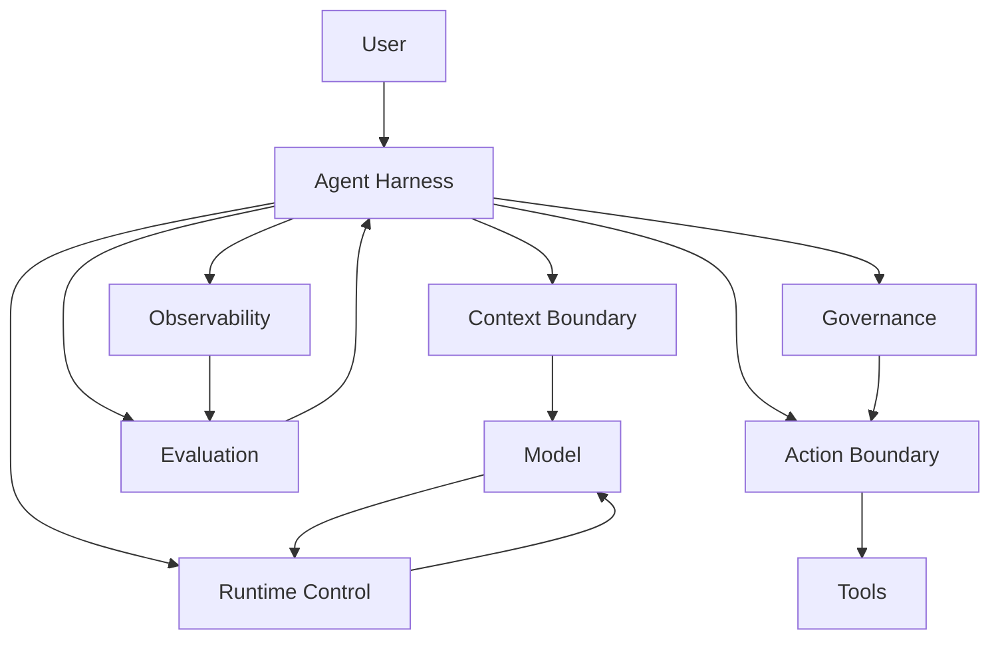

# 01. Why Agent Harness

## 1. Chapter Thesis

The core of an Agent Harness is not making the model smarter. It is placing open-ended, probabilistic model capability inside an engineering system that can control, observe, evaluate, and govern it.

## 2. How This Chapter Connects

This chapter establishes the course question: why prompts, tool calling, and workflows alone are not enough for reliable agent systems. Later chapters decompose the harness into boundaries, runtime, capability packaging, trust mechanisms, and production architecture.

Next: [02. Task, Environment and Boundary](en-course-02.html)

## 3. Learning Outcomes

- Explain the engineering problem solved by `Why Agent Harness` inside an Agent Harness.
- Use this chapter's mental model to review a real agent design.
- Produce the chapter artifact and connect it to the Course Builder Harness case study.
- Identify typical failure modes related to this chapter.

## 4. The Engineering Problem

Many agent prototypes look like a strong model plus a system prompt plus a few tools. This often works in demos, but real tasks reveal unpredictability, poor reproducibility, weak auditability, and limited recovery. The harness does not solve the problem that a model cannot answer; it solves how the system can still complete tasks when the model may be wrong.

## 5. Mental Model

Think of the LLM as a powerful reasoning core without stable engineering boundaries. The harness is the exoskeleton around that core: it defines inputs, constrains actions, records execution, detects failures, triggers recovery, controls permissions, and converts runs into evidence for continuous improvement.

## 6. Harness Abstraction

### LLM
- Responsible for generation, reasoning, explanation, and selection. It is the capability core, not the complete system.

### Agent
- A runtime behavior that takes multi-step actions toward a goal. An agent is not a single class or function; it is a goal-directed execution mode.

### Harness
- The engineering system around the agent that manages boundaries, tools, state, runtime, observation, evaluation, and governance.

### Reliability
- Reliability does not mean the model never fails; it means the system can detect, limit, recover from, and learn from failures.

## 7. Reference Diagram

## 8. Design Principles

- The model provides intelligence; the harness provides control.
- Do not place system reliability in a single system prompt.
- Every external side effect must pass through an explicit boundary.
- Every agent run should leave replayable evidence.

## 9. Reference Implementation Direction

This course emphasizes “thinking > specific solution.” A reference implementation exists to explain the abstraction; no framework, SDK, or protocol should be equated with the harness itself. In implementation, specify boundaries, state, and failure paths before choosing technologies.

Recommended implementation notes
- Store design decisions in Markdown or YAML so they can be versioned and reviewed.
- Place this chapter artifact under `docs/design/` or `labs/` in the repository.
- Whenever an abstraction boundary changes, update the interface assumptions of adjacent chapters.

## 10. Failure Modes

### Prompt-only agent
- All logic is hidden in prompts, making it hard to test, version, or replay.

### Demo reliability
- Works only on demo inputs and lacks failure paths and recovery mechanisms.

### Invisible execution
- Tool calls, context construction, and model decisions are not visible.

### Security by instruction
- Uses instructions such as “do not do dangerous things” instead of real permission control.

## 11. Lab: Course Builder Harness

1. Choose an agent you want to build, such as a course-maintenance assistant, code-review assistant, or research assistant.
2. Write down what it can see, what it can do, and what external effects it can create.
3. List at least three ways it might fail.
4. State in one sentence why it needs a harness rather than only a prompt.

**Expected artifact**: A one-page motivation memo for the Agent Harness.

## 12. Review Checklist

- [ ] I can apply this principle in my own design: The model provides intelligence; the harness provides control.
- [ ] I can apply this principle in my own design: Do not place system reliability in a single system prompt.
- [ ] I can apply this principle in my own design: Every external side effect must pass through an explicit boundary.
- [ ] I can identify and avoid `Prompt-only agent`: All logic is hidden in prompts, making it hard to test, version, or replay.
- [ ] I can identify and avoid `Demo reliability`: Works only on demo inputs and lacks failure paths and recovery mechanisms.

## 13. Image Descriptions

### Image Prompt 1
- A glowing model core enclosed by a transparent engineering shell labeled Context, Tools, Runtime, Eval, and Governance, emphasizing capability inside and control outside.

### Image Prompt 2
- A comparison diagram: a prompt-only demo as a single line on the left, and a closed-loop harness on the right, contrasting uncontrolled and controlled systems.

## 14. Key Takeaways

- `Why Agent Harness` is not an isolated module; it is one engineering boundary through which the Agent Harness handles uncertainty.
- Specific tools will change, but the chapter’s judgment questions should remain stable: what is the boundary, where is the evidence, and how does failure recover?
