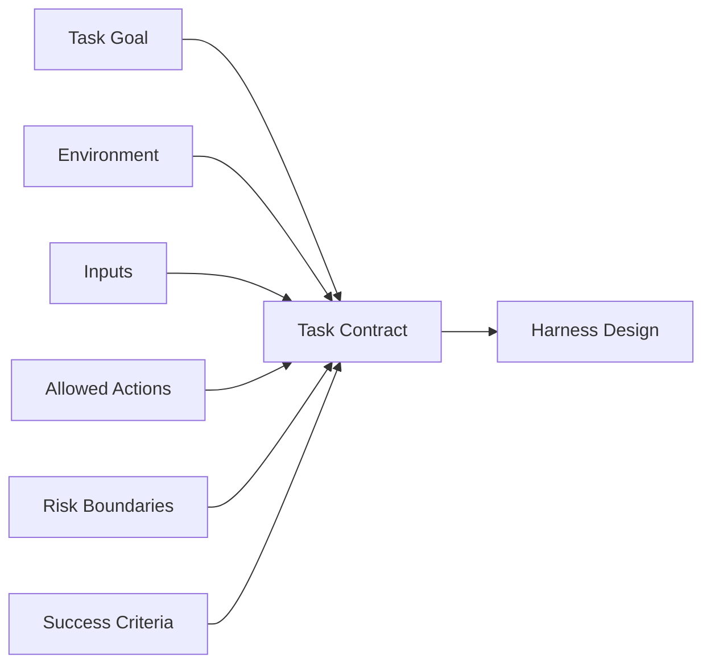

# 02. Task, Environment and Boundary

## 1. Chapter Thesis

The first step in agent design is not choosing tools, frameworks, or models. It is defining the task, environment, and boundaries. Boundaries determine what the agent may know, what it may do, how success is judged, and where it must stop.

## 2. How This Chapter Connects

The previous chapter explained why a harness is needed. This chapter moves the starting point to task definition. The next chapter turns these boundaries into a minimal executable loop.

Previous: [01. Why Agent Harness](en-course-01.html) | Next: [03. Minimal Harness](en-course-03.html)

## 3. Learning Outcomes

- Explain the engineering problem solved by `Task, Environment and Boundary` inside an Agent Harness.
- Use this chapter's mental model to review a real agent design.
- Produce the chapter artifact and connect it to the Course Builder Harness case study.
- Identify typical failure modes related to this chapter.

## 4. The Engineering Problem

Many agent projects fail not because the model is too weak, but because the task has not been engineered. Teams say “let the agent handle email,” “let the agent write code,” or “let the agent do research” without defining input sources, allowed actions, completion criteria, risk levels, and failure handling. Vague goals create vague systems.

## 5. Mental Model

Think of agent design as deploying a constrained actor inside an environment. The task is the goal it pursues, the environment is the world it operates in, boundaries are the walls it cannot cross, and success criteria determine when it should stop.

## 6. Harness Abstraction

### Task contract
- An explicit statement of goal, inputs, outputs, completion criteria, failure conditions, and permission scope.

### Environment
- The external systems the agent can see and affect, such as files, browsers, databases, APIs, email, calendars, or GitHub repositories.

### Information boundary
- The information the agent is allowed to see, including current task, history, user preferences, retrieved material, and system policy.

### Action boundary
- The set of actions the agent may perform, spanning read-only actions, drafts, modifications, commits, sending, purchases, and other risk levels.

### Success criteria
- Evidence used to determine whether the task is complete; it should not rely only on the agent’s own assertion.

## 7. Reference Diagram

## 8. Design Principles

- Define boundaries before expanding capability.
- Success criteria must be observable.
- The higher the risk, the less autonomy the agent should have.
- Do not outsource requirement ambiguity to the model.

## 9. Reference Implementation Direction

This course emphasizes “thinking > specific solution.” A reference implementation exists to explain the abstraction; no framework, SDK, or protocol should be equated with the harness itself. In implementation, specify boundaries, state, and failure paths before choosing technologies.

Recommended implementation notes
- Store design decisions in Markdown or YAML so they can be versioned and reviewed.
- Place this chapter artifact under `docs/design/` or `labs/` in the repository.
- Whenever an abstraction boundary changes, update the interface assumptions of adjacent chapters.

## 10. Failure Modes

### Undefined environment
- The agent does not know which systems are authoritative, causing wrong citations or omissions.

### Unbounded action space
- The agent receives too many action capabilities, so any mistake can create external consequences.

### Subjective completion
- Completion is judged only by the agent itself, without external verification.

### Hidden risk
- Read, write, send, delete, and payment actions are not separated by risk level.

## 11. Lab: Course Builder Harness

1. Use the Course Builder Harness as the case study and define its main task: maintaining and expanding the Agent Harness course repository.
2. List the environment: GitHub repo, course Markdown, image assets, build logs, and references.
3. Divide actions into read-only, low-risk writes, and high-risk publishing.
4. Write three success criteria, such as successful build, complete chapter structure, and no regression in evaluation cases.

**Expected artifact**: A Task Contract template covering goal, environment, inputs, actions, success criteria, failure modes, and approval rules.

## 12. Review Checklist

- [ ] I can apply this principle in my own design: Define boundaries before expanding capability.
- [ ] I can apply this principle in my own design: Success criteria must be observable.
- [ ] I can apply this principle in my own design: The higher the risk, the less autonomy the agent should have.
- [ ] I can identify and avoid `Undefined environment`: The agent does not know which systems are authoritative, causing wrong citations or omissions.
- [ ] I can identify and avoid `Unbounded action space`: The agent receives too many action capabilities, so any mistake can create external consequences.

## 13. Image Descriptions

### Image Prompt 1
- A boundary map with the agent at the center, surrounded by information, action, time, and trust boundaries.

### Image Prompt 2
- An engineering specification card containing goal, environment, inputs, allowed actions, success criteria, and risks.

## 14. Key Takeaways

- `Task, Environment and Boundary` is not an isolated module; it is one engineering boundary through which the Agent Harness handles uncertainty.
- Specific tools will change, but the chapter’s judgment questions should remain stable: what is the boundary, where is the evidence, and how does failure recover?
