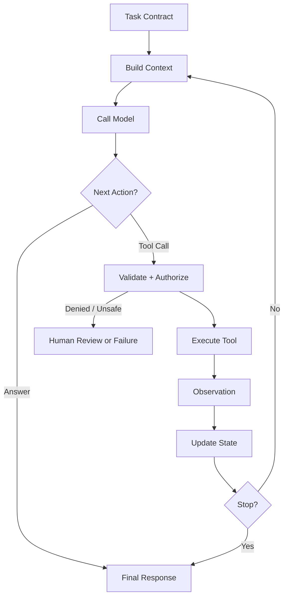

# 03. Minimal Harness

## 1. Chapter Thesis

A minimal harness is not a collection of modules. It is a closed loop: build context, call the model, select an action, execute tools, observe results, update state, and decide whether to continue or stop.

## 2. How This Chapter Connects

The previous chapter defined tasks and boundaries. This chapter turns those definitions into a minimal execution system. Later chapters expand context, tools, state, runtime, and evaluation.

Previous: [02. Task, Environment and Boundary](en-course-02.html) | Next: [04. Context as Information Boundary](en-course-04.html)

## 3. Learning Outcomes

- Explain the engineering problem solved by `Minimal Harness` inside an Agent Harness.
- Use this chapter's mental model to review a real agent design.
- Produce the chapter artifact and connect it to the Course Builder Harness case study.
- Identify typical failure modes related to this chapter.

## 4. The Engineering Problem

Without a minimal loop, teams often treat an agent system as a single model call. Real agent tasks frequently require multi-step execution, and each step can introduce new information, new errors, and new risks. The minimal harness must explicitly manage these steps.

## 5. Mental Model

Think of the harness as a small operating system. The model is not the operating system; it is a reasoning process inside it. The harness handles task scheduling, input construction, external calls, state persistence, error handling, and termination.

## 6. Harness Abstraction

### Context Builder
- Selects what the model should see in the current step based on task, state, environment, and policy.

### Model Step
- Generates the next decision from context: answer, tool call, clarification, or stop.

### Action Selector
- Maps model intent to a controlled action and performs schema validation, permission checks, and risk classification.

### Tool Executor
- Executes external actions and returns structured observations.

### State Update
- Writes each step result into explicit state so the next step does not depend on hidden context.

### Stop Condition
- Determines whether the task is complete, failed, timed out, requires human intervention, or exceeded budget.

## 7. Reference Diagram



## 8. Design Principles

- Make every step explicit: input, decision, action, observation, and state.
- Model output is not the action itself; actions must be validated by the harness.
- Stop conditions are as important as continuation conditions.
- The minimal loop should be framework-independent; specific frameworks are implementation choices.

## 9. Reference Implementation Direction

This course emphasizes “thinking > specific solution.” A reference implementation exists to explain the abstraction; no framework, SDK, or protocol should be equated with the harness itself. In implementation, specify boundaries, state, and failure paths before choosing technologies.

Recommended implementation notes
- Store design decisions in Markdown or YAML so they can be versioned and reviewed.
- Place this chapter artifact under `docs/design/` or `labs/` in the repository.
- Whenever an abstraction boundary changes, update the interface assumptions of adjacent chapters.

## 10. Failure Modes

### Single-call illusion
- Compresses a multi-step task into one model call, making errors hard to isolate and recover.

### Implicit state
- State exists only in conversation text, making it hard to validate, migrate, or recover.

### Unvalidated actions
- Tool arguments generated by the model are executed directly without schema, permission, or risk checks.

### No stop guard
- The loop cannot decide when to stop, causing infinite loops or uncontrolled cost.

## 11. Lab: Course Builder Harness

1. Write minimal loop pseudocode.
2. Define at least five fields in the state object, such as task_id, current_step, files_touched, observations, and risk_level.
3. Define three next-action types: answer, tool_call, and request_approval.
4. Define three stop conditions: success, failure, and human_required.

**Expected artifact**: Pseudocode and a state schema for a minimal harness loop.

## 12. Review Checklist

- [ ] I can apply this principle in my own design: Make every step explicit: input, decision, action, observation, and state.
- [ ] I can apply this principle in my own design: Model output is not the action itself; actions must be validated by the harness.
- [ ] I can apply this principle in my own design: Stop conditions are as important as continuation conditions.
- [ ] I can identify and avoid `Single-call illusion`: Compresses a multi-step task into one model call, making errors hard to isolate and recover.
- [ ] I can identify and avoid `Implicit state`: State exists only in conversation text, making it hard to validate, migrate, or recover.

## 13. Image Descriptions

### Image Prompt 1
- A closed-loop diagram showing Build Context, Model, Tool, Observation, State, and Stop Condition.

### Image Prompt 2
- A timeline with step 1, step 2, and step 3, each showing context, decision, tool call, observation, and state diff.

## Reference Pseudocode

```python
state = initialize_state(task_contract)

while not state.done:
    context = build_context(task_contract, state)
    model_decision = call_model(context)
    action = parse_and_validate(model_decision)

    if action.requires_approval:
        state = request_human_review(state, action)
        continue

    if action.type == "tool_call":
        observation = execute_tool(action)
        state = update_state(state, observation)
    elif action.type == "final_answer":
        state.final_answer = action.content
        state.done = True
    else:
        state = mark_failure(state, reason="unknown_action")

    state = apply_stop_guards(state)
```

## 14. Key Takeaways

- `Minimal Harness` is not an isolated module; it is one engineering boundary through which the Agent Harness handles uncertainty.
- Specific tools will change, but the chapter’s judgment questions should remain stable: what is the boundary, where is the evidence, and how does failure recover?
