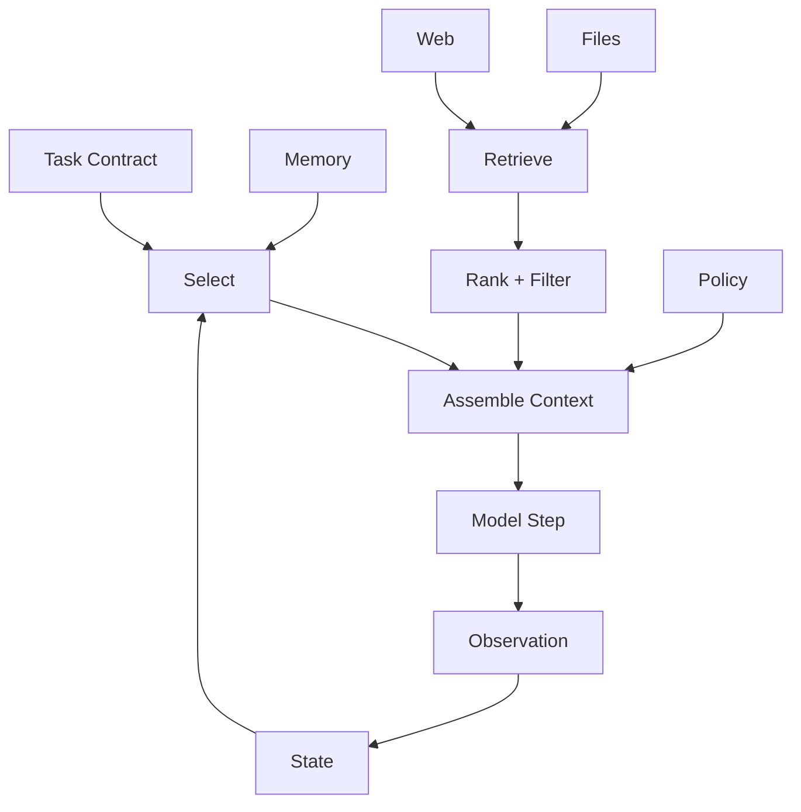

# 04. Context as Information Boundary

## 1. Chapter Thesis

Context is not about stuffing more text into a window. It is the decision about what the agent should know at a step, what it should not know, in what order it should know it, and why it should trust that information.

## 2. How This Chapter Connects

The previous chapter’s minimal loop begins with Build Context. This chapter expands that stage: context is the harness’s information boundary. The next chapter covers the action boundary: Tools and MCP.

Previous: [03. Minimal Harness](en-course-03.html) | Next: [05. Tools and MCP as Action Boundary](en-course-05.html)

## 3. Learning Outcomes

- Explain the engineering problem solved by `Context as Information Boundary` inside an Agent Harness.
- Use this chapter's mental model to review a real agent design.
- Produce the chapter artifact and connect it to the Course Builder Harness case study.
- Identify typical failure modes related to this chapter.

## 4. The Engineering Problem

Models often fail not because they lack capability, but because they see information that is wrong, excessive, stale, irrelevant, or polluted. Context engineering is not about maximizing information volume; it is about constructing a sufficient, relevant, trustworthy, low-noise information boundary.

## 5. Mental Model

Think of context as the agent’s workbench. The workbench should contain task-relevant materials, tool instructions, constraints, state, and evidence—not the entire repository, all past chats, and every search result.

## 6. Harness Abstraction

### Task context
- The current goal, constraints, inputs, output format, and success criteria.

### Environment context
- Current facts from files, web pages, databases, APIs, or repositories.

### Historical context
- Past steps, sessions, decisions, and user preferences. It must be selected, not injected wholesale.

### Policy context
- Safety, permission, approval, and output rules. It tells the model not only facts but boundaries.

### Context budget
- The allocation strategy for a finite window, including token, attention, ordering, and noise budgets.

### Provenance
- Important information should retain source, time, confidence, and reason for use.

## 7. Reference Diagram

## 8. Design Principles

- Relevance over volume.
- Freshness, provenance, and confidence should be part of context.
- Context should be layered: task, state, evidence, and policy should not be mixed together.
- Avoid injecting long-term memory as facts without validation.
- Context construction must be replayable.

## 9. Reference Implementation Direction

This course emphasizes “thinking > specific solution.” A reference implementation exists to explain the abstraction; no framework, SDK, or protocol should be equated with the harness itself. In implementation, specify boundaries, state, and failure paths before choosing technologies.

Recommended implementation notes
- Store design decisions in Markdown or YAML so they can be versioned and reviewed.
- Place this chapter artifact under `docs/design/` or `labs/` in the repository.
- Whenever an abstraction boundary changes, update the interface assumptions of adjacent chapters.

## 10. Failure Modes

### Context overload
- Injects large amounts of irrelevant material and dilutes model attention.

### Context poisoning
- Untrusted sources or prompt injection enter the context.

### Stale context
- Uses stale information, causing the agent to act on old facts.

### Hidden context dependency
- System behavior depends on context that is not recorded or reproducible.

## 11. Lab: Course Builder Harness

1. Design context layers for the course-maintenance case: task, repo snapshot, style guide, chapter state, and policy.
2. Define source, refresh frequency, max token budget, and trust level for each layer.
3. Write a context assembly order and explain which information goes first or later.
4. Design one rule to defend against context pollution.

**Expected artifact**: A Context Pipeline design document.

## 12. Review Checklist

- [ ] I can apply this principle in my own design: Relevance over volume.
- [ ] I can apply this principle in my own design: Freshness, provenance, and confidence should be part of context.
- [ ] I can apply this principle in my own design: Context should be layered: task, state, evidence, and policy should not be mixed together.
- [ ] I can identify and avoid `Context overload`: Injects large amounts of irrelevant material and dilutes model attention.
- [ ] I can identify and avoid `Context poisoning`: Untrusted sources or prompt injection enter the context.

## 13. Image Descriptions

### Image Prompt 1
- An onion-layer diagram showing system policy, task contract, state, retrieved evidence, and tool observations with different trust levels.

### Image Prompt 2
- A workbench with task cards, evidence cards, state board, and policy manual, while unused materials remain outside the desk.

## 14. Key Takeaways

- `Context as Information Boundary` is not an isolated module; it is one engineering boundary through which the Agent Harness handles uncertainty.
- Specific tools will change, but the chapter’s judgment questions should remain stable: what is the boundary, where is the evidence, and how does failure recover?
