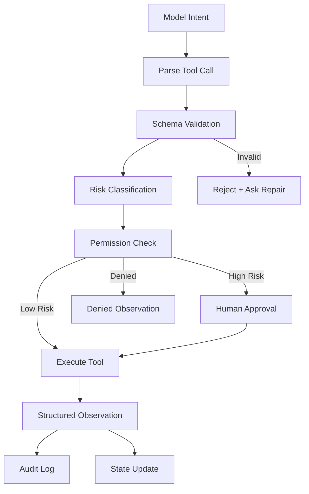

# 05. Tools and MCP as Action Boundary

> **Subtitle**
> Tools are not plugins; they are controlled side effects

## 1. Chapter Thesis

Tools turn an agent from something that can speak into something that can act. Once an agent can act, tools must be treated as action boundaries: every action needs a contract, permission, audit, isolation, and recovery strategy.

## 2. How This Chapter Connects

The previous chapter covered what the agent can see. This chapter covers what the agent can change. The next chapter explains how action results enter state, sessions, and memory.

Previous: [04. Context as Information Boundary](en-course-04.html) | Next: [06. State, Session and Memory](en-course-06.html)

## 3. Learning Outcomes

- Explain the engineering problem solved by `Tools and MCP as Action Boundary` inside an Agent Harness.
- Use this chapter's mental model to review a real agent design.
- Produce the chapter artifact and connect it to the Course Builder Harness case study.
- Identify typical failure modes related to this chapter.

## 4. The Engineering Problem

Many systems treat tool calling as adding features to the model. But tools connect to the real external world: files can be modified, emails sent, data leaked, and services called. Tools create side effects, so they must be engineered and controlled.

## 5. Mental Model

Think of tools as the agent’s robotic arms. The model may propose an action, but the arm should not obey the model directly. It must pass through action parsing, argument validation, permission checks, risk classification, possible human approval, and then execution.

## 6. Harness Abstraction

### Tool schema
- Defines tool name, arguments, types, constraints, return values, and errors. It is the contract between model intent and external action.

### Tool gateway
- A unified control layer through which all tool calls pass for permission, logging, rate limiting, isolation, and audit.

### MCP
- A protocol approach for standardizing connections between model applications and external tools, resources, and context. Treat it as a protocol idea, not the only solution.

### Side effect
- A change made to the external world after tool execution, such as writing files, opening PRs, sending messages, or publishing pages.

### Idempotency
- Whether repeating the same action is safe. It determines retry strategy.

### Approval gate
- A control point where high-risk actions require human approval before execution.

## 7. Reference Diagram

## 8. Design Principles

- The model may propose actions; the harness decides whether to execute.
- All tool calls should be structured, validated, and recorded.
- High-risk actions require human approval by default.
- The more powerful the tool, the finer the permissions should be.
- Check idempotency before retrying.

## 9. Reference Implementation Direction

This course emphasizes “thinking > specific solution.” A reference implementation exists to explain the abstraction; no framework, SDK, or protocol should be equated with the harness itself. In implementation, specify boundaries, state, and failure paths before choosing technologies.

Recommended implementation notes
- Store design decisions in Markdown or YAML so they can be versioned and reviewed.
- Place this chapter artifact under `docs/design/` or `labs/` in the repository.
- Whenever an abstraction boundary changes, update the interface assumptions of adjacent chapters.

## 10. Failure Modes

### Tool soup
- Many tools exist without a unified gateway, naming convention, or risk classification.

### Direct execution
- Model-generated arguments are executed without validation, causing wrong writes, deletions, or sends.

### Over-broad permissions
- The agent receives permissions far broader than the task requires.

### Unlogged side effects
- External systems change without audit records.

## 11. Lab: Course Builder Harness

1. Design six tools for Course Builder Harness: read_file, search_repo, write_draft, run_build, open_pull_request, and publish_pages.
2. Assign a risk level to each tool: read, draft, write, or publish.
3. Design approval gates for open_pull_request and publish_pages.
4. Write a structured observation format for a failed tool call.

**Expected artifact**: A Tool Registry and Permission Matrix.

## 12. Review Checklist

- [ ] I can apply this principle in my own design: The model may propose actions; the harness decides whether to execute.
- [ ] I can apply this principle in my own design: All tool calls should be structured, validated, and recorded.
- [ ] I can apply this principle in my own design: High-risk actions require human approval by default.
- [ ] I can identify and avoid `Tool soup`: Many tools exist without a unified gateway, naming convention, or risk classification.
- [ ] I can identify and avoid `Direct execution`: Model-generated arguments are executed without validation, causing wrong writes, deletions, or sends.

## 13. Image Descriptions

### Image Prompt 1
- A tool gateway diagram where model intent passes through schema validation, permission check, approval gate, executor, and audit log like an airport security process.

### Image Prompt 2
- A side-effect risk ladder from read to draft to write to publish, with different permissions and approval requirements at each level.

## 14. Key Takeaways

- `Tools and MCP as Action Boundary` is not an isolated module; it is one engineering boundary through which the Agent Harness handles uncertainty.
- Specific tools will change, but the chapter’s judgment questions should remain stable: what is the boundary, where is the evidence, and how does failure recover?
