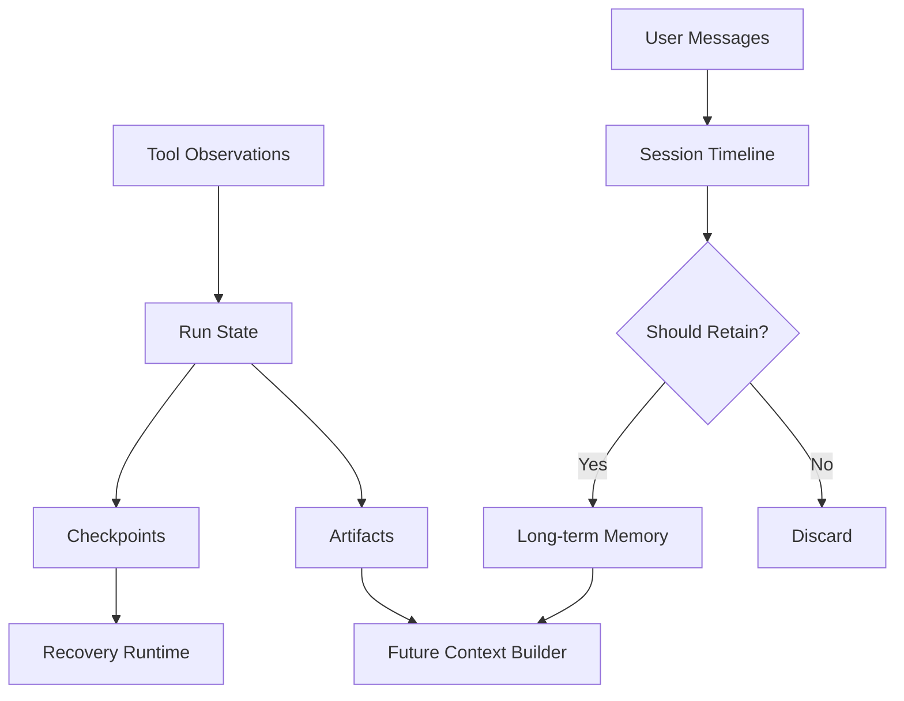

# 06. State, Session and Memory

## 1. Chapter Thesis

Agent continuity comes from explicit state management, not from injecting all history back into context. Memory is fundamentally a policy: what is worth carrying into the future, how long to keep it, how to correct it, and when to delete it.

## 2. How This Chapter Connects

The previous chapter explained how tool actions produce observations. This chapter explains how observations become state, sessions, memory, or artifacts. The next chapter shows how runtime uses state for planning, recovery, and termination.

Previous: [05. Tools and MCP as Action Boundary](en-course-05.html) | Next: [07. Runtime Control](en-course-07.html)

## 3. Learning Outcomes

- Explain the engineering problem solved by `State, Session and Memory` inside an Agent Harness.
- Use this chapter's mental model to review a real agent design.
- Produce the chapter artifact and connect it to the Course Builder Harness case study.
- Identify typical failure modes related to this chapter.

## 4. The Engineering Problem

Agents need continuity across steps, but simply concatenating all chat history, tool results, and user preferences creates noise, privacy risk, error fossilization, and uncontrolled behavior. The harness must distinguish runtime state, session history, long-term memory, and artifacts, and assign lifecycle rules to each.

## 5. Mental Model

Think of state as a whiteboard for the current task, session as the timeline of a work period, memory as approved information entering long-term records, and artifacts as external outputs created by the task. They are not the same thing.

## 6. Harness Abstraction

### State
- Explicit variables for the current run: goal, steps, completed actions, pending errors, file changes, and risk level.

### Session
- The contextual boundary of one continuous interaction or work period. A session does not necessarily become long-term memory.

### Memory
- Information retained across sessions. It should pass through selection, validation, expiration, and deletion policies.

### Profile
- Relatively stable user preferences, style, constraints, and common environments, but it must be editable and revocable.

### Artifact
- Persistent objects created or modified by the agent, such as Markdown, PRs, reports, spreadsheets, or images.

### Checkpoint
- A recoverable intermediate state used for interruption, rollback, retry, and debugging.

## 7. Reference Diagram

## 8. Design Principles

- State must be explicit, not hidden in chat text.
- Memory requires write policy, not default full retention.
- Long-term memory must be correctable, expirable, and deletable.
- Distinguish user preferences, facts, inferences, and temporary task information.
- Artifacts are real outputs and should not be confused with internal state.

## 9. Reference Implementation Direction

This course emphasizes “thinking > specific solution.” A reference implementation exists to explain the abstraction; no framework, SDK, or protocol should be equated with the harness itself. In implementation, specify boundaries, state, and failure paths before choosing technologies.

Recommended implementation notes
- Store design decisions in Markdown or YAML so they can be versioned and reviewed.
- Place this chapter artifact under `docs/design/` or `labs/` in the repository.
- Whenever an abstraction boundary changes, update the interface assumptions of adjacent chapters.

## 10. Failure Modes

### Memory dump
- Injects all history into context, creating noise and privacy risk.

### False memory
- The agent turns a mistaken inference into a long-term fact.

### State hidden in prompt
- Key execution state exists only in the prompt, making recovery and audit hard.

### No forgetting
- Expired, obsolete, or revoked information continues to be used.

## 11. Lab: Course Builder Harness

1. Define a run_state schema for the course-maintenance task.
2. Design a memory write policy: which information may enter long-term memory and which stays only in the session.
3. Define artifact types: chapter Markdown, image prompt, evaluation report, and build log.
4. Design a memory correction flow.

**Expected artifact**: A State Schema and Memory Policy.

## 12. Review Checklist

- [ ] I can apply this principle in my own design: State must be explicit, not hidden in chat text.
- [ ] I can apply this principle in my own design: Memory requires write policy, not default full retention.
- [ ] I can apply this principle in my own design: Long-term memory must be correctable, expirable, and deletable.
- [ ] I can identify and avoid `Memory dump`: Injects all history into context, creating noise and privacy risk.
- [ ] I can identify and avoid `False memory`: The agent turns a mistaken inference into a long-term fact.

## 13. Image Descriptions

### Image Prompt 1
- A layered continuity diagram: a whiteboard for state, a timeline for session, a filing cabinet for memory, and folders for artifacts, showing data flow among them.

### Image Prompt 2
- A memory lifecycle diagram where candidate memory passes through select, verify, store, expire, correct, and delete.

## 14. Key Takeaways

- `State, Session and Memory` is not an isolated module; it is one engineering boundary through which the Agent Harness handles uncertainty.
- Specific tools will change, but the chapter’s judgment questions should remain stable: what is the boundary, where is the evidence, and how does failure recover?
