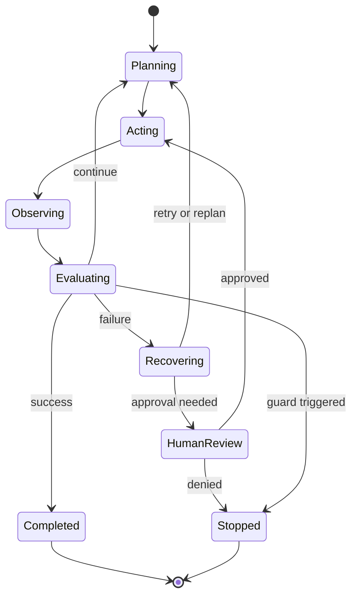

# 07. Runtime Control

## 1. Chapter Thesis

Agent intelligence comes from the model, but reliability comes from the runtime. Runtime Control manages steps, loops, errors, retries, rollback, interruption, cost, and human intervention.

## 2. How This Chapter Connects

The previous chapters defined context, tools, and state. This chapter organizes them into executable runtime discipline. The next part discusses packaging capability into skills and workflows.

Previous: [06. State, Session and Memory](en-course-06.html) | Next: [08. Skills as Capability Packaging](en-course-08.html)

## 3. Learning Outcomes

- Explain the engineering problem solved by `Runtime Control` inside an Agent Harness.
- Use this chapter's mental model to review a real agent design.
- Produce the chapter artifact and connect it to the Course Builder Harness case study.
- Identify typical failure modes related to this chapter.

## 4. The Engineering Problem

Multi-step agent tasks do not follow an ideal linear path. Tools fail, pages change, files conflict, users interrupt, models over-plan or forget the goal. The runtime keeps these uncertainties within a manageable boundary.

## 5. Mental Model

Think of runtime as a flight-control system. The model provides directional judgment, but runtime manages route, fuel, alerts, fallback airports, autopilot limits, and pilot takeover.

## 6. Harness Abstraction

### Planning
- Decomposes goals into steps, dependencies, and checkpoints. Planning can be model-generated or workflow-constrained.

### Execution
- Executes the next action according to current state and permissions.

### Observation
- Converts external results into structured feedback rather than unstructured text accumulation.

### Recovery
- After failure, decides whether to retry, degrade, rollback, ask for human help, or stop.

### Loop guard
- Limits maximum steps, cost, time, repeated actions, and low-progress loops.

### Human-in-the-loop
- Introduces human decision-making at uncertain, high-risk, or value-laden points.

## 7. Reference Diagram



## 8. Design Principles

- The runtime manages uncertainty rather than letting the model roam freely.
- Every retry needs a reason, limit, and idempotency check.
- Planning should guide execution but not replace observation.
- Human intervention is not failure; it is a control capability of the harness.
- Cost, time, and step count are runtime resources.

## 9. Reference Implementation Direction

This course emphasizes “thinking > specific solution.” A reference implementation exists to explain the abstraction; no framework, SDK, or protocol should be equated with the harness itself. In implementation, specify boundaries, state, and failure paths before choosing technologies.

Recommended implementation notes
- Store design decisions in Markdown or YAML so they can be versioned and reviewed.
- Place this chapter artifact under `docs/design/` or `labs/` in the repository.
- Whenever an abstraction boundary changes, update the interface assumptions of adjacent chapters.

## 10. Failure Modes

### Infinite loop
- The agent repeats similar actions without progress.

### Over-planning
- The agent spends many steps planning without executing verifiable actions.

### Blind retry
- After tool failure, the system retries without analyzing the cause.

### No interruption model
- The system cannot safely save and recover after user or system interruption.

## 11. Lab: Course Builder Harness

1. Define maximum steps, maximum cost, and maximum runtime for the Course Builder Harness.
2. Design replan conditions such as build failure, file conflict, or goal change.
3. Design a retry policy: which tools may retry and which require human confirmation.
4. Define a recovery flow for user interruption.

**Expected artifact**: A Runtime Policy and Stop Guard design.

## 12. Review Checklist

- [ ] I can apply this principle in my own design: The runtime manages uncertainty rather than letting the model roam freely.
- [ ] I can apply this principle in my own design: Every retry needs a reason, limit, and idempotency check.
- [ ] I can apply this principle in my own design: Planning should guide execution but not replace observation.
- [ ] I can identify and avoid `Infinite loop`: The agent repeats similar actions without progress.
- [ ] I can identify and avoid `Over-planning`: The agent spends many steps planning without executing verifiable actions.

## 13. Image Descriptions

### Image Prompt 1
- A flight-control analogy: the model provides navigation judgment, while runtime provides dashboard, fuel, alerts, autopilot constraints, and manual takeover button.

### Image Prompt 2
- A runtime state machine showing transitions among Planning, Acting, Observing, Recovering, Human Review, and Completed.

## Runtime Guard Example

```yaml
runtime_policy:
  max_steps: 20
  max_tool_calls: 12
  timeout_seconds: 300
  retry:
    read_file:
      max_attempts: 2
      idempotent: true
    publish_pages:
      max_attempts: 0
      requires_approval: true
  stop_when:
    - success_criteria_met
    - human_approval_denied
    - repeated_no_progress_steps >= 3
```

## 14. Key Takeaways

- `Runtime Control` is not an isolated module; it is one engineering boundary through which the Agent Harness handles uncertainty.
- Specific tools will change, but the chapter’s judgment questions should remain stable: what is the boundary, where is the evidence, and how does failure recover?
