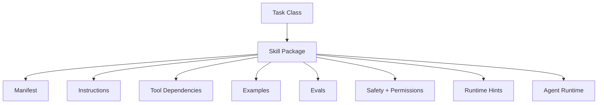

# 08. Skills as Capability Packaging

> **Subtitle**
> From one-off action to reusable capability unit

## 1. Chapter Thesis

A skill is not a single prompt and not a single tool. A skill packages context, tools, steps, constraints, examples, and evaluation criteria around a class of task goals.

## 2. How This Chapter Connects

The previous chapter established runtime control. This chapter moves into composition: how to package repeated successful behavior into reusable capability. The next chapter covers workflows as deterministic scaffolding.

Previous: [07. Runtime Control](en-course-07.html) | Next: [09. Workflows as Deterministic Scaffolding](en-course-09.html)

## 3. Learning Outcomes

- Explain the engineering problem solved by `Skills as Capability Packaging` inside an Agent Harness.
- Use this chapter's mental model to review a real agent design.
- Produce the chapter artifact and connect it to the Course Builder Harness case study.
- Identify typical failure modes related to this chapter.

## 4. The Engineering Problem

If every task rewrites prompts, reselects tools, and re-explains the process, the system cannot accumulate capability. A skill captures a successful path for a class of tasks so the agent can reuse it reliably instead of exploring from scratch every time.

## 5. Mental Model

Think of a skill as a standard operating capability package. It tells the agent what information, tools, steps, constraints, and quality criteria to use for this class of task.

## 6. Harness Abstraction

### Skill manifest
- Describes skill name, goal, inputs, outputs, required tools, permissions, runtime policy, and version.

### Instruction bundle
- The skill’s operating principles, style, constraints, and error-handling guidance.

### Examples
- High-quality input-output examples that help the model understand task distribution and quality criteria.

### Evals
- Tests and rubrics used to judge whether the skill remains effective.

### Skill registry
- A central registry that manages available skills, versions, dependencies, and authorization scope.

## 7. Reference Diagram



## 8. Design Principles

- A skill packages how to complete a task, not only how to call tools.
- Every skill should define where it applies and where it does not.
- Reusable capability must be evaluable.
- Skills need versioning because capability packages evolve.
- Do not hide high-risk permissions inside a skill.

## 9. Reference Implementation Direction

This course emphasizes “thinking > specific solution.” A reference implementation exists to explain the abstraction; no framework, SDK, or protocol should be equated with the harness itself. In implementation, specify boundaries, state, and failure paths before choosing technologies.

Recommended implementation notes
- Store design decisions in Markdown or YAML so they can be versioned and reviewed.
- Place this chapter artifact under `docs/design/` or `labs/` in the repository.
- Whenever an abstraction boundary changes, update the interface assumptions of adjacent chapters.

## 10. Failure Modes

### Prompt fragment as skill
- Stores only a prompt fragment without inputs, outputs, tools, permissions, or evaluation.

### Over-general skill
- One skill tries to cover too many tasks, causing unstable behavior.

### Unversioned skill
- After modifying a skill, the team cannot know which version caused regression.

### Unsafe reuse
- A skill designed for low-risk scenarios is reused in high-risk scenarios.

## 11. Lab: Course Builder Harness

1. Define a lesson_writer skill for the Course Builder Harness.
2. Write an input_schema: topic, audience, chapter_position, source_materials, and style_guide.
3. Write an output_schema: markdown, summary, image_descriptions, and self_check.
4. Design three eval cases to judge whether the skill is stable.

**Expected artifact**: A complete Skill Manifest.

## 12. Review Checklist

- [ ] I can apply this principle in my own design: A skill packages how to complete a task, not only how to call tools.
- [ ] I can apply this principle in my own design: Every skill should define where it applies and where it does not.
- [ ] I can apply this principle in my own design: Reusable capability must be evaluable.
- [ ] I can identify and avoid `Prompt fragment as skill`: Stores only a prompt fragment without inputs, outputs, tools, permissions, or evaluation.
- [ ] I can identify and avoid `Over-general skill`: One skill tries to cover too many tasks, causing unstable behavior.

## 13. Image Descriptions

### Image Prompt 1
- An exploded view of a skill package showing manifest, instructions, tools, examples, evals, policy, and runtime hints.

### Image Prompt 2
- A comparison: a single wrench icon for a tool on the left, and a toolbox for a skill on the right, emphasizing that a skill is a higher-level capability package.

## Skill Manifest Template

```yaml
name: lesson_writer
version: 0.1.0
goal: Generate a bilingual course lesson in Markdown.
inputs:
  - topic
  - audience
  - chapter_position
  - source_materials
  - style_guide
outputs:
  - markdown
  - summary
  - image_descriptions
  - self_check
tools:
  - read_file
  - search_repo
  - write_draft
permissions:
  default: draft_only
evals:
  - structure_completeness
  - bilingual_consistency
  - philosophy_alignment
```

## 14. Key Takeaways

- `Skills as Capability Packaging` is not an isolated module; it is one engineering boundary through which the Agent Harness handles uncertainty.
- Specific tools will change, but the chapter’s judgment questions should remain stable: what is the boundary, where is the evidence, and how does failure recover?
