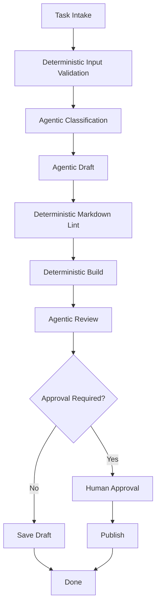

# 09. Workflows as Deterministic Scaffolding

> **Subtitle**
> Leave determinism to code and uncertainty to the model

## 1. Chapter Thesis

A workflow is not the opposite of an agent; it is the agent’s scaffold. A good harness encodes deterministic, enumerable, and verifiable parts as workflow, while leaving open-ended judgment, explanation, and generation to the model.

## 2. How This Chapter Connects

The previous chapter explained how skills package capability. This chapter explains how workflows organize those capabilities and constrain execution order. The next chapter covers multi-agent division of labor in more complex organizations.

Previous: [08. Skills as Capability Packaging](en-course-08.html) | Next: [10. Multi-agent Orchestration](en-course-10.html)

## 3. Learning Outcomes

- Explain the engineering problem solved by `Workflows as Deterministic Scaffolding` inside an Agent Harness.
- Use this chapter's mental model to review a real agent design.
- Produce the chapter artifact and connect it to the Course Builder Harness case study.
- Identify typical failure modes related to this chapter.

## 4. The Engineering Problem

Many agent systems are unstable because deterministic procedures are delegated to the model: file-read order, build commands, approval flow, output validation, pre-commit checks. These do not need model creativity. The value of workflow is to reduce uncertainty.

## 5. Mental Model

Think of workflow as rails and the agent as a driver making judgments on the rails. Rails limit dangerous space; the driver handles open situations. Without rails, the driver wanders; without a driver, rails only handle fixed paths.

## 6. Harness Abstraction

### Deterministic step
- A step with clear input-output behavior and fixed rules that does not require model judgment.

### Agentic step
- A step requiring open-ended judgment, semantic understanding, generation, explanation, or exploration.

### Workflow graph
- An explicit structure of steps, dependencies, branches, and termination conditions.

### Validator
- Uses deterministic rules to check model output or tool results.

### Router
- Selects the next path based on task type, risk, context, or result.

## 7. Reference Diagram

## 8. Design Principles

- Deterministic procedures should not be improvised by the model.
- Workflow owns structure; the agent owns judgment.
- Each agentic step should ideally be followed by a validator.
- High-risk branches should be explicitly modeled, not left to model self-discipline.
- Do not abandon predictability just to appear intelligent.

## 9. Reference Implementation Direction

This course emphasizes “thinking > specific solution.” A reference implementation exists to explain the abstraction; no framework, SDK, or protocol should be equated with the harness itself. In implementation, specify boundaries, state, and failure paths before choosing technologies.

Recommended implementation notes
- Store design decisions in Markdown or YAML so they can be versioned and reviewed.
- Place this chapter artifact under `docs/design/` or `labs/` in the repository.
- Whenever an abstraction boundary changes, update the interface assumptions of adjacent chapters.

## 10. Failure Modes

### Agent does everything
- Hands all process control to the model, causing poor reproducibility.

### Rigid workflow
- Hard-codes the entire process and cannot handle open-ended tasks.

### No validation after generation
- Generated output directly enters the next step and errors amplify.

### Hidden branch logic
- Branch conditions are hidden in prompts instead of workflow graphs.

## 11. Lab: Course Builder Harness

1. Design a chapter-generation workflow: intake, context build, draft, review, lint, build, approval, publish.
2. Mark which steps are deterministic and which are agentic.
3. Design a validator for draft output.
4. Design human approval for the publish step.

**Expected artifact**: A Course Publishing Hybrid Workflow diagram and step description.

## 12. Review Checklist

- [ ] I can apply this principle in my own design: Deterministic procedures should not be improvised by the model.
- [ ] I can apply this principle in my own design: Workflow owns structure; the agent owns judgment.
- [ ] I can apply this principle in my own design: Each agentic step should ideally be followed by a validator.
- [ ] I can identify and avoid `Agent does everything`: Hands all process control to the model, causing poor reproducibility.
- [ ] I can identify and avoid `Rigid workflow`: Hard-codes the entire process and cannot handle open-ended tasks.

## 13. Image Descriptions

### Image Prompt 1
- Rails represent workflow, a driver represents the agent, road signs represent validators, and toll gates represent approval gates.

### Image Prompt 2
- A hybrid workflow diagram using different shapes for deterministic steps, agentic steps, approval gates, and validators.

## 14. Key Takeaways

- `Workflows as Deterministic Scaffolding` is not an isolated module; it is one engineering boundary through which the Agent Harness handles uncertainty.
- Specific tools will change, but the chapter’s judgment questions should remain stable: what is the boundary, where is the evidence, and how does failure recover?
