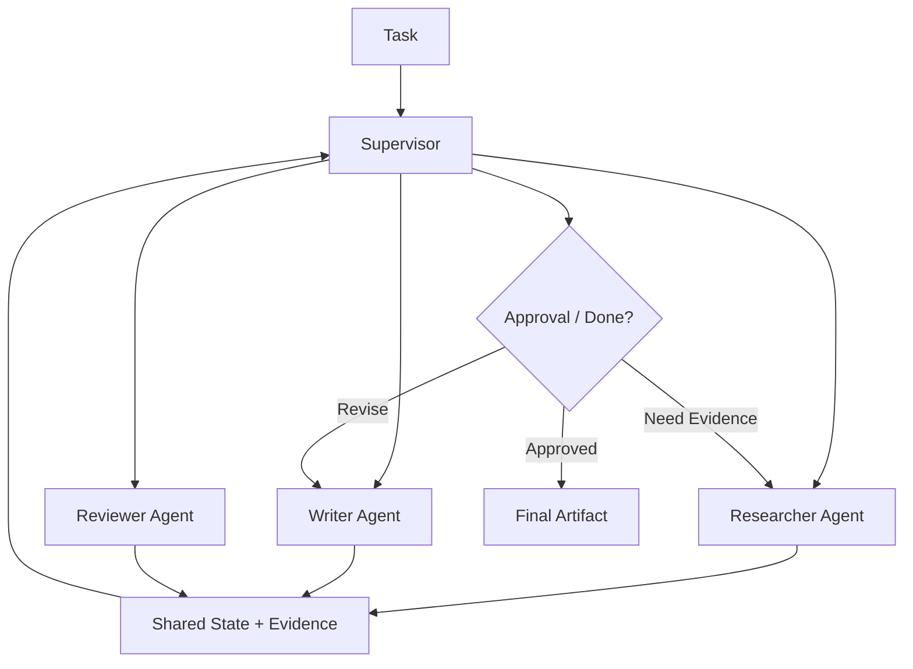

# 10. Multi-agent Orchestration

> **Subtitle**
> Multi-agent design is organizational design, not more agents

## 1. Chapter Thesis

Multi-agent design is valuable only when goals, contexts, permissions, or evaluation criteria need separation. It is not about adding more capability; it is a tradeoff between complexity and coordination cost.

## 2. How This Chapter Connects

The previous chapter discussed workflows as deterministic scaffolding. This chapter covers role division when a single agent or workflow is insufficient. The next part enters trusted systems: observation, evaluation, and governance.

Previous: [09. Workflows as Deterministic Scaffolding](en-course-09.html) | Next: [11. Observability and Debugging](en-course-11.html)

## 3. Learning Outcomes

- Explain the engineering problem solved by `Multi-agent Orchestration` inside an Agent Harness.
- Use this chapter's mental model to review a real agent design.
- Produce the chapter artifact and connect it to the Course Builder Harness case study.
- Identify typical failure modes related to this chapter.

## 4. The Engineering Problem

Multi-agent systems are often misused as complexity theater: planner, researcher, writer, critic, executor are all added without clear boundaries. The result is duplicated context, more conflicts, higher cost, and unclear responsibility. The right question is: which uncertainties need separation?

## 5. Mental Model

Think of multi-agent design as organizational structure. Roles are not for anthropomorphism; they isolate goals, permissions, information, and evaluation criteria. Each role should have clear input, output, responsibility, and stop conditions.

## 6. Harness Abstraction

### Supervisor
- Assigns tasks, summarizes state, handles conflicts, and decides when to stop.

### Specialist
- Performs high-quality work within a specific task type, context, or tool set.

### Reviewer
- Independently checks results and should not share exactly the same judgment path as the generator.

### Handoff protocol
- A structured format for one agent handing work to another, including goal, state, evidence, risk, and expected output.

### Shared state
- Task state visible to all roles. It must be small and explicit to avoid cross-contamination.

### Private context
- Information or evaluation perspective specific to one role, used to reduce bias and responsibility confusion.

## 7. Reference Diagram

## 8. Design Principles

- Different roles are justified only when boundaries differ.
- Multi-agent design increases coordination cost and must buy clearer responsibility or higher-quality judgment.
- A reviewer should have independent criteria, not a copy of the writer’s prompt.
- All handoffs should be structured.
- Shared state should be minimized; private context should be explicit.

## 9. Reference Implementation Direction

This course emphasizes “thinking > specific solution.” A reference implementation exists to explain the abstraction; no framework, SDK, or protocol should be equated with the harness itself. In implementation, specify boundaries, state, and failure paths before choosing technologies.

Recommended implementation notes
- Store design decisions in Markdown or YAML so they can be versioned and reviewed.
- Place this chapter artifact under `docs/design/` or `labs/` in the repository.
- Whenever an abstraction boundary changes, update the interface assumptions of adjacent chapters.

## 10. Failure Modes

### Multi-agent theater
- Many roles exist, but boundaries, permissions, and outputs are not meaningfully different.

### Consensus illusion
- Multiple agents agree with each other and are mistaken for independent verification.

### Coordination explosion
- Handoff, summarization, and conflict-resolution costs exceed benefits.

### Shared context pollution
- One agent’s wrong inference pollutes all roles.

## 11. Lab: Course Builder Harness

1. Design four roles for course maintenance: Researcher, Writer, Reviewer, Publisher.
2. Define goal, input, output, tool permissions, and evaluation criteria for each role.
3. Design a handoff payload.
4. List three scenarios that should not be split into multiple agents.

**Expected artifact**: A Multi-agent Role Charter and Handoff Protocol.

## 12. Review Checklist

- [ ] I can apply this principle in my own design: Different roles are justified only when boundaries differ.
- [ ] I can apply this principle in my own design: Multi-agent design increases coordination cost and must buy clearer responsibility or higher-quality judgment.
- [ ] I can apply this principle in my own design: A reviewer should have independent criteria, not a copy of the writer’s prompt.
- [ ] I can identify and avoid `Multi-agent theater`: Many roles exist, but boundaries, permissions, and outputs are not meaningfully different.
- [ ] I can identify and avoid `Consensus illusion`: Multiple agents agree with each other and are mistaken for independent verification.

## 13. Image Descriptions

### Image Prompt 1
- An organization chart with Supervisor at the top and Researcher, Writer, Reviewer, Publisher below, each with permission and output labels.

### Image Prompt 2
- A handoff card containing objective, state, evidence, risks, expected output, and deadline.

## 14. Key Takeaways

- `Multi-agent Orchestration` is not an isolated module; it is one engineering boundary through which the Agent Harness handles uncertainty.
- Specific tools will change, but the chapter’s judgment questions should remain stable: what is the boundary, where is the evidence, and how does failure recover?
