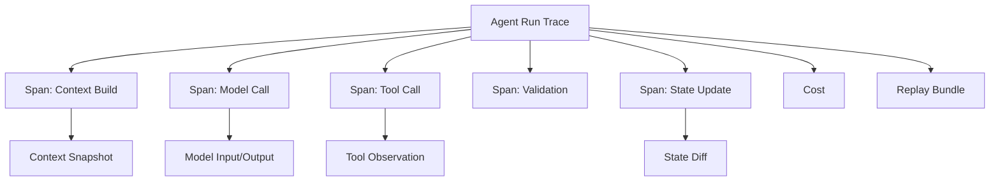

# 11. Observability and Debugging

## 1. Chapter Thesis

An agent that cannot be observed cannot be debugged; an agent that cannot be debugged cannot be productionized. Observability turns an agent run into readable, replayable, and comparable engineering evidence.

## 2. How This Chapter Connects

The previous chapters defined execution structure. This chapter enters the trust layer: system execution must leave evidence. The next chapter uses that evidence for evaluation, testing, and benchmarking.

Previous: [10. Multi-agent Orchestration](en-course-10.html) | Next: [12. Evaluation, Testing and Benchmarking](en-course-12.html)

## 3. Learning Outcomes

- Explain the engineering problem solved by `Observability and Debugging` inside an Agent Harness.
- Use this chapter's mental model to review a real agent design.
- Produce the chapter artifact and connect it to the Course Builder Harness case study.
- Identify typical failure modes related to this chapter.

## 4. The Engineering Problem

When an agent fails, the final answer alone cannot tell whether the problem came from task definition, context, tools, state, model judgment, permissions, or runtime. Observability is not about collecting more logs; it is about locating causes of failure and comparing system changes.

## 5. Mental Model

Think of observability as the agent’s black box and timeline. Every run should be reconstructable: what it saw, what it intended, what it did, what the external world returned, how state changed, and why it stopped.

## 6. Harness Abstraction

### Trace
- The top-level record of one complete agent run.

### Span
- A sub-operation such as context build, model call, tool call, validation, or approval.

### Event
- A discrete fact during execution, such as retry, error, user interruption, or policy denial.

### Context snapshot
- A record of the exact context seen by the model call, used for replay and diffing.

### State diff
- The state changes before and after each step, helping identify when an error entered the system.

### Replay
- Reruns or inspects a run using the same input, state, and context.

## 7. Reference Diagram



## 8. Design Principles

- Record enough information for replay, not only the final answer.
- Logs should be structured so they can be searched, aggregated, and compared.
- Every model call should be associated with a context snapshot.
- Every tool call needs a correlation ID, arguments, result, error, and permission record.
- Privacy and observability must be designed together.

## 9. Reference Implementation Direction

This course emphasizes “thinking > specific solution.” A reference implementation exists to explain the abstraction; no framework, SDK, or protocol should be equated with the harness itself. In implementation, specify boundaries, state, and failure paths before choosing technologies.

Recommended implementation notes
- Store design decisions in Markdown or YAML so they can be versioned and reviewed.
- Place this chapter artifact under `docs/design/` or `labs/` in the repository.
- Whenever an abstraction boundary changes, update the interface assumptions of adjacent chapters.

## 10. Failure Modes

### Final-answer-only logging
- Only final answers are saved, making intermediate analysis impossible.

### Unstructured logs
- Logs are natural-language fragments, hard to aggregate or compare.

### No context snapshot
- Cannot know what the model saw at the time.

### No correlation IDs
- Cannot connect tool calls, state changes, and user requests.

## 11. Lab: Course Builder Harness

1. Design trace_id, run_id, step_id, and tool_call_id for the Course Builder Harness.
2. Define fields to store for each model_call span.
3. Define context diff: how to compare two contexts when chapter quality regresses.
4. Design a failure replay page or report.

**Expected artifact**: An Agent Run Trace Schema and Debugging Report template.

## 12. Review Checklist

- [ ] I can apply this principle in my own design: Record enough information for replay, not only the final answer.
- [ ] I can apply this principle in my own design: Logs should be structured so they can be searched, aggregated, and compared.
- [ ] I can apply this principle in my own design: Every model call should be associated with a context snapshot.
- [ ] I can identify and avoid `Final-answer-only logging`: Only final answers are saved, making intermediate analysis impossible.
- [ ] I can identify and avoid `Unstructured logs`: Logs are natural-language fragments, hard to aggregate or compare.

## 13. Image Descriptions

### Image Prompt 1
- A black-box recorder showing task, context, model output, tool call, state diff, and stop reason.

### Image Prompt 2
- A horizontal timeline showing duration, cost, input, output, and errors for each span.

## Trace Schema Example

```json
{
  "run_id": "run_001",
  "task_id": "chapter_revision",
  "spans": [
    {"type": "context_build", "context_hash": "...", "sources": []},
    {"type": "model_call", "input_hash": "...", "output_hash": "..."},
    {"type": "tool_call", "tool": "write_draft", "risk": "draft"}
  ],
  "stop_reason": "success_criteria_met"
}
```

## 14. Key Takeaways

- `Observability and Debugging` is not an isolated module; it is one engineering boundary through which the Agent Harness handles uncertainty.
- Specific tools will change, but the chapter’s judgment questions should remain stable: what is the boundary, where is the evidence, and how does failure recover?
