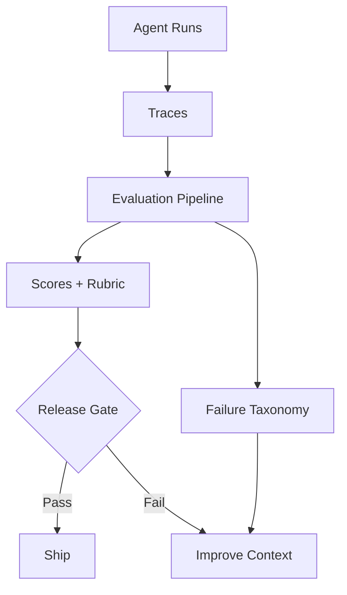

# 12. Evaluation, Testing and Benchmarking

> **Subtitle**
> A feedback system from behavior to evidence

## 1. Chapter Thesis

Evaluation is not about ranking models on leaderboards; it is about building a feedback loop for the harness. It answers whether the system completes tasks, whether it regressed, why it failed, and whether a change is ready to ship.

## 2. How This Chapter Connects

The previous chapter made agent runs visible. This chapter turns visible runs into evidence for judging system quality. The next chapter covers how to limit the power of a system that can change the external world.

Previous: [11. Observability and Debugging](en-course-11.html) | Next: [13. Security, Permissions and Governance](en-course-13.html)

## 3. Learning Outcomes

- Explain the engineering problem solved by `Evaluation, Testing and Benchmarking` inside an Agent Harness.
- Use this chapter's mental model to review a real agent design.
- Produce the chapter artifact and connect it to the Course Builder Harness case study.
- Identify typical failure modes related to this chapter.

## 4. The Engineering Problem

Many teams judge agent improvement by whether it “feels good.” This cannot support regression testing, version selection, cost control, or release decisions. Harness evaluation should cover tools, workflows, skills, tasks, risks, and production metrics.

## 5. Mental Model

Think of evaluation as the system’s immune system and feedback system. It not only finds errors, but helps the team locate the layer responsible: task definition, context, tools, state, runtime, skill, workflow, safety policy, or model choice.

## 6. Harness Abstraction

### Unit test
- Tests deterministic components such as parsers, validators, tool wrappers, and schemas.

### Workflow test
- Tests workflow branches, approvals, fallbacks, and stop conditions.

### Golden task set
- A fixed set of representative real tasks used for regression comparison.

### Rubric
- Breaks quality judgment into executable criteria such as accuracy, completeness, evidence, style, and consistency.

### Adversarial eval
- Tests risks such as prompt injection, tool abuse, permission bypass, and data leakage.

### Production metrics
- Success rate, human-intervention rate, cost, latency, failure type, and user-correction rate in real runs.

## 7. Reference Diagram



## 8. Design Principles

- Define success before optimizing the system.
- Evaluation should cover behavior, not only answer text.
- Every important skill should have a regression set.
- Evaluation results should localize the failing layer.
- Cost and latency are quality metrics too.

## 9. Reference Implementation Direction

This course emphasizes “thinking > specific solution.” A reference implementation exists to explain the abstraction; no framework, SDK, or protocol should be equated with the harness itself. In implementation, specify boundaries, state, and failure paths before choosing technologies.

Recommended implementation notes
- Store design decisions in Markdown or YAML so they can be versioned and reviewed.
- Place this chapter artifact under `docs/design/` or `labs/` in the repository.
- Whenever an abstraction boundary changes, update the interface assumptions of adjacent chapters.

## 10. Failure Modes

### Eval by vibes
- Judges quality by feeling, making results non-repeatable and non-comparable.

### Answer-only eval
- Evaluates only final text, not tools, state, permissions, or process.

### Static benchmark obsession
- Optimizes for generic benchmarks while ignoring the system’s own task distribution.

### No regression gate
- Prompt, skill, or tool changes ship without regression checks.

## 11. Lab: Course Builder Harness

1. Design five golden tasks for the lesson_writer skill.
2. Write a rubric: structure completeness, bilingual consistency, engineering philosophy, and concrete implementation not overpowering the main idea.
3. Design an adversarial case where source material tries to make the agent ignore the course structure.
4. Define release gates: pass rate, human-edit rate, build success rate, and cost ceiling.

**Expected artifact**: An Evaluation Matrix, Golden Task Set, and Rubric.

## 12. Review Checklist

- [ ] I can apply this principle in my own design: Define success before optimizing the system.
- [ ] I can apply this principle in my own design: Evaluation should cover behavior, not only answer text.
- [ ] I can apply this principle in my own design: Every important skill should have a regression set.
- [ ] I can identify and avoid `Eval by vibes`: Judges quality by feeling, making results non-repeatable and non-comparable.
- [ ] I can identify and avoid `Answer-only eval`: Evaluates only final text, not tools, state, permissions, or process.

## 13. Image Descriptions

### Image Prompt 1
- An evaluation pyramid with unit tests at the bottom, workflow/skill evals in the middle, and task success plus production metrics at the top.

### Image Prompt 2
- A feedback loop where trace data enters eval, eval produces failure categories, and categories drive improvements to context, tools, runtime, and skills.

## Rubric Example

```yaml
rubric:
  structure_completeness: 0-5
  bilingual_consistency: 0-5
  philosophy_alignment: 0-5
  concrete_examples: 0-5
  safety_awareness: 0-5
release_gate:
  min_average_score: 4.2
  max_critical_failures: 0
  max_cost_per_task_usd: 1.50
```

## 14. Key Takeaways

- `Evaluation, Testing and Benchmarking` is not an isolated module; it is one engineering boundary through which the Agent Harness handles uncertainty.
- Specific tools will change, but the chapter’s judgment questions should remain stable: what is the boundary, where is the evidence, and how does failure recover?
