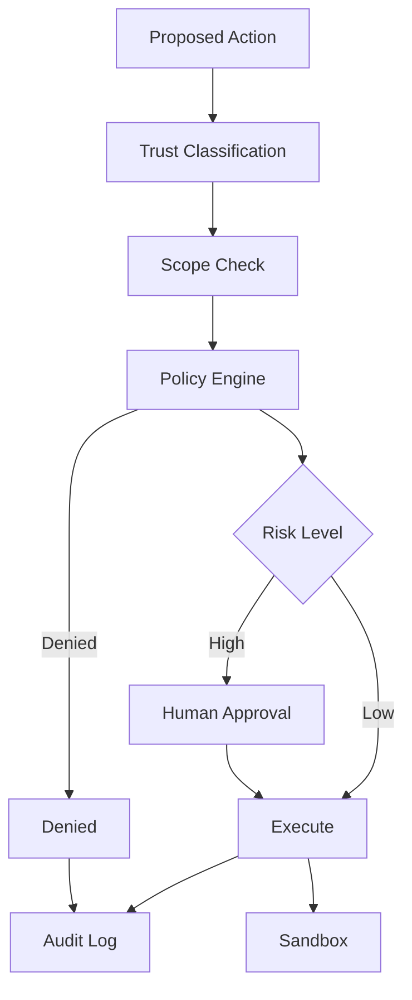

# 13. Security, Permissions and Governance

> **Subtitle**
> Limit the agent’s power

## 1. Chapter Thesis

Agent security is not about making the model more obedient; it is about keeping the system safe even when the model is unreliable. Permissions, approval, sandboxing, audit, and policy engines should be part of the harness architecture.

## 2. How This Chapter Connects

The previous chapter covered judging whether the system works. This chapter asks whether the system is safe, compliant, and controllable. The next chapter organizes all components into production architecture.

Previous: [12. Evaluation, Testing and Benchmarking](en-course-12.html) | Next: [14. Production Architecture](en-course-14.html)

## 3. Learning Outcomes

- Explain the engineering problem solved by `Security, Permissions and Governance` inside an Agent Harness.
- Use this chapter's mental model to review a real agent design.
- Produce the chapter artifact and connect it to the Course Builder Harness case study.
- Identify typical failure modes related to this chapter.

## 4. The Engineering Problem

An agent that can read data, call tools, modify files, send messages, or publish content has real power. Prompts cannot replace permission systems. Assume the model may be induced, misunderstand context, or choose the wrong action, then use architecture to limit damage.

## 5. Mental Model

Think of security as power design. Every capability must answer: who authorizes it, what scope is allowed, when approval is required, how it is recorded, how to recover, and how the user can revoke it.

## 6. Harness Abstraction

### Prompt injection
- Untrusted content attempts to alter instructions, leak data, or execute unauthorized actions.

### Least privilege
- The agent receives only the minimum capability needed for the current task.

### Permission scope
- Permissions should be scoped by resource, action, time, risk, and user intent.

### Approval gate
- Human confirmation before high-risk or irreversible actions.

### Policy engine
- Uses auditable rules to decide whether an action is allowed.

### Audit log
- Records who requested and executed what action, when, and for which task.

## 7. Reference Diagram

## 8. Design Principles

- Security is architecture, not instruction.
- Deny high-risk actions by default and execute only after explicit authorization.
- Untrusted content must never be promoted to system instruction.
- Permissions should expire when the task ends.
- Audit logs should cover denied actions, not only successful ones.

## 9. Reference Implementation Direction

This course emphasizes “thinking > specific solution.” A reference implementation exists to explain the abstraction; no framework, SDK, or protocol should be equated with the harness itself. In implementation, specify boundaries, state, and failure paths before choosing technologies.

Recommended implementation notes
- Store design decisions in Markdown or YAML so they can be versioned and reviewed.
- Place this chapter artifact under `docs/design/` or `labs/` in the repository.
- Whenever an abstraction boundary changes, update the interface assumptions of adjacent chapters.

## 10. Failure Modes

### Security as prompt
- Uses “do not leak information” instead of data-access control.

### Permanent broad token
- Gives the agent a long-lived, broad, high-privilege token.

### No trust separation
- Mixes web content, user input, and system policy in the same instruction layer.

### No approval trail
- After high-risk actions, there is no proof that the user approved them.

## 11. Lab: Course Builder Harness

1. Design a permission matrix for Course Builder Harness: read_repo, write_draft, open_pr, publish_pages, delete_file.
2. Mark which actions require approval and which are denied by default.
3. Design prompt-injection defense: untrusted material can be evidence, not instruction.
4. Write an audit-log record format.

**Expected artifact**: A Permission Matrix, Approval Policy, and Audit Log Schema.

## 12. Review Checklist

- [ ] I can apply this principle in my own design: Security is architecture, not instruction.
- [ ] I can apply this principle in my own design: Deny high-risk actions by default and execute only after explicit authorization.
- [ ] I can apply this principle in my own design: Untrusted content must never be promoted to system instruction.
- [ ] I can identify and avoid `Security as prompt`: Uses “do not leak information” instead of data-access control.
- [ ] I can identify and avoid `Permanent broad token`: Gives the agent a long-lived, broad, high-privilege token.

## 13. Image Descriptions

### Image Prompt 1
- Permission concentric circles: read-only at the center, then draft, write, publish, delete, with stricter approval outward.

### Image Prompt 2
- A security gateway diagram where all tool calls pass through policy engine, scope check, approval, sandbox, and audit.

## Permission Matrix Example

| Action | Default | Approval | Notes |
|---|---:|---:|---|
| read_repo | allow | no | Read-only. |
| write_draft | allow | no | Draft branch only. |
| open_pr | deny | yes | Requires summary and diff. |
| publish_pages | deny | yes | Requires build pass. |
| delete_file | deny | yes | Requires explicit file path and rollback plan. |

## 14. Key Takeaways

- `Security, Permissions and Governance` is not an isolated module; it is one engineering boundary through which the Agent Harness handles uncertainty.
- Specific tools will change, but the chapter’s judgment questions should remain stable: what is the boundary, where is the evidence, and how does failure recover?
