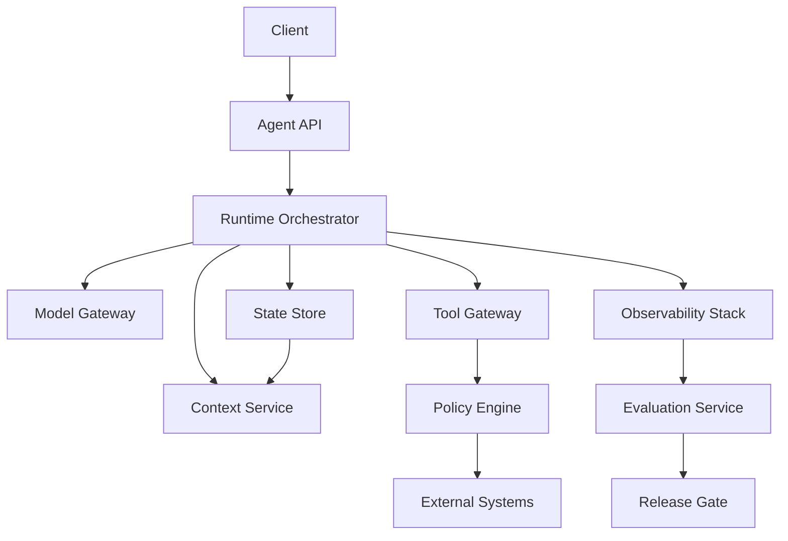

# 14. Production Architecture

> **Subtitle**
> From demo to deliverable system

## 1. Chapter Thesis

An agent product is not a prompt plus several tools; it is a control system built around uncertainty. Production architecture must organize API, runtime, context, model, tools, state, policy, eval, and observability into maintainable boundaries.

## 2. How This Chapter Connects

All previous chapters defined local harness capabilities. This chapter combines them into a production system. The final chapter abstracts patterns, anti-patterns, and future directions.

Previous: [13. Security, Permissions and Governance](en-course-13.html) | Next: [15. Patterns, Anti-patterns and Future](en-course-15.html)

## 3. Learning Outcomes

- Explain the engineering problem solved by `Production Architecture` inside an Agent Harness.
- Use this chapter's mental model to review a real agent design.
- Produce the chapter artifact and connect it to the Course Builder Harness case study.
- Identify typical failure modes related to this chapter.

## 4. The Engineering Problem

The main challenge from demo to production is not whether the model can be called, but concurrency, isolation, permissions, queues, cost, latency, state recovery, versioning, evaluation regression, log privacy, and release workflow. Production architecture must bring these issues forward.

## 5. Mental Model

Think of a production harness as a composition of controlled services: Agent API receives tasks, Runtime Orchestrator manages loops, Context Service builds information boundaries, Tool Gateway manages side effects, Policy Engine controls power, and Observability plus Evaluation form feedback.

## 6. Harness Abstraction

### Agent API
- Exposes a task interface while hiding internal model and tool implementation.

### Runtime Orchestrator
- Manages steps, state, loops, retries, approvals, and stop conditions.

### Context Service
- Handles retrieval, compression, layering, citation, and context snapshots.

### Model Gateway
- Manages model selection, rate limits, fallback, cost, and versioning.

### Tool Gateway
- Manages tool calls, MCP clients, permissions, audit, and sandboxing.

### State Store
- Stores run state, session, checkpoints, and artifact metadata.

### Policy Engine
- Performs safety and permission decisions before action execution.

### Eval + Observability
- Records, replays, scores, regresses, and gates releases.

## 7. Reference Diagram



## 8. Design Principles

- Production architecture should be organized around boundaries, not framework names.
- All external actions must go through a unified tool gateway.
- State and log storage need privacy and retention policies.
- Models, prompts, skills, and workflows all need versioning.
- Use eval gates before release and continue collecting production metrics afterward.

## 9. Reference Implementation Direction

This course emphasizes “thinking > specific solution.” A reference implementation exists to explain the abstraction; no framework, SDK, or protocol should be equated with the harness itself. In implementation, specify boundaries, state, and failure paths before choosing technologies.

Recommended implementation notes
- Store design decisions in Markdown or YAML so they can be versioned and reviewed.
- Place this chapter artifact under `docs/design/` or `labs/` in the repository.
- Whenever an abstraction boundary changes, update the interface assumptions of adjacent chapters.

## 10. Failure Modes

### Monolith prompt app
- All logic lives in one prompt and one handler, making responsibility impossible to isolate.

### No async model
- Long tasks block requests and cannot be recovered or canceled.

### No release discipline
- Prompt and skill changes go live without regression and versions.

### Tool integration sprawl
- Business code integrates tools directly, bypassing permission and audit.

## 11. Lab: Course Builder Harness

1. Draw the production architecture for the Course Builder Harness.
2. Define responsibility boundaries and data flow for each service.
3. List synchronous and asynchronous tasks: immediate answer, chapter generation, build, publish.
4. Write an ADR: why use a Tool Gateway and Policy Engine.

**Expected artifact**: A Production Architecture Diagram and ADR.

## 12. Review Checklist

- [ ] I can apply this principle in my own design: Production architecture should be organized around boundaries, not framework names.
- [ ] I can apply this principle in my own design: All external actions must go through a unified tool gateway.
- [ ] I can apply this principle in my own design: State and log storage need privacy and retention policies.
- [ ] I can identify and avoid `Monolith prompt app`: All logic lives in one prompt and one handler, making responsibility impossible to isolate.
- [ ] I can identify and avoid `No async model`: Long tasks block requests and cannot be recovered or canceled.

## 13. Image Descriptions

### Image Prompt 1
- A service diagram showing Client, Agent API, Runtime Orchestrator, Context Service, Model Gateway, Tool Gateway, State Store, Policy Engine, Eval, and Observability.

### Image Prompt 2
- A staircase from prompt demo to tool agent to observable harness to governed production system.

## Architecture Decision Record Template

```markdown
# ADR: Use a Tool Gateway for All External Actions

## Context
Agents need to call multiple tools with different risk levels.

## Decision
All tool calls must pass through a Tool Gateway.

## Consequences
- Centralized permission and audit
- Easier replay and debugging
- Additional service boundary and latency
```

## 14. Key Takeaways

- `Production Architecture` is not an isolated module; it is one engineering boundary through which the Agent Harness handles uncertainty.
- Specific tools will change, but the chapter’s judgment questions should remain stable: what is the boundary, where is the evidence, and how does failure recover?
