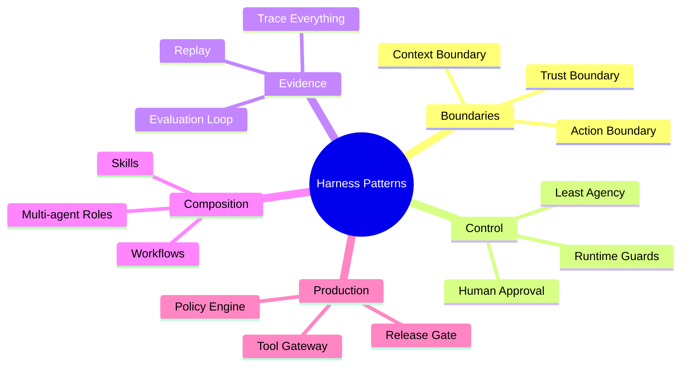

# 15. Patterns, Anti-patterns and Future

## 1. Chapter Thesis

The future of the harness is not “larger agents,” but better control layers. This chapter abstracts the entire course into reusable design patterns, common anti-patterns, and future directions.

## 2. How This Chapter Connects

The previous chapter completed production architecture. This chapter consolidates the course: how to judge whether a harness design is good, and how to extend toward the future without losing boundaries, control, and evidence.

Previous: [14. Production Architecture](en-course-14.html)

## 3. Learning Outcomes

- Explain the engineering problem solved by `Patterns, Anti-patterns and Future` inside an Agent Harness.
- Use this chapter's mental model to review a real agent design.
- Produce the chapter artifact and connect it to the Course Builder Harness case study.
- Identify typical failure modes related to this chapter.

## 4. The Engineering Problem

Agent technology will change quickly, but the engineering philosophy should not expire with frameworks. A useful ending should not only list trends; it should form judgment criteria: which designs become more reliable, and which designs amplify uncertainty.

## 5. Mental Model

Think of this chapter as a harness design review manual. For any new framework, protocol, model, or agent product, ask the same questions: Are boundaries clear? Is state explicit? Are actions controlled? Is execution observable? Is quality evidenced? Is power limited?

## 6. Harness Abstraction

### Context Boundary pattern
- Explicitly defines what the agent can and cannot see, and the trust level of information sources.

### Tool Gateway pattern
- All external side effects pass through one gateway to support permission, audit, and recovery.

### Explicit State pattern
- Extracts task state from conversation text into validatable and recoverable data.

### Least Agency pattern
- Gives the agent only the minimum autonomy needed for the current task.

### Trace Everything pattern
- Every run records input, decision, action, observation, state, and stop reason.

### Eval Before Scale pattern
- Before expanding autonomy, tool permissions, or user scale, establish evaluation evidence.

## 7. Reference Diagram

## 8. Design Principles

- Design judgment should prioritize boundaries over model strength.
- Anti-patterns usually lack control, not features.
- Future frameworks can be replaced, but engineering boundaries must not disappear.
- The more autonomous the system, the more observable, evaluable, and revocable it must be.
- The best harness makes complexity explicit instead of hiding it in prompts.

## 9. Reference Implementation Direction

This course emphasizes “thinking > specific solution.” A reference implementation exists to explain the abstraction; no framework, SDK, or protocol should be equated with the harness itself. In implementation, specify boundaries, state, and failure paths before choosing technologies.

Recommended implementation notes
- Store design decisions in Markdown or YAML so they can be versioned and reviewed.
- Place this chapter artifact under `docs/design/` or `labs/` in the repository.
- Whenever an abstraction boundary changes, update the interface assumptions of adjacent chapters.

## 10. Failure Modes

### Prompt-only Agent
- Uncontrolled, untestable, and unmaintainable.

### Tool Soup
- Many tools exist without boundaries, permissions, or naming discipline.

### Memory Dump
- Everything is remembered, causing pollution, privacy risk, and fossilized errors.

### Agent Does Everything
- Deterministic processes are delegated to the model, amplifying uncertainty.

### Multi-agent Theater
- Multiple agents add complexity without independent boundaries and responsibility.

### Eval by Vibes
- Ships by feeling, without regression comparison.

### Security as Prompt
- Uses prompts instead of permission systems.

## 11. Lab: Course Builder Harness

1. Use this chapter’s checklist to review the complete Course Builder Harness design.
2. Identify the three most likely anti-pattern risks and write repair plans.
3. Choose one future direction—browser agent, personal agent, enterprise agent, or multimodal harness—and analyze which new boundaries it needs.
4. Write a final design reflection: how the harness handles uncertainty.

**Expected artifact**: A Harness Design Review Checklist and Final Reflection.

## 12. Review Checklist

- [ ] I can apply this principle in my own design: Design judgment should prioritize boundaries over model strength.
- [ ] I can apply this principle in my own design: Anti-patterns usually lack control, not features.
- [ ] I can apply this principle in my own design: Future frameworks can be replaced, but engineering boundaries must not disappear.
- [ ] I can identify and avoid `Prompt-only Agent`: Uncontrolled, untestable, and unmaintainable.
- [ ] I can identify and avoid `Tool Soup`: Many tools exist without boundaries, permissions, or naming discipline.

## 13. Image Descriptions

### Image Prompt 1
- A pattern map with Harness at the center, surrounded by Context Boundary, Tool Gateway, Explicit State, Trace Everything, Eval Before Scale, and Least Agency.

### Image Prompt 2
- A future control-layer diagram where browser agents, personal agents, enterprise agents, and multimodal agents connect to the same control layer.

## Final Design Review

| Question | Good Signal | Warning Signal |
|---|---|---|
| Boundary | Explicit context/action/trust limits | “The model will know what to do” |
| State | Structured and recoverable | Hidden in chat history |
| Tooling | Gateway, audit, approval | Direct execution |
| Runtime | Guards and recovery | Infinite or blind loops |
| Evaluation | Golden tasks and regressions | Vibes-based release |
| Security | Least privilege and policy | Security by prompt |

## 14. Key Takeaways

- `Patterns, Anti-patterns and Future` is not an isolated module; it is one engineering boundary through which the Agent Harness handles uncertainty.
- Specific tools will change, but the chapter’s judgment questions should remain stable: what is the boundary, where is the evidence, and how does failure recover?
