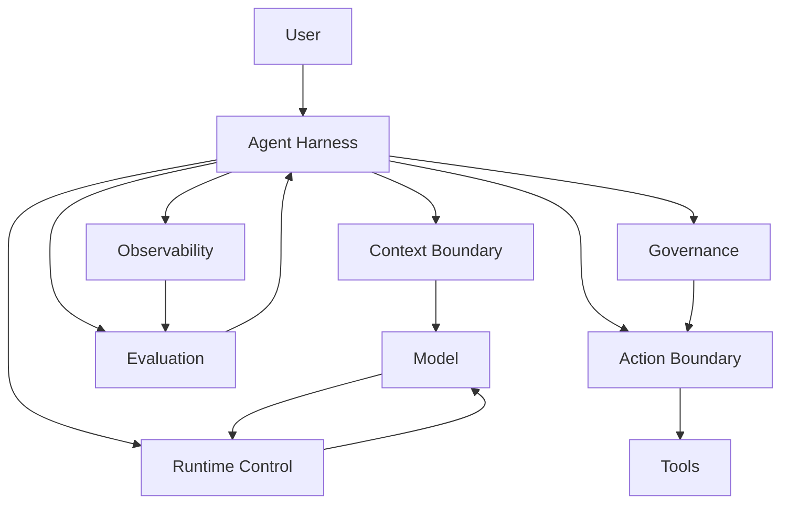

# 01. 为什么需要 Agent Harness

> **本章副标题**
> 从 Prompt 到工程系统  

## 1. 本章命题

Agent Harness 的核心不是让模型更聪明，而是把开放、概率化、不可完全预测的模型能力，放进一个可控、可观察、可评估、可治理的工程系统中。

## 2. 前后关联

本章建立全课的总问题：为什么 prompt、tool calling、workflow 都不足以单独构成可靠 Agent 系统。后续章节会把 Harness 拆成边界、运行时、能力封装、信任机制和生产架构。

下一章: [02. 任务、环境与边界](course-02.html)

## 3. 学习目标

- 解释 `Why Agent Harness` 在 Agent Harness 中解决的工程问题。  
- 用本章思维模型审查一个真实 Agent 设计。  
- 产出本章对应的设计 artifact，并把它接入 Course Builder Harness 贯穿案例。  
- 识别本章相关的典型失败模式。  

## 4. 工程问题

很多 Agent 原型看起来像“一个强模型 + 一段系统提示词 + 几个工具”。这种形态在演示中经常有效，但进入真实任务后会暴露出不可预测、不可复现、不可审计、不可恢复的问题。Harness 要解决的不是“模型不会回答”，而是“系统如何在模型可能出错时仍然可靠完成任务”。

## 5. 思维模型

把 LLM 想象成一个强大的推理核心，但它本身不拥有稳定工程边界。Harness 是围绕这个核心建立的外骨骼：定义输入、限制动作、记录过程、检测失败、触发恢复、控制权限，并把运行结果变成可持续改进的证据。

## 6. Harness 抽象

### 大语言模型
- 负责生成、推理、解释和选择。它是能力核心，但不是完整系统。

### 智能体
- 围绕目标进行多步行动的运行时行为。Agent 不是单一类或函数，而是一种目标驱动的执行模式。

### 控制外壳
- 围绕 Agent 建立的工程系统，负责边界、工具、状态、运行时、观察、评测和治理。

### 可靠性
- 不是要求模型永不犯错，而是让系统能够发现错误、限制错误、恢复错误并学习错误。

## 7. 参考图

## 8. 设计原则

- 模型提供智能，Harness 提供控制。  
- 不要把系统可靠性寄托在一句 system prompt 上。  
- 所有外部副作用都必须经过显式边界。  
- 每一次 Agent run 都应该留下可回放证据。  

## 9. 参考实现方向

本课程强调“思维 > 具体方案”。参考实现的作用是帮助理解抽象，不应把某个框架、SDK 或协议等同于 Harness 本身。实现时建议先写清楚边界、状态和失败路径，再选择具体技术。

推荐实现备注：
- 用 Markdown 或 YAML 保存设计决策，便于版本化和评审。  
- 把本章 artifact 放入仓库的 `docs/design/` 或 `labs/` 目录。  
- 每次修改抽象边界后，都要更新相邻章节的接口假设。  

## 10. 失效模式

### Prompt-only agent
- 所有逻辑都藏在 prompt 中，无法测试、版本化或回放。

### Demo reliability
- 只在示例输入上有效，缺少失败路径和恢复机制。

### Invisible execution
- 工具调用、上下文构造和模型判断不可见。

### Security by instruction
- 用“不要做危险事”代替权限控制。

## 11. 实验：课程构建 Harness

1. 选择一个你想构建的 Agent，例如课程维护助手、代码审查助手或研究助手。  
2. 写下它能看到什么、能做什么、会产生什么外部影响。  
3. 列出至少三个它可能失败的方式。  
4. 用一句话说明为什么它需要 Harness，而不只是 prompt。  

**预期产物**：一页 Agent Harness 设计动机说明。

## 12. 复盘清单

- [ ] 我能在自己的设计中落实：模型提供智能，Harness 提供控制。  
- [ ] 我能在自己的设计中落实：不要把系统可靠性寄托在一句 system prompt 上。  
- [ ] 我能在自己的设计中落实：所有外部副作用都必须经过显式边界。  
- [ ] 我能识别并避免 `Prompt-only agent`：所有逻辑都藏在 prompt 中，无法测试、版本化或回放。  
- [ ] 我能识别并避免 `Demo reliability`：只在示例输入上有效，缺少失败路径和恢复机制。  

## 13. 图片描述

### 封面图
- 一个发光的模型核心被透明工程外壳包围，外壳上标有 Context、Tools、Runtime、Eval、Governance，强调“能力在内，控制在外”。

### 对比图
- 左侧是 prompt-only demo 的单线结构，右侧是完整 harness 的闭环结构，对比不可控与可控。

## 14. 关键总结

- `Why Agent Harness` 不是孤立模块，而是 Agent Harness 处理不确定性的一层工程边界。
- 具体工具会变化，但本章的判断问题应保持稳定：边界是什么，证据在哪里，失败如何恢复。
