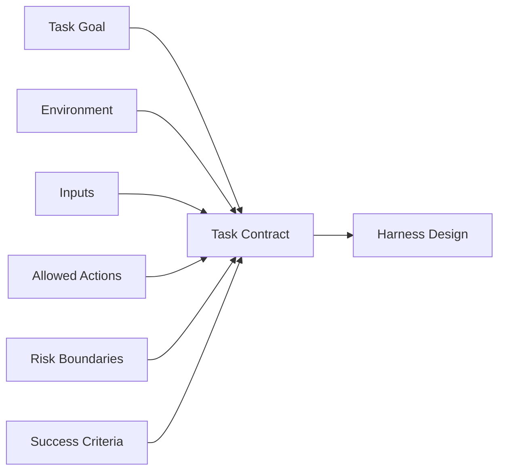

# 02. 任务、环境与边界

## 1. 本章命题

Agent 设计的第一步不是选择工具、框架或模型，而是定义任务、环境和边界。边界决定 Agent 可以知道什么、可以做什么、如何判断成功、哪里必须停止。

## 2. 前后关联

上一章说明为什么需要 Harness。本章把 Harness 的起点前移到任务定义。下一章会把这些边界转化为一个最小可运行闭环。

上一章: [01. 为什么需要 Agent Harness](course-01.html) | 下一章: [03. 最小 Agent Harness](course-03.html)

## 3. 学习目标

- 解释 `Task, Environment and Boundary` 在 Agent Harness 中解决的工程问题。  
- 用本章思维模型审查一个真实 Agent 设计。  
- 产出本章对应的设计 artifact，并把它接入 Course Builder Harness 贯穿案例。  
- 识别本章相关的典型失败模式。  

## 4. 工程问题

很多 Agent 项目失败，并不是因为模型不够强，而是因为任务本身没有被工程化定义。团队只知道“让 Agent 处理邮件”“让 Agent 写代码”“让 Agent 做研究”，却没有定义输入来源、允许动作、完成条件、风险等级和失败处理。模糊目标会制造模糊系统。

## 5. 思维模型

把 Agent 设计看成在一个环境中部署一个受约束的行动者。任务是它追求的目标，环境是它运行的世界，边界是它不能越过的墙，成功标准是它何时停止的判断依据。

## 6. Harness 抽象

### 任务契约
- 对目标、输入、输出、完成标准、失败条件和权限范围的明确声明。

### 环境
- Agent 可见和可作用的外部系统，例如文件、浏览器、数据库、API、邮件、日历、GitHub 仓库。

### 信息边界
- Agent 被允许看到的信息范围，包括当前任务、历史记录、用户偏好、检索资料和系统策略。

### 动作边界
- Agent 被允许执行的动作范围，包括只读、草稿、修改、提交、发送、购买等不同风险级别。

### 成功标准
- 判断任务是否完成的证据，不应只依赖 Agent 自我声明。

## 7. 参考图

## 8. 设计原则

- 先定义边界，再扩展能力。  
- 成功标准必须可观察。  
- 风险越高，自主权越小。  
- 不要把需求模糊性外包给模型。  

## 9. 参考实现方向

本课程强调“思维 > 具体方案”。参考实现的作用是帮助理解抽象，不应把某个框架、SDK 或协议等同于 Harness 本身。实现时建议先写清楚边界、状态和失败路径，再选择具体技术。

推荐实现备注：
- 用 Markdown 或 YAML 保存设计决策，便于版本化和评审。  
- 把本章 artifact 放入仓库的 `docs/design/` 或 `labs/` 目录。  
- 每次修改抽象边界后，都要更新相邻章节的接口假设。  

## 10. 失效模式

### Undefined environment
- Agent 不知道哪些系统是权威来源，导致引用错误或遗漏。

### Unbounded action space
- Agent 被授予过多动作能力，任何误判都会产生外部后果。

### Subjective completion
- 任务是否完成只凭 Agent 自己判断，缺少外部验证。

### Hidden risk
- 读、写、发送、删除、支付等动作没有风险分层。

## 11. 实验：课程构建 Harness

1. 以 Course Builder Harness 为案例，定义它的主任务：维护和扩展 Agent Harness 课程仓库。  
2. 列出环境：GitHub repo、课程 Markdown、图片资源、构建日志、参考资料。  
3. 把动作分成只读、低风险写入、高风险发布三类。  
4. 写出三个成功标准，例如构建通过、章节结构完整、评测用例不退化。  

**预期产物**：一个 Task Contract 模板，包含目标、环境、输入、动作、成功标准、失败模式和审批规则。

## 12. 复盘清单

- [ ] 我能在自己的设计中落实：先定义边界，再扩展能力。  
- [ ] 我能在自己的设计中落实：成功标准必须可观察。  
- [ ] 我能在自己的设计中落实：风险越高，自主权越小。  
- [ ] 我能识别并避免 `Undefined environment`：Agent 不知道哪些系统是权威来源，导致引用错误或遗漏。  
- [ ] 我能识别并避免 `Unbounded action space`：Agent 被授予过多动作能力，任何误判都会产生外部后果。  

## 13. 图片描述

### 边界地图
- 中心是 Agent，四周是信息边界、动作边界、时间边界、信任边界，每个边界外有不同系统。

### 任务契约卡
- 一张工程规格卡片，包含 goal、environment、inputs、allowed actions、success criteria、risks。

## 14. 关键总结

- `Task, Environment and Boundary` 不是孤立模块，而是 Agent Harness 处理不确定性的一层工程边界。
- 具体工具会变化，但本章的判断问题应保持稳定：边界是什么，证据在哪里，失败如何恢复。
