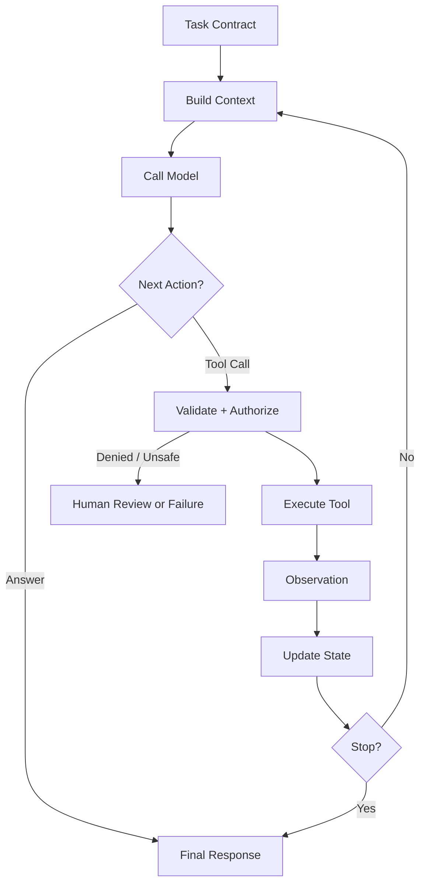

# 03. 最小 Agent Harness

## 1. 本章命题

最小 Harness 不是一堆功能模块，而是一个闭环：构造上下文、调用模型、选择动作、执行工具、观察结果、更新状态、决定继续或停止。

## 2. 前后关联

上一章定义了任务和边界。本章把这些定义落到一个最小执行系统。后续章节会分别展开上下文、工具、状态、运行时和评测等部件。

上一章: [02. 任务、环境与边界](course-02.html) | 下一章: [04. 上下文作为信息边界](course-04.html)

## 3. 学习目标

- 解释 `Minimal Harness` 在 Agent Harness 中解决的工程问题。  
- 用本章思维模型审查一个真实 Agent 设计。  
- 产出本章对应的设计 artifact，并把它接入 Course Builder Harness 贯穿案例。  
- 识别本章相关的典型失败模式。  

## 4. 工程问题

如果没有最小闭环，团队很容易把 Agent 系统理解成一次模型调用。实际 Agent 任务往往需要多步执行，每一步都可能引入新信息、新错误和新风险。Harness 的最小形态必须显式管理这些步骤。

## 5. 思维模型

把 Harness 看成一个小型操作系统。模型不是操作系统本身，而是其中的推理进程。Harness 负责任务调度、输入构造、外部调用、状态保存、错误处理和终止判断。

## 6. Harness 抽象

### 上下文构造器
- 根据任务、状态、环境和策略选择模型本轮应看到的信息。

### 模型步骤
- 根据上下文生成下一步判断：回答、调用工具、请求澄清或停止。

### 动作选择器
- 把模型意图映射到受控动作，并进行 schema 校验、权限判断和风险分类。

### 工具执行器
- 执行外部动作并返回结构化观察结果。

### 状态更新
- 把每一步结果写入显式状态，使下一步不依赖隐含上下文。

### 停止条件
- 判断任务完成、失败、超时、需要人工介入或成本超限。

## 7. 参考图



## 8. 设计原则

- 每一步都应该显式化：输入、决策、动作、观察、状态。  
- 模型输出不是动作本身，动作必须经过 Harness 验证。  
- 停止条件与继续条件同样重要。  
- 最小闭环应框架无关，具体框架只是实现选择。  

## 9. 参考实现方向

本课程强调“思维 > 具体方案”。参考实现的作用是帮助理解抽象，不应把某个框架、SDK 或协议等同于 Harness 本身。实现时建议先写清楚边界、状态和失败路径，再选择具体技术。

推荐实现备注：
- 用 Markdown 或 YAML 保存设计决策，便于版本化和评审。  
- 把本章 artifact 放入仓库的 `docs/design/` 或 `labs/` 目录。  
- 每次修改抽象边界后，都要更新相邻章节的接口假设。  

## 10. 失效模式

### Single-call illusion
- 把多步任务压成一次模型调用，导致错误无法分解和恢复。

### Implicit state
- 状态只存在于对话文本中，无法校验、迁移或恢复。

### Unvalidated actions
- 模型生成的工具参数直接执行，缺少 schema、权限和风险检查。

### No stop guard
- Agent 循环无法判断何时停止，产生无限循环或成本失控。

## 11. 实验：课程构建 Harness

1. 写一个最小 loop 伪代码。  
2. 定义 state 对象中至少五个字段，例如 task_id、current_step、files_touched、observations、risk_level。  
3. 定义三类 next action：answer、tool_call、request_approval。  
4. 定义三个 stop condition：success、failure、human_required。  

**预期产物**：一个最小 Harness loop 的伪代码和状态 schema。

## 12. 复盘清单

- [ ] 我能在自己的设计中落实：每一步都应该显式化：输入、决策、动作、观察、状态。  
- [ ] 我能在自己的设计中落实：模型输出不是动作本身，动作必须经过 Harness 验证。  
- [ ] 我能在自己的设计中落实：停止条件与继续条件同样重要。  
- [ ] 我能识别并避免 `Single-call illusion`：把多步任务压成一次模型调用，导致错误无法分解和恢复。  
- [ ] 我能识别并避免 `Implicit state`：状态只存在于对话文本中，无法校验、迁移或恢复。  

## 13. 图片描述

### 闭环运行图
- 用循环箭头表示 Build Context、Model、Tool、Observation、State、Stop Condition，强调 Harness 是循环系统。

### 状态时间线
- 横轴是 step 1、step 2、step 3，每一步显示 context、decision、tool call、observation、state diff。

## 参考伪代码

```python
state = initialize_state(task_contract)

while not state.done:
    context = build_context(task_contract, state)
    model_decision = call_model(context)
    action = parse_and_validate(model_decision)

    if action.requires_approval:
        state = request_human_review(state, action)
        continue

    if action.type == "tool_call":
        observation = execute_tool(action)
        state = update_state(state, observation)
    elif action.type == "final_answer":
        state.final_answer = action.content
        state.done = True
    else:
        state = mark_failure(state, reason="unknown_action")

    state = apply_stop_guards(state)
```

## 14. 关键总结

- `Minimal Harness` 不是孤立模块，而是 Agent Harness 处理不确定性的一层工程边界。
- 具体工具会变化，但本章的判断问题应保持稳定：边界是什么，证据在哪里，失败如何恢复。
