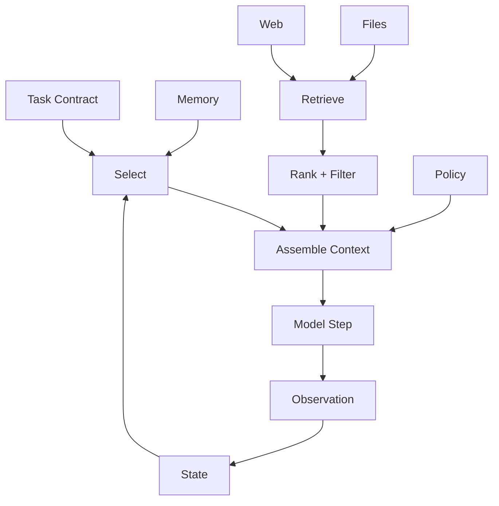

# 04. 上下文作为信息边界

> **本章副标题**
> Context Engineering 不只是 Prompt Engineering  

## 1. 本章命题

上下文不是把更多文字塞进窗口，而是决定 Agent 在某一步应该知道什么、不应该知道什么、以什么顺序知道、凭什么信任这些信息。

## 2. 前后关联

上一章的最小闭环从 Build Context 开始。本章展开这个环节：上下文是 Harness 的信息边界。下一章会讨论动作边界，即 Tools 和 MCP。

上一章: [03. 最小 Agent Harness](course-03.html) | 下一章: [05. 工具与 MCP 作为动作边界](course-05.html)

## 3. 学习目标

- 解释 `Context as Information Boundary` 在 Agent Harness 中解决的工程问题。  
- 用本章思维模型审查一个真实 Agent 设计。  
- 产出本章对应的设计 artifact，并把它接入 Course Builder Harness 贯穿案例。  
- 识别本章相关的典型失败模式。  

## 4. 工程问题

模型常常不是因为缺少能力而失败，而是因为看到的信息错误、过多、过旧、无关或被污染。Context Engineering 的目标不是最大化信息量，而是构造一个足够、相关、可信、低噪声的信息边界。

## 5. 思维模型

把上下文看成 Agent 的工作台。工作台上应该摆放当前任务真正需要的资料、工具说明、约束、状态和证据，而不是把整个仓库、所有历史聊天和所有搜索结果堆上去。

## 6. Harness 抽象

### 任务上下文
- 当前目标、约束、输入、输出格式和成功标准。

### 环境上下文
- 来自文件、网页、数据库、API、repo 的当前事实。

### 历史上下文
- 过去步骤、会话、决策和用户偏好。必须经过筛选，而不是全部注入。

### 策略上下文
- 安全、权限、审批和输出规范。它决定模型不只是知道事实，还知道边界。

### 上下文预算
- 有限窗口中的信息分配策略，包含 token、注意力、顺序和噪声预算。

### 来源可追溯性
- 重要信息应保留来源、时间、置信度和使用理由。

## 7. 参考图

## 8. 设计原则

- 相关性优先于数量。  
- 新鲜度、来源和置信度应成为上下文的一部分。  
- 上下文应分层：任务、状态、证据、策略不要混在一起。  
- 避免把长期记忆直接当作事实注入。  
- 上下文构造必须可回放。  

## 9. 参考实现方向

本课程强调“思维 > 具体方案”。参考实现的作用是帮助理解抽象，不应把某个框架、SDK 或协议等同于 Harness 本身。实现时建议先写清楚边界、状态和失败路径，再选择具体技术。

推荐实现备注：
- 用 Markdown 或 YAML 保存设计决策，便于版本化和评审。  
- 把本章 artifact 放入仓库的 `docs/design/` 或 `labs/` 目录。  
- 每次修改抽象边界后，都要更新相邻章节的接口假设。  

## 10. 失效模式

### Context overload
- 塞入大量无关资料，稀释模型注意力。

### Context poisoning
- 不可信来源或 prompt injection 混入上下文。

### Stale context
- 使用过期资料，导致 Agent 依据旧事实行动。

### Hidden context dependency
- 系统表现依赖某段未记录或不可复现的上下文。

## 11. 实验：课程构建 Harness

1. 为课程维护场景设计 context layers：task、repo snapshot、style guide、chapter state、policy。  
2. 为每层定义来源、刷新频率、最大 token 预算和可信度。  
3. 写一个 context assembly order，说明哪类信息放前面、哪类放后面。  
4. 设计一个上下文污染防护规则。  

**预期产物**：Context Pipeline 设计文档。

## 12. 复盘清单

- [ ] 我能在自己的设计中落实：相关性优先于数量。  
- [ ] 我能在自己的设计中落实：新鲜度、来源和置信度应成为上下文的一部分。  
- [ ] 我能在自己的设计中落实：上下文应分层：任务、状态、证据、策略不要混在一起。  
- [ ] 我能识别并避免 `Context overload`：塞入大量无关资料，稀释模型注意力。  
- [ ] 我能识别并避免 `Context poisoning`：不可信来源或 prompt injection 混入上下文。  

## 13. 图片描述

### 信息边界剖面图
- 像洋葱层一样展示 system policy、task contract、state、retrieved evidence、tool observations，不同颜色表示不同可信级别。

### 上下文工作台
- 一张桌面上有任务卡、证据卡、状态板、策略手册，远处堆着未选入的资料。

## 14. 关键总结

- `Context as Information Boundary` 不是孤立模块，而是 Agent Harness 处理不确定性的一层工程边界。
- 具体工具会变化，但本章的判断问题应保持稳定：边界是什么，证据在哪里，失败如何恢复。
