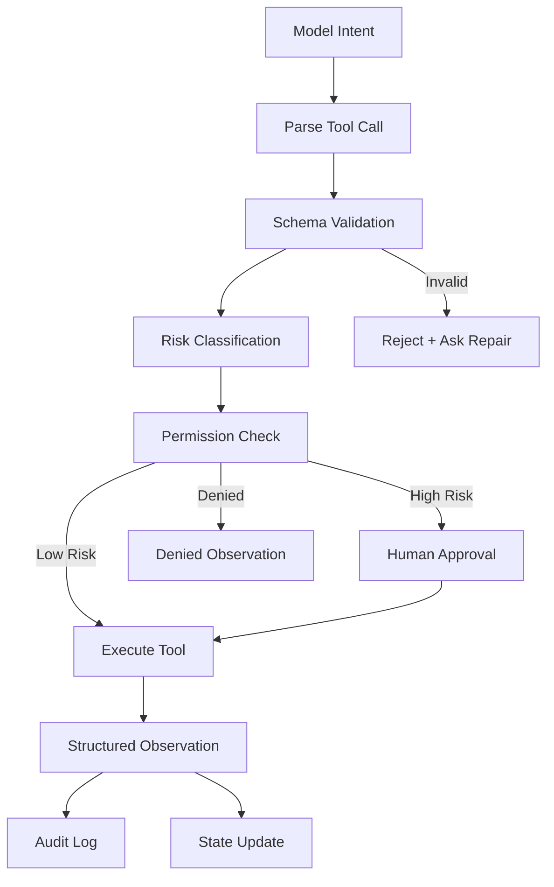

# 05. 工具与 MCP 作为动作边界

## 1. 本章命题

工具让 Agent 从“会说”变成“会做”。一旦 Agent 能做事，就必须把工具视为动作边界：每个动作都需要契约、权限、审计、隔离和恢复策略。

## 2. 前后关联

上一章讨论 Agent 能看到什么。本章讨论 Agent 能改变什么。下一章会讨论这些动作结果如何进入状态、会话和记忆。

上一章: [04. 上下文作为信息边界](course-04.html) | 下一章: [06. 状态、会话与记忆](course-06.html)

## 3. 学习目标

- 解释 `Tools and MCP as Action Boundary` 在 Agent Harness 中解决的工程问题。  
- 用本章思维模型审查一个真实 Agent 设计。  
- 产出本章对应的设计 artifact，并把它接入 Course Builder Harness 贯穿案例。  
- 识别本章相关的典型失败模式。  

## 4. 工程问题

很多系统把工具调用当作“给模型增加功能”。但工具连接的是真实外部世界：文件会被改、邮件会被发、数据会被泄露、服务会被调用。工具带来的是副作用，因此必须被工程化控制。

## 5. 思维模型

把工具看成 Agent 的机械臂。模型可以提出动作意图，但机械臂不能直接听命于模型。它必须经过动作解析、参数校验、权限检查、风险分类、可能的人工审批，再执行。

## 6. Harness 抽象

### 工具契约
- 定义工具名称、参数、类型、约束、返回值和错误。它是模型与外部动作之间的协议。

### 工具网关
- 所有工具调用进入统一控制层，进行权限、日志、限流、隔离和审计。

### 工具协议
- 用于标准化模型应用与外部工具、资源、上下文之间的连接方式。课程中应把它作为一种协议思想，而不是唯一方案。

### 副作用
- 工具执行后对外部世界造成的变化，例如写文件、提交 PR、发送消息、发布页面。

### 幂等性
- 同一动作重复执行是否安全。它决定 retry 策略。

### 审批门
- 高风险动作必须在人类确认后执行。

## 7. 参考图

## 8. 设计原则

- 模型可以提出动作，Harness 决定是否执行。  
- 所有工具调用都要结构化、可校验、可记录。  
- 高风险动作默认需要人工审批。  
- 工具越强，权限越细。  
- 重试前先判断幂等性。  

## 9. 参考实现方向

本课程强调“思维 > 具体方案”。参考实现的作用是帮助理解抽象，不应把某个框架、SDK 或协议等同于 Harness 本身。实现时建议先写清楚边界、状态和失败路径，再选择具体技术。

推荐实现备注：
- 用 Markdown 或 YAML 保存设计决策，便于版本化和评审。  
- 把本章 artifact 放入仓库的 `docs/design/` 或 `labs/` 目录。  
- 每次修改抽象边界后，都要更新相邻章节的接口假设。  

## 10. 失效模式

### Tool soup
- 工具很多，但没有统一网关、命名规范或风险分层。

### Direct execution
- 模型参数未经验证直接执行，造成误写、误删或误发。

### Over-broad permissions
- Agent 获得远超任务所需的权限。

### Unlogged side effects
- 外部系统发生变化，但没有审计记录。

## 11. 实验：课程构建 Harness

1. 为 Course Builder Harness 设计 6 个工具：read_file、search_repo、write_draft、run_build、open_pull_request、publish_pages。  
2. 给每个工具标记风险级别：read、draft、write、publish。  
3. 为 open_pull_request 和 publish_pages 设计 approval gate。  
4. 写出一个工具调用失败时的 structured observation 格式。  

**预期产物**：Tool Registry 与 Permission Matrix。

## 12. 复盘清单

- [ ] 我能在自己的设计中落实：模型可以提出动作，Harness 决定是否执行。  
- [ ] 我能在自己的设计中落实：所有工具调用都要结构化、可校验、可记录。  
- [ ] 我能在自己的设计中落实：高风险动作默认需要人工审批。  
- [ ] 我能识别并避免 `Tool soup`：工具很多，但没有统一网关、命名规范或风险分层。  
- [ ] 我能识别并避免 `Direct execution`：模型参数未经验证直接执行，造成误写、误删或误发。  

## 13. 图片描述

### 工具网关图
- 模型意图经过 schema validation、permission check、approval gate、executor、audit log，像机场安检一样层层通过。

### 副作用风险阶梯
- 从 read 到 draft 到 write 到 publish 的四级阶梯，每一级对应不同权限和审批要求。

## 14. 关键总结

- `Tools and MCP as Action Boundary` 不是孤立模块，而是 Agent Harness 处理不确定性的一层工程边界。
- 具体工具会变化，但本章的判断问题应保持稳定：边界是什么，证据在哪里，失败如何恢复。
