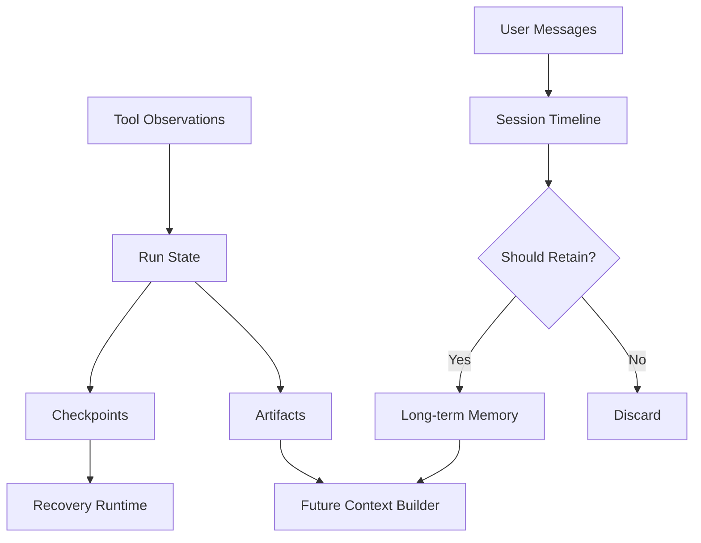

# 06. 状态、会话与记忆

> **本章副标题**
> 连续性不是记住更多，而是管理状态  

## 1. 本章命题

Agent 的连续性来自显式状态管理，而不是把所有历史都塞回上下文。Memory 的本质是策略：什么值得带到未来、保留多久、如何纠错、何时删除。

## 2. 前后关联

上一章说明工具动作如何产生 observation。本章讨论这些 observation 如何成为状态、会话、记忆或 artifact。下一章会讨论运行时如何使用这些状态进行规划、恢复和终止。

上一章: [05. 工具与 MCP 作为动作边界](course-05.html) | 下一章: [07. 运行时控制](course-07.html)

## 3. 学习目标

- 解释 `State, Session and Memory` 在 Agent Harness 中解决的工程问题。  
- 用本章思维模型审查一个真实 Agent 设计。  
- 产出本章对应的设计 artifact，并把它接入 Course Builder Harness 贯穿案例。  
- 识别本章相关的典型失败模式。  

## 4. 工程问题

Agent 需要跨步骤保持连续性，但简单地把所有聊天记录、工具结果和用户偏好拼接回来，会造成噪声、隐私风险、错误固化和不可控行为。Harness 必须区分运行状态、会话历史、长期记忆和产物，并对每类信息设置生命周期。

## 5. 思维模型

把状态看成正在执行任务的白板，把会话看成一次工作期间的时间线，把记忆看成经过批准进入长期档案的信息，把 artifact 看成任务产生的外部产物。它们都不是同一种东西。

## 6. Harness 抽象

### 状态
- 当前 run 的显式变量：目标、步骤、已完成动作、待处理错误、文件变更、风险级别。

### 会话
- 一次连续交互或工作过程的上下文边界。Session 不一定都要进入长期记忆。

### 记忆
- 跨会话保留的信息。它应该经过选择、验证、过期和删除策略。

### 用户画像
- 相对稳定的用户偏好、风格、约束和常用环境，但必须可编辑和可撤销。

### 产物
- Agent 创建或修改的持久对象，例如 Markdown、PR、报告、表格、图像。

### 检查点
- 可恢复的中间状态，用于中断、回滚、重试和调试。

## 7. 参考图

## 8. 设计原则

- 状态必须显式化，不要隐含在聊天文本中。  
- 记忆需要写入策略，不是默认全量保存。  
- 长期记忆必须可纠错、可过期、可删除。  
- 区分用户偏好、事实、推断和临时任务信息。  
- Artifacts 是真实结果，不应与内部状态混淆。  

## 9. 参考实现方向

本课程强调“思维 > 具体方案”。参考实现的作用是帮助理解抽象，不应把某个框架、SDK 或协议等同于 Harness 本身。实现时建议先写清楚边界、状态和失败路径，再选择具体技术。

推荐实现备注：
- 用 Markdown 或 YAML 保存设计决策，便于版本化和评审。  
- 把本章 artifact 放入仓库的 `docs/design/` 或 `labs/` 目录。  
- 每次修改抽象边界后，都要更新相邻章节的接口假设。  

## 10. 失效模式

### Memory dump
- 把全部历史塞入上下文，产生噪声和隐私风险。

### False memory
- Agent 把一次错误推断固化成长期事实。

### State hidden in prompt
- 关键执行状态只存在于 prompt 中，无法恢复和审计。

### No forgetting
- 过期、不再适用或用户撤销的信息仍被使用。

## 11. 实验：课程构建 Harness

1. 为课程维护任务定义 run_state schema。  
2. 设计 memory write policy：哪些信息可以写入长期记忆，哪些只能保留在 session 中。  
3. 定义 artifact 类型：chapter markdown、image prompt、evaluation report、build log。  
4. 设计一个 memory correction 流程。  

**预期产物**：State Schema 与 Memory Policy。

## 12. 复盘清单

- [ ] 我能在自己的设计中落实：状态必须显式化，不要隐含在聊天文本中。  
- [ ] 我能在自己的设计中落实：记忆需要写入策略，不是默认全量保存。  
- [ ] 我能在自己的设计中落实：长期记忆必须可纠错、可过期、可删除。  
- [ ] 我能识别并避免 `Memory dump`：把全部历史塞入上下文，产生噪声和隐私风险。  
- [ ] 我能识别并避免 `False memory`：Agent 把一次错误推断固化成长期事实。  

## 13. 图片描述

### 连续性分层图
- 白板表示 state，时间线表示 session，档案柜表示 memory，文件夹表示 artifacts，展示它们之间的数据流。

### 记忆生命周期图
- 候选记忆经过 select、verify、store、expire、correct、delete 六个阶段。

## 14. 关键总结

- `State, Session and Memory` 不是孤立模块，而是 Agent Harness 处理不确定性的一层工程边界。
- 具体工具会变化，但本章的判断问题应保持稳定：边界是什么，证据在哪里，失败如何恢复。
