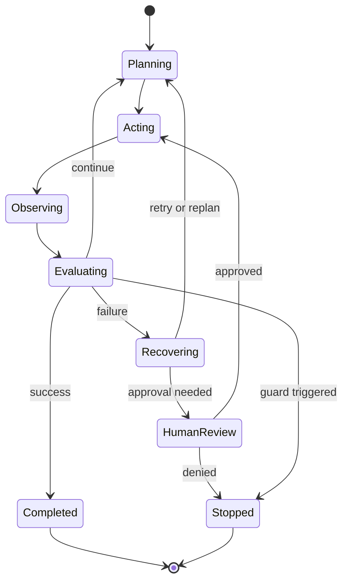

# 07. 运行时控制

> **本章副标题**
> 规划、执行与恢复  

## 1. 本章命题

Agent 的智能来自模型，但可靠性来自运行时。Runtime Control 负责管理步骤、循环、错误、重试、回滚、中断、成本和人工介入。

## 2. 前后关联

前几章定义了上下文、工具和状态。本章把它们组织成可执行的运行时纪律。下一部分会讨论如何把能力封装成 skills 和 workflows。

上一章: [06. 状态、会话与记忆](course-06.html) | 下一章: [08. 技能作为能力封装](course-08.html)

## 3. 学习目标

- 解释 `Runtime Control` 在 Agent Harness 中解决的工程问题。  
- 用本章思维模型审查一个真实 Agent 设计。  
- 产出本章对应的设计 artifact，并把它接入 Course Builder Harness 贯穿案例。  
- 识别本章相关的典型失败模式。  

## 4. 工程问题

多步 Agent 任务不会按照理想路径线性前进。工具会失败，网页会变化，文件会冲突，用户会打断，模型会过度规划或忘记目标。Runtime 的职责是让这些不确定性被限制在可管理范围内。

## 5. 思维模型

把 runtime 看成飞行控制系统。模型给出方向判断，但 runtime 负责航线、燃料、警报、备降、自动驾驶限制和飞行员接管。

## 6. Harness 抽象

### 规划
- 把目标分解为步骤、依赖和检查点。规划可以由模型生成，也可以由 workflow 约束。

### 执行
- 按照当前状态和权限执行下一步动作。

### 观察
- 把外部结果转为结构化反馈，而不是非结构化文本堆叠。

### 恢复
- 失败后决定重试、降级、回滚、请求人工帮助或终止。

### 循环保卫
- 限制最大步数、最大成本、最大时间、重复动作和低进展循环。

### 人类介入
- 在不确定、高风险或价值判断处引入人类决策。

## 7. 参考图



## 8. 设计原则

- Runtime 管理不确定性，而不是让模型自由发挥。  
- 每个 retry 都需要原因、上限和幂等性判断。  
- 规划应该足够指导执行，但不应替代观察。  
- 人工介入不是失败，而是 Harness 的控制能力。  
- 成本、时间和步数都是运行时资源。  

## 9. 参考实现方向

本课程强调“思维 > 具体方案”。参考实现的作用是帮助理解抽象，不应把某个框架、SDK 或协议等同于 Harness 本身。实现时建议先写清楚边界、状态和失败路径，再选择具体技术。

推荐实现备注：
- 用 Markdown 或 YAML 保存设计决策，便于版本化和评审。  
- 把本章 artifact 放入仓库的 `docs/design/` 或 `labs/` 目录。  
- 每次修改抽象边界后，都要更新相邻章节的接口假设。  

## 10. 失效模式

### Infinite loop
- Agent 反复执行相似动作但没有进展。

### Over-planning
- Agent 花大量步骤规划却不执行可验证动作。

### Blind retry
- 工具失败后不分析原因直接重试。

### No interruption model
- 用户或系统打断后无法安全保存和恢复。

## 11. 实验：课程构建 Harness

1. 为 Course Builder Harness 定义最大步数、最大成本和最大运行时间。  
2. 设计 replan 条件：例如构建失败、文件冲突、目标变化。  
3. 设计 retry policy：哪些工具可以重试，哪些必须人工确认。  
4. 定义 user interruption 的恢复流程。  

**预期产物**：Runtime Policy 与 Stop Guard 设计。

## 12. 复盘清单

- [ ] 我能在自己的设计中落实：Runtime 管理不确定性，而不是让模型自由发挥。  
- [ ] 我能在自己的设计中落实：每个 retry 都需要原因、上限和幂等性判断。  
- [ ] 我能在自己的设计中落实：规划应该足够指导执行，但不应替代观察。  
- [ ] 我能识别并避免 `Infinite loop`：Agent 反复执行相似动作但没有进展。  
- [ ] 我能识别并避免 `Over-planning`：Agent 花大量步骤规划却不执行可验证动作。  

## 13. 图片描述

### 飞行控制类比图
- 模型是导航判断，runtime 是仪表盘、燃料、警报、自动驾驶限制和人工接管按钮。

### 运行时状态机
- Planning、Acting、Observing、Recovering、Human Review、Completed 之间的状态转换图。

## 运行时保护示例

```yaml
runtime_policy:
  max_steps: 20
  max_tool_calls: 12
  timeout_seconds: 300
  retry:
    read_file:
      max_attempts: 2
      idempotent: true
    publish_pages:
      max_attempts: 0
      requires_approval: true
  stop_when:
    - success_criteria_met
    - human_approval_denied
    - repeated_no_progress_steps >= 3
```

## 14. 关键总结

- `Runtime Control` 不是孤立模块，而是 Agent Harness 处理不确定性的一层工程边界。
- 具体工具会变化，但本章的判断问题应保持稳定：边界是什么，证据在哪里，失败如何恢复。
