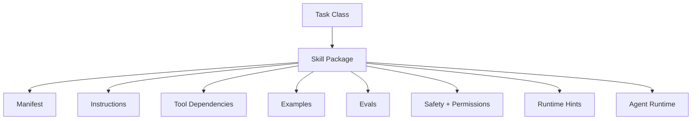

# 08. 技能作为能力封装

## 1. 本章命题

Skill 不是单个 prompt，也不是单个 tool。Skill 是围绕一类任务目标封装的上下文、工具、步骤、约束、示例和评测标准。

## 2. 前后关联

上一章建立了运行时控制。本章进入组合层：如何把多次成功经验封装为可复用能力。下一章会讨论 workflow 如何提供确定性支架。

上一章: [07. 运行时控制](course-07.html) | 下一章: [09. 工作流作为确定性支架](course-09.html)

## 3. 学习目标

- 解释 `Skills as Capability Packaging` 在 Agent Harness 中解决的工程问题。  
- 用本章思维模型审查一个真实 Agent 设计。  
- 产出本章对应的设计 artifact，并把它接入 Course Builder Harness 贯穿案例。  
- 识别本章相关的典型失败模式。  

## 4. 工程问题

如果每次任务都重新写 prompt、重新选择工具、重新解释流程，系统就无法积累能力。Skill 的意义是把一类任务的成功路径沉淀下来，让 Agent 能稳定复用，而不是每次从零探索。

## 5. 思维模型

把 skill 看成工程团队中的“标准作业能力包”。它告诉 Agent：面对这类任务，应该使用哪些信息、哪些工具、哪些步骤、哪些限制，以及如何判断结果好坏。

## 6. Harness 抽象

### 技能清单
- 描述 skill 名称、目标、输入输出、依赖工具、权限、运行策略和版本。

### 指令包
- 该 skill 的具体操作原则、风格、约束和错误处理建议。

### 示例
- 高质量输入输出样例，帮助模型理解任务分布和质量标准。

### 评测
- 用于判断 skill 是否仍然有效的测试集和 rubric。

### 技能注册表
- 集中管理可用 skill、版本、依赖和授权范围。

## 7. 参考图



## 8. 设计原则

- Skill 封装的是完成任务的方法，不只是调用工具的方法。  
- 每个 skill 都应该有适用范围和不适用范围。  
- 可复用能力必须可评测。  
- Skill 需要版本管理，因为能力封装会演化。  
- 不要把高风险权限隐含在 skill 中。  

## 9. 参考实现方向

本课程强调“思维 > 具体方案”。参考实现的作用是帮助理解抽象，不应把某个框架、SDK 或协议等同于 Harness 本身。实现时建议先写清楚边界、状态和失败路径，再选择具体技术。

推荐实现备注：
- 用 Markdown 或 YAML 保存设计决策，便于版本化和评审。  
- 把本章 artifact 放入仓库的 `docs/design/` 或 `labs/` 目录。  
- 每次修改抽象边界后，都要更新相邻章节的接口假设。  

## 10. 失效模式

### Prompt fragment as skill
- 只保存一段 prompt，却没有输入输出、工具、权限和评测。

### Over-general skill
- 一个 skill 试图覆盖过多任务，导致行为不稳定。

### Unversioned skill
- 修改 skill 后无法知道哪个版本导致回归。

### Unsafe reuse
- 在低风险场景设计的 skill 被复用到高风险场景。

## 11. 实验：课程构建 Harness

1. 为 Course Builder Harness 定义 lesson_writer skill。  
2. 写出 input_schema：topic、audience、chapter_position、source_materials、style_guide。  
3. 写出 output_schema：markdown、summary、image_descriptions、self_check。  
4. 设计三个 eval cases，用来判断 skill 是否稳定。  

**预期产物**：一个完整 Skill Manifest。

## 12. 复盘清单

- [ ] 我能在自己的设计中落实：Skill 封装的是完成任务的方法，不只是调用工具的方法。  
- [ ] 我能在自己的设计中落实：每个 skill 都应该有适用范围和不适用范围。  
- [ ] 我能在自己的设计中落实：可复用能力必须可评测。  
- [ ] 我能识别并避免 `Prompt fragment as skill`：只保存一段 prompt，却没有输入输出、工具、权限和评测。  
- [ ] 我能识别并避免 `Over-general skill`：一个 skill 试图覆盖过多任务，导致行为不稳定。  

## 13. 图片描述

### 技能包 exploded view
- 一个 skill 被拆开展示为 manifest、instructions、tools、examples、evals、policy、runtime hints。

### 工具与技能对比图
- 左边是单个 tool 的扳手图标，右边是 skill 的工具箱，强调 skill 是更高层能力封装。

## 技能清单模板

```yaml
name: lesson_writer
version: 0.1.0
goal: Generate a bilingual course lesson in Markdown.
inputs:
  - topic
  - audience
  - chapter_position
  - source_materials
  - style_guide
outputs:
  - markdown
  - summary
  - image_descriptions
  - self_check
tools:
  - read_file
  - search_repo
  - write_draft
permissions:
  default: draft_only
evals:
  - structure_completeness
  - bilingual_consistency
  - philosophy_alignment
```

## 14. 关键总结

- `Skills as Capability Packaging` 不是孤立模块，而是 Agent Harness 处理不确定性的一层工程边界。
- 具体工具会变化，但本章的判断问题应保持稳定：边界是什么，证据在哪里，失败如何恢复。
