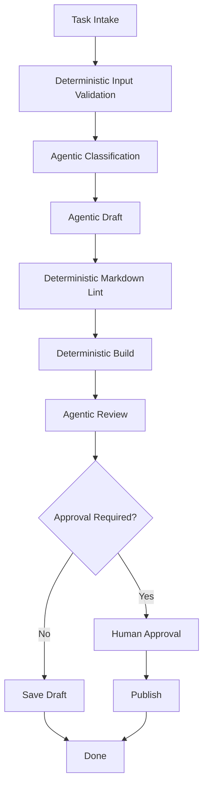

# 09. 工作流作为确定性支架

> **本章副标题**
> 把确定性留给代码，把不确定性留给模型  

## 1. 本章命题

Workflow 不是 Agent 的反面，而是 Agent 的支架。好的 Harness 会把可确定、可枚举、可验证的部分写成流程，把开放判断、解释和生成交给模型。

## 2. 前后关联

上一章讲 skill 如何封装能力。本章讲 workflow 如何组织这些能力并约束执行顺序。下一章会讨论多 Agent 如何在更复杂组织中分工。

上一章: [08. 技能作为能力封装](course-08.html) | 下一章: [10. 多 Agent 编排](course-10.html)

## 3. 学习目标

- 解释 `Workflows as Deterministic Scaffolding` 在 Agent Harness 中解决的工程问题。  
- 用本章思维模型审查一个真实 Agent 设计。  
- 产出本章对应的设计 artifact，并把它接入 Course Builder Harness 贯穿案例。  
- 识别本章相关的典型失败模式。  

## 4. 工程问题

很多 Agent 系统不稳定，是因为把确定性流程也交给模型决定。例如文件读取顺序、构建命令、审批流程、输出校验、提交前检查，这些并不需要模型自由发挥。Workflow 的价值是降低不确定性。

## 5. 思维模型

把 workflow 看成轨道，把 Agent 看成在轨道上做判断的驾驶员。轨道限制了危险空间，驾驶员处理开放情境。没有轨道，驾驶员会乱跑；没有驾驶员，轨道只能处理固定路径。

## 6. Harness 抽象

### 确定性步骤
- 输入输出明确、规则固定、无需模型判断的步骤。

### Agent 步骤
- 需要开放判断、语义理解、生成、解释或探索的步骤。

### 工作流图
- 步骤、依赖、分支和终止条件的显式结构。

### 校验器
- 用确定性规则检查模型输出或工具结果。

### 路由器
- 根据任务类型、风险、上下文或结果选择下一条路径。

## 7. 参考图

## 8. 设计原则

- 确定性流程不应交给模型即兴决定。  
- Workflow 负责结构，Agent 负责判断。  
- 每个 Agentic step 后最好有 validator。  
- 高风险分支应显式建模，而不是靠模型自觉。  
- 不要为了显得智能而放弃可预测性。  

## 9. 参考实现方向

本课程强调“思维 > 具体方案”。参考实现的作用是帮助理解抽象，不应把某个框架、SDK 或协议等同于 Harness 本身。实现时建议先写清楚边界、状态和失败路径，再选择具体技术。

推荐实现备注：
- 用 Markdown 或 YAML 保存设计决策，便于版本化和评审。  
- 把本章 artifact 放入仓库的 `docs/design/` 或 `labs/` 目录。  
- 每次修改抽象边界后，都要更新相邻章节的接口假设。  

## 10. 失效模式

### Agent does everything
- 把所有流程控制交给模型，导致不可复现。

### Rigid workflow
- 完全写死流程，无法处理开放任务。

### No validation after generation
- 生成结果直接进入下一步，错误被放大。

### Hidden branch logic
- 分支条件藏在 prompt 中，而不是 workflow graph 中。

## 11. 实验：课程构建 Harness

1. 设计一个章节生成 workflow：intake、context build、draft、review、lint、build、approval、publish。  
2. 标记哪些步骤是 deterministic，哪些步骤是 agentic。  
3. 为 draft 输出设计一个 validator。  
4. 为 publish 步骤设计人工审批。  

**预期产物**：Course Publishing Hybrid Workflow 图和步骤说明。

## 12. 复盘清单

- [ ] 我能在自己的设计中落实：确定性流程不应交给模型即兴决定。  
- [ ] 我能在自己的设计中落实：Workflow 负责结构，Agent 负责判断。  
- [ ] 我能在自己的设计中落实：每个 Agentic step 后最好有 validator。  
- [ ] 我能识别并避免 `Agent does everything`：把所有流程控制交给模型，导致不可复现。  
- [ ] 我能识别并避免 `Rigid workflow`：完全写死流程，无法处理开放任务。  

## 13. 图片描述

### 轨道与驾驶员类比
- 轨道代表 workflow，驾驶员代表 Agent，路牌代表 validators，收费站代表 approval gates。

### 混合工作流图
- 用不同形状区分 deterministic steps、agentic steps、approval gates、validators。

## 14. 关键总结

- `Workflows as Deterministic Scaffolding` 不是孤立模块，而是 Agent Harness 处理不确定性的一层工程边界。
- 具体工具会变化，但本章的判断问题应保持稳定：边界是什么，证据在哪里，失败如何恢复。
