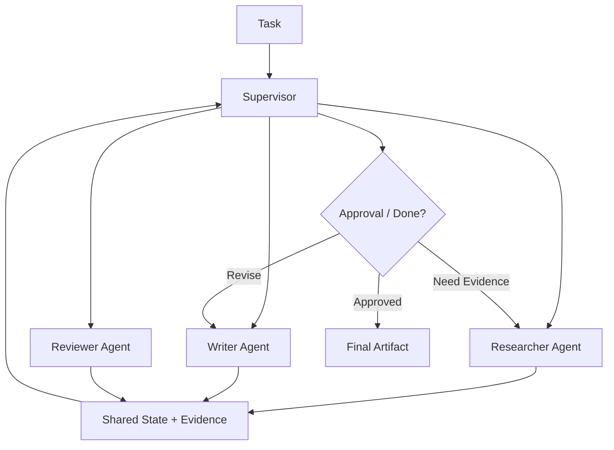

# 10. 多 Agent 编排

> **本章副标题**
> 多 Agent 是组织设计，不是堆更多 Agent  

## 1. 本章命题

多 Agent 只有在目标、上下文、权限或评测标准需要分离时才有价值。它不是能力越多越好，而是复杂性与协调成本之间的权衡。

## 2. 前后关联

上一章讨论 workflow 如何提供确定性支架。本章讨论当单个 Agent 或单条 workflow 不足时，如何通过角色分工组织复杂任务。下一部分会进入可信系统：观察、评测和治理。

上一章: [09. 工作流作为确定性支架](course-09.html) | 下一章: [11. 可观测性与调试](course-11.html)

## 3. 学习目标

- 解释 `Multi-agent Orchestration` 在 Agent Harness 中解决的工程问题。  
- 用本章思维模型审查一个真实 Agent 设计。  
- 产出本章对应的设计 artifact，并把它接入 Course Builder Harness 贯穿案例。  
- 识别本章相关的典型失败模式。  

## 4. 工程问题

多 Agent 经常被误用为展示复杂度：planner、researcher、writer、critic、executor 全都加上，但缺少清晰边界。结果是上下文重复、冲突增加、成本上升、责任不清。多 Agent 的正确问题是：哪些不确定性需要隔离？

## 5. 思维模型

把多 Agent 看成组织结构设计。角色不是为了拟人化，而是为了隔离目标、权限、信息和评测标准。每个角色都应该有明确输入、输出、责任和停止条件。

## 6. Harness 抽象

### 监督者
- 负责分派任务、汇总状态、处理冲突和决定何时停止。

### 专家
- 在某一任务类型、上下文或工具集合内执行高质量工作。

### 审查者
- 独立检查结果，不应与生成者共享完全相同的判断路径。

### 交接协议
- 一个 Agent 向另一个 Agent 交付任务时的结构化格式，包括目标、状态、证据、风险和期望输出。

### 共享状态
- 所有角色共同可见的任务状态。它必须小而明确，避免互相污染。

### 私有上下文
- 某个角色专属的信息或评估视角，用于减少偏见和职责混乱。

## 7. 参考图

## 8. 设计原则

- 只有边界不同，才值得角色不同。  
- 多 Agent 增加协调成本，必须换来更清晰的责任或更高质量的判断。  
- Reviewer 应该有独立标准，而不是重复 writer 的 prompt。  
- 所有 handoff 都应该结构化。  
- 共享状态应最小化，私有上下文应明确化。  

## 9. 参考实现方向

本课程强调“思维 > 具体方案”。参考实现的作用是帮助理解抽象，不应把某个框架、SDK 或协议等同于 Harness 本身。实现时建议先写清楚边界、状态和失败路径，再选择具体技术。

推荐实现备注：
- 用 Markdown 或 YAML 保存设计决策，便于版本化和评审。  
- 把本章 artifact 放入仓库的 `docs/design/` 或 `labs/` 目录。  
- 每次修改抽象边界后，都要更新相邻章节的接口假设。  

## 10. 失效模式

### Multi-agent theater
- 角色很多，但边界、权限和输出没有区别。

### Consensus illusion
- 多个 Agent 互相附和，被误认为独立验证。

### Coordination explosion
- 交接、汇总和冲突处理成本超过收益。

### Shared context pollution
- 一个 Agent 的错误推断污染所有角色。

## 11. 实验：课程构建 Harness

1. 为课程维护设计四个角色：Researcher、Writer、Reviewer、Publisher。  
2. 为每个角色定义目标、输入、输出、工具权限和评测标准。  
3. 设计一个 handoff payload。  
4. 列出三个不应拆成多 Agent 的场景。  

**预期产物**：Multi-agent Role Charter 与 Handoff Protocol。

## 12. 复盘清单

- [ ] 我能在自己的设计中落实：只有边界不同，才值得角色不同。  
- [ ] 我能在自己的设计中落实：多 Agent 增加协调成本，必须换来更清晰的责任或更高质量的判断。  
- [ ] 我能在自己的设计中落实：Reviewer 应该有独立标准，而不是重复 writer 的 prompt。  
- [ ] 我能识别并避免 `Multi-agent theater`：角色很多，但边界、权限和输出没有区别。  
- [ ] 我能识别并避免 `Consensus illusion`：多个 Agent 互相附和，被误认为独立验证。  

## 13. 图片描述

### 组织结构图
- Supervisor 位于上方，Researcher、Writer、Reviewer、Publisher 分列下方，每个角色旁边有权限和输出标签。

### 交接卡片
- 一张 handoff card，包含 objective、state、evidence、risks、expected output、deadline。

## 14. 关键总结

- `Multi-agent Orchestration` 不是孤立模块，而是 Agent Harness 处理不确定性的一层工程边界。
- 具体工具会变化，但本章的判断问题应保持稳定：边界是什么，证据在哪里，失败如何恢复。
