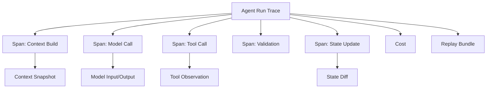

# 11. 可观测性与调试

> **本章副标题**
> 让 Agent Run 可见、可回放、可解释  

## 1. 本章命题

不能观察的 Agent 不能调试，不能调试的 Agent 不能生产化。Observability 把一次 Agent run 变成可阅读、可回放、可比较的工程证据。

## 2. 前后关联

前面章节定义了执行结构。本章进入信任层：系统运行时必须留下证据。下一章会基于这些证据做评测、测试和基准。

上一章: [10. 多 Agent 编排](course-10.html) | 下一章: [12. 评测、测试与基准](course-12.html)

## 3. 学习目标

- 解释 `Observability and Debugging` 在 Agent Harness 中解决的工程问题。  
- 用本章思维模型审查一个真实 Agent 设计。  
- 产出本章对应的设计 artifact，并把它接入 Course Builder Harness 贯穿案例。  
- 识别本章相关的典型失败模式。  

## 4. 工程问题

Agent 失败时，如果只看到最终回答，就无法判断问题来自任务定义、上下文、工具、状态、模型判断、权限还是 runtime。可观测性的目的不是收集更多日志，而是让失败原因可定位，让系统变化可比较。

## 5. 思维模型

把 observability 看成 Agent 的黑匣子和时间线。每一次运行都应该能重建：它看到了什么、想做什么、做了什么、外部世界返回了什么、状态如何变化、为什么停止。

## 6. Harness 抽象

### 跟踪
- 一次完整 Agent run 的顶层记录。

### 跨度
- 一次子操作，例如 context build、model call、tool call、validation、approval。

### 事件
- 运行中的离散事实，例如 retry、error、user interruption、policy denial。

### 上下文快照
- 模型调用时实际看到的上下文记录，用于回放和差异比较。

### 状态差异
- 每一步前后状态变化，帮助判断错误何时进入系统。

### 回放
- 用同样输入、状态和上下文重跑或检查某次运行。

## 7. 参考图



## 8. 设计原则

- 记录足够回放的信息，而不是只记录最终答案。  
- 日志应结构化，能被检索、聚合和比较。  
- 每次模型调用都要关联上下文快照。  
- 每次工具调用都要有关联 ID、参数、结果、错误和权限记录。  
- 隐私与可观测性必须同时设计。  

## 9. 参考实现方向

本课程强调“思维 > 具体方案”。参考实现的作用是帮助理解抽象，不应把某个框架、SDK 或协议等同于 Harness 本身。实现时建议先写清楚边界、状态和失败路径，再选择具体技术。

推荐实现备注：
- 用 Markdown 或 YAML 保存设计决策，便于版本化和评审。  
- 把本章 artifact 放入仓库的 `docs/design/` 或 `labs/` 目录。  
- 每次修改抽象边界后，都要更新相邻章节的接口假设。  

## 10. 失效模式

### Final-answer-only logging
- 只保存最终回答，无法分析中间步骤。

### Unstructured logs
- 日志是自然语言碎片，难以聚合和比较。

### No context snapshot
- 无法知道模型当时看到了什么。

### No correlation IDs
- 无法把工具调用、状态变化和用户请求关联起来。

## 11. 实验：课程构建 Harness

1. 为 Course Builder Harness 设计 trace_id、run_id、step_id、tool_call_id。  
2. 定义每个 model_call span 应保存的字段。  
3. 定义 context diff：当章节质量退化时，如何比较两次上下文。  
4. 设计一个 failure replay 页面或报告。  

**预期产物**：Agent Run Trace Schema 与 Debugging Report 模板。

## 12. 复盘清单

- [ ] 我能在自己的设计中落实：记录足够回放的信息，而不是只记录最终答案。  
- [ ] 我能在自己的设计中落实：日志应结构化，能被检索、聚合和比较。  
- [ ] 我能在自己的设计中落实：每次模型调用都要关联上下文快照。  
- [ ] 我能识别并避免 `Final-answer-only logging`：只保存最终回答，无法分析中间步骤。  
- [ ] 我能识别并避免 `Unstructured logs`：日志是自然语言碎片，难以聚合和比较。  

## 13. 图片描述

### Agent 黑匣子
- 一个黑匣子记录 task、context、model output、tool call、state diff、stop reason。

### 运行时间线
- 横向时间线显示每个 span 的耗时、成本、输入、输出、错误。

## Trace Schema 示例

```json
{
  "run_id": "run_001",
  "task_id": "chapter_revision",
  "spans": [
    {"type": "context_build", "context_hash": "...", "sources": []},
    {"type": "model_call", "input_hash": "...", "output_hash": "..."},
    {"type": "tool_call", "tool": "write_draft", "risk": "draft"}
  ],
  "stop_reason": "success_criteria_met"
}
```

## 14. 关键总结

- `Observability and Debugging` 不是孤立模块，而是 Agent Harness 处理不确定性的一层工程边界。
- 具体工具会变化，但本章的判断问题应保持稳定：边界是什么，证据在哪里，失败如何恢复。
