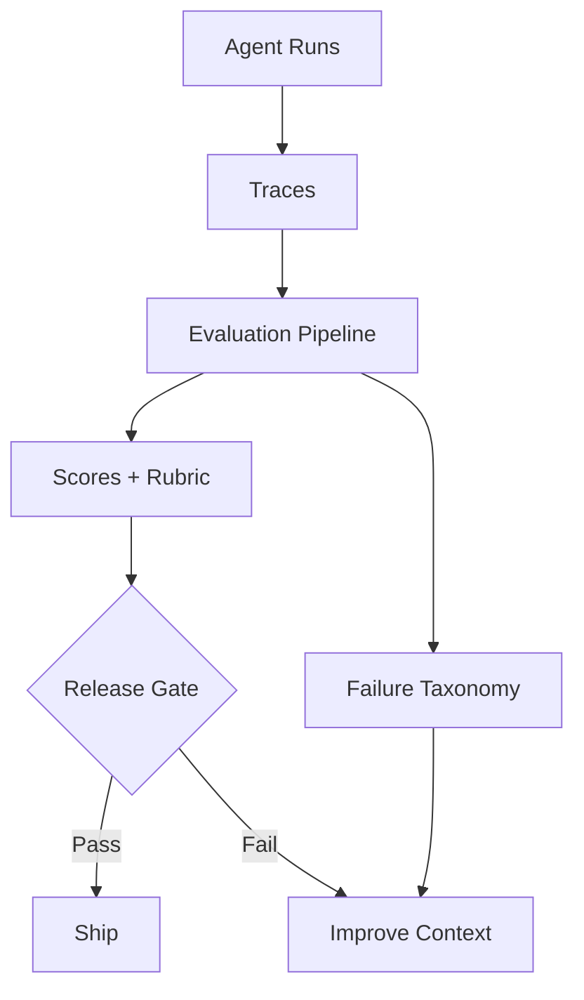

# 12. 评测、测试与基准

## 1. 本章命题

评测不是给模型打排行榜分数，而是给 Harness 建立反馈回路。它回答：系统是否完成任务、是否退化、为何失败、改动是否值得上线。

## 2. 前后关联

上一章让 Agent run 可见。本章把可见的 run 转化为判断系统好坏的证据。下一章会讨论当系统有能力改变外部世界时，如何限制它的权力。

上一章: [11. 可观测性与调试](course-11.html) | 下一章: [13. 安全、权限与治理](course-13.html)

## 3. 学习目标

- 解释 `Evaluation, Testing and Benchmarking` 在 Agent Harness 中解决的工程问题。  
- 用本章思维模型审查一个真实 Agent 设计。  
- 产出本章对应的设计 artifact，并把它接入 Course Builder Harness 贯穿案例。  
- 识别本章相关的典型失败模式。  

## 4. 工程问题

很多团队通过“感觉不错”判断 Agent 是否进步。这种方式无法支持回归测试、版本选择、成本控制或上线决策。Harness 的 evaluation 应覆盖工具、workflow、skill、任务、风险和生产指标。

## 5. 思维模型

把 evaluation 看成系统的免疫系统和反馈系统。它不仅发现错误，还帮助团队知道错误属于哪一层：任务定义、上下文、工具、状态、运行时、skill、workflow、安全策略或模型选择。

## 6. Harness 抽象

### 单元测试
- 测试 parser、validator、tool wrapper、schema 等确定性部件。

### 工作流测试
- 测试流程分支、审批、fallback 和停止条件。

### 黄金任务集
- 代表真实任务分布的固定样例集，用于回归比较。

### 评分规约
- 把质量判断拆成可执行标准，例如准确性、完整性、证据、风格、一致性。

### 对抗评测
- 测试 prompt injection、工具滥用、权限绕过、数据泄露等风险。

### 生产指标
- 真实运行中的成功率、人工介入率、成本、延迟、失败类型和用户修正率。

## 7. 参考图



## 8. 设计原则

- 先定义成功，再优化系统。  
- 评测应覆盖行为，而不只是回答文本。  
- 每个重要 skill 都应有回归集。  
- 评测结果要能反向定位失败层。  
- 成本和延迟也是质量指标。  

## 9. 参考实现方向

本课程强调“思维 > 具体方案”。参考实现的作用是帮助理解抽象，不应把某个框架、SDK 或协议等同于 Harness 本身。实现时建议先写清楚边界、状态和失败路径，再选择具体技术。

推荐实现备注：
- 用 Markdown 或 YAML 保存设计决策，便于版本化和评审。  
- 把本章 artifact 放入仓库的 `docs/design/` 或 `labs/` 目录。  
- 每次修改抽象边界后，都要更新相邻章节的接口假设。  

## 10. 失效模式

### Eval by vibes
- 凭感觉判断质量，无法重复和比较。

### Answer-only eval
- 只评估最终文本，不评估工具、状态、权限和过程。

### Static benchmark obsession
- 只追求通用 benchmark，而不评估自己的任务分布。

### No regression gate
- 修改 prompt、skill 或工具后没有上线前回归检查。

## 11. 实验：课程构建 Harness

1. 为 lesson_writer skill 设计 5 条 golden tasks。  
2. 写一个 rubric：结构完整、双语一致、工程哲学贯穿、具体方案不过度抢主线。  
3. 设计一个 adversarial case：资料中包含诱导 Agent 忽略课程结构的内容。  
4. 定义上线门槛：通过率、人工修改率、构建成功率、成本上限。  

**预期产物**：Evaluation Matrix、Golden Task Set 与 Rubric。

## 12. 复盘清单

- [ ] 我能在自己的设计中落实：先定义成功，再优化系统。  
- [ ] 我能在自己的设计中落实：评测应覆盖行为，而不只是回答文本。  
- [ ] 我能在自己的设计中落实：每个重要 skill 都应有回归集。  
- [ ] 我能识别并避免 `Eval by vibes`：凭感觉判断质量，无法重复和比较。  
- [ ] 我能识别并避免 `Answer-only eval`：只评估最终文本，不评估工具、状态、权限和过程。  

## 13. 图片描述

### 评测金字塔
- 底层 unit tests，中层 workflow/skill evals，上层 task success 和 production metrics。

### 反馈回路图
- Trace 数据进入 eval，eval 产生失败分类，失败分类驱动 context、tool、runtime、skill 的改进。

## 评分规约示例

```yaml
rubric:
  structure_completeness: 0-5
  bilingual_consistency: 0-5
  philosophy_alignment: 0-5
  concrete_examples: 0-5
  safety_awareness: 0-5
release_gate:
  min_average_score: 4.2
  max_critical_failures: 0
  max_cost_per_task_usd: 1.50
```

## 14. 关键总结

- `Evaluation, Testing and Benchmarking` 不是孤立模块，而是 Agent Harness 处理不确定性的一层工程边界。
- 具体工具会变化，但本章的判断问题应保持稳定：边界是什么，证据在哪里，失败如何恢复。
