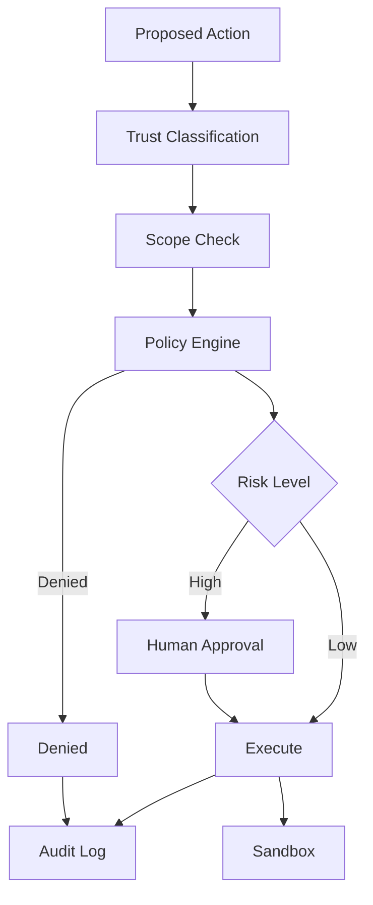

# 13. 安全、权限与治理

> **本章副标题**
> 限制 Agent 的权力  

## 1. 本章命题

Agent 安全不是让模型更听话，而是让系统即使在模型不可靠时仍然安全。权限、审批、沙箱、审计和策略引擎应当成为 Harness 架构的一部分。

## 2. 前后关联

上一章讨论如何判断系统是否有效。本章讨论系统在有效之外是否安全、合规、可控。下一章会把全部部件组织成生产架构。

上一章: [12. 评测、测试与基准](course-12.html) | 下一章: [14. 生产架构](course-14.html)

## 3. 学习目标

- 解释 `Security, Permissions and Governance` 在 Agent Harness 中解决的工程问题。  
- 用本章思维模型审查一个真实 Agent 设计。  
- 产出本章对应的设计 artifact，并把它接入 Course Builder Harness 贯穿案例。  
- 识别本章相关的典型失败模式。  

## 4. 工程问题

一个能读取数据、调用工具、修改文件、发送消息或发布内容的 Agent 已经拥有实际权力。不能用提示词替代权限系统。必须假设模型可能被诱导、误解上下文或选择错误动作，然后用架构限制损害范围。

## 5. 思维模型

把安全看成权力设计。每个能力都要回答：谁授权、允许什么范围、何时需要审批、如何记录、出事如何回滚、用户如何撤销。

## 6. Harness 抽象

### 提示注入
- 不可信内容试图改变 Agent 指令、泄露数据或执行未授权动作。

### 最小权限
- Agent 只获得完成当前任务所需的最小能力。

### 权限范围
- 权限应按资源、动作、时间、风险和用户意图细分。

### 审批门
- 高风险或不可逆动作前的人工确认。

### 策略引擎
- 用可审计规则判断某个动作是否允许。

### 审计日志
- 记录谁、何时、因为什么任务、请求和执行了什么动作。

## 7. 参考图

## 8. 设计原则

- 安全是架构，不是指令。  
- 默认拒绝高风险动作，显式授权后再执行。  
- 不可信内容永远不能升级为系统指令。  
- 权限应随任务结束而过期。  
- 审计日志应覆盖拒绝动作，而不仅是成功动作。  

## 9. 参考实现方向

本课程强调“思维 > 具体方案”。参考实现的作用是帮助理解抽象，不应把某个框架、SDK 或协议等同于 Harness 本身。实现时建议先写清楚边界、状态和失败路径，再选择具体技术。

推荐实现备注：
- 用 Markdown 或 YAML 保存设计决策，便于版本化和评审。  
- 把本章 artifact 放入仓库的 `docs/design/` 或 `labs/` 目录。  
- 每次修改抽象边界后，都要更新相邻章节的接口假设。  

## 10. 失效模式

### Security as prompt
- 用“不要泄露信息”代替数据访问控制。

### Permanent broad token
- 给 Agent 一个长期、全量、高权限 token。

### No trust separation
- 把网页内容、用户输入、系统策略混在同一指令层。

### No approval trail
- 执行高风险动作后无法证明用户曾批准。

## 11. 实验：课程构建 Harness

1. 为 Course Builder Harness 设计权限矩阵：read_repo、write_draft、open_pr、publish_pages、delete_file。  
2. 标记哪些动作需要审批，哪些动作默认拒绝。  
3. 设计 prompt injection 防护：不可信资料只能作为 evidence，不可作为 instruction。  
4. 写一条 audit log 记录格式。  

**预期产物**：Permission Matrix、Approval Policy 与 Audit Log Schema。

## 12. 复盘清单

- [ ] 我能在自己的设计中落实：安全是架构，不是指令。  
- [ ] 我能在自己的设计中落实：默认拒绝高风险动作，显式授权后再执行。  
- [ ] 我能在自己的设计中落实：不可信内容永远不能升级为系统指令。  
- [ ] 我能识别并避免 `Security as prompt`：用“不要泄露信息”代替数据访问控制。  
- [ ] 我能识别并避免 `Permanent broad token`：给 Agent 一个长期、全量、高权限 token。  

## 13. 图片描述

### 权限同心圆
- 中心是只读，向外依次是草稿、写入、发布、删除，越外层审批越严格。

### 安全网关图
- 所有工具调用经过 policy engine、scope check、approval、sandbox、audit。

## 权限矩阵示例

| Action | Default | Approval | Notes |
|---|---:|---:|---|
| read_repo | allow | no | Read-only. |
| write_draft | allow | no | Draft branch only. |
| open_pr | deny | yes | Requires summary and diff. |
| publish_pages | deny | yes | Requires build pass. |
| delete_file | deny | yes | Requires explicit file path and rollback plan. |

## 14. 关键总结

- `Security, Permissions and Governance` 不是孤立模块，而是 Agent Harness 处理不确定性的一层工程边界。
- 具体工具会变化，但本章的判断问题应保持稳定：边界是什么，证据在哪里，失败如何恢复。
