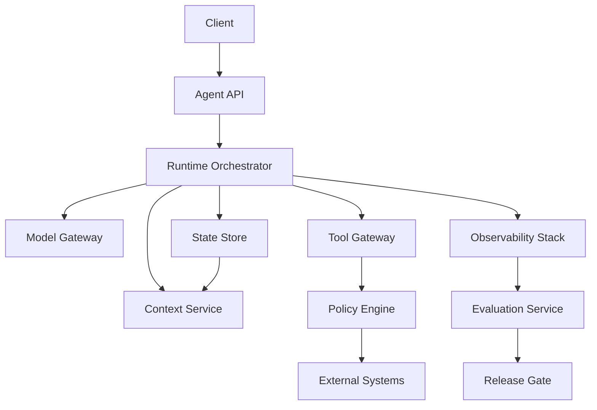

# 14. 生产架构

## 1. 本章命题

Agent 产品不是一个 prompt 加几个 tools，而是一套围绕不确定性构建的控制系统。生产架构需要把 API、runtime、context、model、tool、state、policy、eval、observability 组织成可维护边界。

## 2. 前后关联

前面所有章节都在定义 Harness 的局部能力。本章把它们组合成生产系统。最后一章会抽象出 patterns、anti-patterns 和未来方向。

上一章: [13. 安全、权限与治理](course-13.html) | 下一章: [15. 模式、反模式与未来](course-15.html)

## 3. 学习目标

- 解释 `Production Architecture` 在 Agent Harness 中解决的工程问题。  
- 用本章思维模型审查一个真实 Agent 设计。  
- 产出本章对应的设计 artifact，并把它接入 Course Builder Harness 贯穿案例。  
- 识别本章相关的典型失败模式。  

## 4. 工程问题

从 demo 到生产的主要挑战不是“能否调用模型”，而是并发、隔离、权限、队列、成本、延迟、状态恢复、版本管理、评测回归、日志隐私和发布流程。生产架构必须把这些问题前置。

## 5. 思维模型

把生产 Harness 看成多个受控服务的组合：Agent API 接任务，Runtime Orchestrator 管循环，Context Service 构造信息边界，Tool Gateway 管副作用，Policy Engine 管权力，Observability 和 Evaluation 形成反馈。

## 6. Harness 抽象

### Agent 接口
- 对外暴露任务入口，隐藏内部模型和工具实现。

### 运行时编排器
- 管理步骤、状态、循环、重试、审批和停止条件。

### 上下文服务
- 统一处理检索、压缩、分层、引用和上下文快照。

### 模型网关
- 管理模型选择、限流、fallback、成本和版本。

### 工具网关
- 统一管理工具调用、MCP client、权限、审计和沙箱。

### 状态存储
- 保存 run state、session、checkpoint、artifact metadata。

### 策略引擎
- 在动作执行前进行安全和权限判断。

### 评测与观测
- 记录、回放、打分、回归和发布门禁。

## 7. 参考图



## 8. 设计原则

- 生产架构应围绕边界而不是框架命名。  
- 所有外部动作必须经过统一工具网关。  
- 状态存储和日志存储要有隐私与保留策略。  
- 模型、prompt、skill、workflow 都需要版本化。  
- 上线前先有 eval gate，生产中继续采集 metrics。  

## 9. 参考实现方向

本课程强调“思维 > 具体方案”。参考实现的作用是帮助理解抽象，不应把某个框架、SDK 或协议等同于 Harness 本身。实现时建议先写清楚边界、状态和失败路径，再选择具体技术。

推荐实现备注：
- 用 Markdown 或 YAML 保存设计决策，便于版本化和评审。  
- 把本章 artifact 放入仓库的 `docs/design/` 或 `labs/` 目录。  
- 每次修改抽象边界后，都要更新相邻章节的接口假设。  

## 10. 失效模式

### Monolith prompt app
- 所有逻辑都在一个 prompt 和一个 handler 中，无法隔离责任。

### No async model
- 长任务阻塞请求，无法恢复或取消。

### No release discipline
- prompt 和 skill 修改直接上线，没有回归和版本。

### Tool integration sprawl
- 各业务直接接工具，绕过权限和审计。

## 11. 实验：课程构建 Harness

1. 画出 Course Builder Harness 的 production architecture。  
2. 定义每个服务的责任边界和数据流。  
3. 列出同步任务和异步任务：即时回答、章节生成、构建、发布。  
4. 写一个 ADR：为什么采用 Tool Gateway 和 Policy Engine。  

**预期产物**：Production Architecture Diagram 与 ADR。

## 12. 复盘清单

- [ ] 我能在自己的设计中落实：生产架构应围绕边界而不是框架命名。  
- [ ] 我能在自己的设计中落实：所有外部动作必须经过统一工具网关。  
- [ ] 我能在自己的设计中落实：状态存储和日志存储要有隐私与保留策略。  
- [ ] 我能识别并避免 `Monolith prompt app`：所有逻辑都在一个 prompt 和一个 handler 中，无法隔离责任。  
- [ ] 我能识别并避免 `No async model`：长任务阻塞请求，无法恢复或取消。  

## 13. 图片描述

### 生产架构总图
- Client、Agent API、Runtime Orchestrator、Context Service、Model Gateway、Tool Gateway、State Store、Policy Engine、Eval、Observability 的服务图。

### 从 demo 到 production 阶梯
- 四层阶梯：prompt demo、tool agent、observable harness、governed production system。

## ADR 模板

```markdown
# ADR: Use a Tool Gateway for All External Actions

## Context
Agents need to call multiple tools with different risk levels.

## Decision
All tool calls must pass through a Tool Gateway.

## Consequences
- Centralized permission and audit
- Easier replay and debugging
- Additional service boundary and latency
```

## 14. 关键总结

- `Production Architecture` 不是孤立模块，而是 Agent Harness 处理不确定性的一层工程边界。
- 具体工具会变化，但本章的判断问题应保持稳定：边界是什么，证据在哪里，失败如何恢复。
