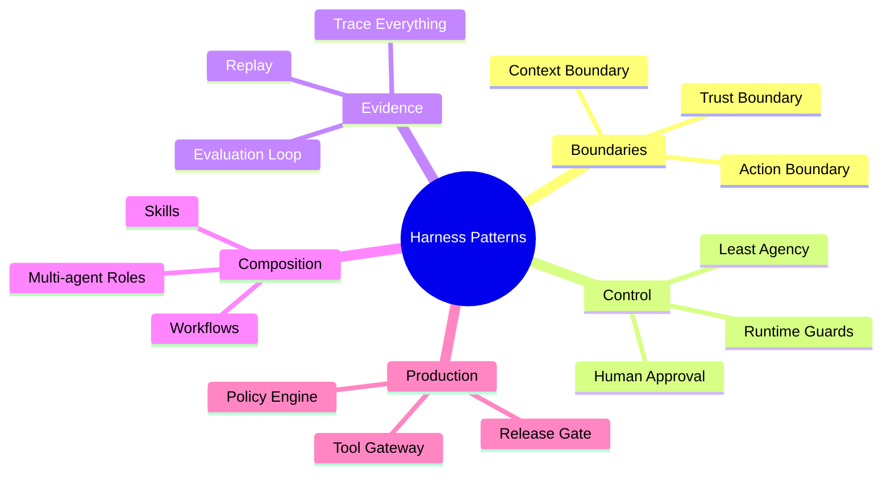

# 15. 模式、反模式与未来

> **本章副标题**
> 设计原则、反模式与未来方向  

## 1. 本章命题

Harness 的未来不是“更大的 Agent”，而是“更好的控制层”。本章把前面所有内容抽象成可复用设计模式、常见反模式和未来演化方向。

## 2. 前后关联

上一章完成生产架构。本章回收全课思想：如何判断一个 Harness 设计好坏，以及如何面向未来扩展，而不丢失边界、控制和证据。

上一章: [14. 生产架构](course-14.html)

## 3. 学习目标

- 解释 `Patterns, Anti-patterns and Future` 在 Agent Harness 中解决的工程问题。  
- 用本章思维模型审查一个真实 Agent 设计。  
- 产出本章对应的设计 artifact，并把它接入 Course Builder Harness 贯穿案例。  
- 识别本章相关的典型失败模式。  

## 4. 工程问题

Agent 技术会快速变化，但工程哲学不会随框架一起过期。真正有用的课程结尾不应只是罗列趋势，而应形成一套判断准则：什么设计会变得更可靠，什么设计会把不确定性放大。

## 5. 思维模型

把本章看成 Harness 设计评审手册。面对任何新框架、新协议、新模型或新 Agent 产品，都用同一组问题审查：边界是否清晰？状态是否显式？动作是否受控？运行是否可观测？质量是否可证？权力是否受限？

## 6. Harness 抽象

### 上下文边界模式
- 明确 Agent 能看到什么、不能看到什么，以及信息来源的可信级别。

### 工具网关模式
- 所有外部副作用经过统一入口，以支持权限、审计和恢复。

### 显式状态模式
- 把任务状态从对话文本中抽离，保存为可校验、可恢复的数据。

### 最小自主权模式
- 只给 Agent 完成当前任务所需的最小自主空间。

### 全链路跟踪模式
- 每次运行都记录输入、决策、动作、观察、状态和停止原因。

### 先评测再扩权模式
- 在扩大自治范围、工具权限或用户规模之前先建立评测证据。

## 7. 参考图

## 8. 设计原则

- 设计判断应优先看边界，而不是看模型有多强。  
- 反模式通常不是缺功能，而是缺控制。  
- 未来框架可以替换，但工程边界不能消失。  
- 越自治，越需要可观察、可评测、可撤销。  
- 最好的 Harness 会把复杂性显式化，而不是藏进 prompt。  

## 9. 参考实现方向

本课程强调“思维 > 具体方案”。参考实现的作用是帮助理解抽象，不应把某个框架、SDK 或协议等同于 Harness 本身。实现时建议先写清楚边界、状态和失败路径，再选择具体技术。

推荐实现备注：
- 用 Markdown 或 YAML 保存设计决策，便于版本化和评审。  
- 把本章 artifact 放入仓库的 `docs/design/` 或 `labs/` 目录。  
- 每次修改抽象边界后，都要更新相邻章节的接口假设。  

## 10. 失效模式

### Prompt-only Agent
- 不可控、不可测试、不可维护。

### Tool Soup
- 工具很多，但没有边界、权限和命名规范。

### Memory Dump
- 什么都记，导致污染、隐私风险和错误固化。

### Agent Does Everything
- 确定性流程也交给模型，放大不确定性。

### Multi-agent Theater
- 多 Agent 只是增加复杂度，没有独立边界和责任。

### Eval by Vibes
- 凭感觉上线，无法回归比较。

### Security as Prompt
- 用提示词替代权限系统。

## 11. 实验：课程构建 Harness

1. 用本章 checklist 审查 Course Builder Harness 的完整设计。  
2. 找出三个最可能的反模式风险，并写出对应修复方案。  
3. 选择一个未来方向：browser agent、personal agent、enterprise agent、multimodal harness，分析它需要哪些新边界。  
4. 写一篇最终设计反思：Harness 如何处理不确定性。  

**预期产物**：Harness Design Review Checklist 与 Final Reflection。

## 12. 复盘清单

- [ ] 我能在自己的设计中落实：设计判断应优先看边界，而不是看模型有多强。  
- [ ] 我能在自己的设计中落实：反模式通常不是缺功能，而是缺控制。  
- [ ] 我能在自己的设计中落实：未来框架可以替换，但工程边界不能消失。  
- [ ] 我能识别并避免 `Prompt-only Agent`：不可控、不可测试、不可维护。  
- [ ] 我能识别并避免 `Tool Soup`：工具很多，但没有边界、权限和命名规范。  

## 13. 图片描述

### 模式地图
- 中心是 Harness，周围环绕 Context Boundary、Tool Gateway、Explicit State、Trace Everything、Eval Before Scale、Least Agency。

### 未来控制层图
- 不同未来 Agent 形态，如 browser agent、personal agent、enterprise agent、multimodal agent，都接入同一套 control layer。

## 终局设计审查

| Question | Good Signal | Warning Signal |
|---|---|---|
| Boundary | Explicit context/action/trust limits | “The model will know what to do” |
| State | Structured and recoverable | Hidden in chat history |
| Tooling | Gateway, audit, approval | Direct execution |
| Runtime | Guards and recovery | Infinite or blind loops |
| Evaluation | Golden tasks and regressions | Vibes-based release |
| Security | Least privilege and policy | Security by prompt |

## 14. 关键总结

- `Patterns, Anti-patterns and Future` 不是孤立模块，而是 Agent Harness 处理不确定性的一层工程边界。
- 具体工具会变化，但本章的判断问题应保持稳定：边界是什么，证据在哪里，失败如何恢复。
